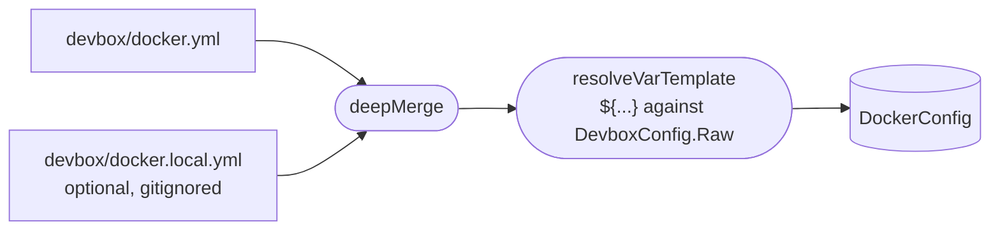

# docker.yml / docker.local.yml

Compose execution policy for the devbox project.

## Contents

- [Purpose](#purpose)
- [devbox docker vs devbox compose](#devbox-docker-vs-devbox-compose)
- [Structure](#structure)
- [Field reference](#field-reference)
  - [`project_name`](#project_name)
  - [`args`](#args)
  - [`process_env`](#process_env)
  - [`env`](#env)
  - [`topology`](#topology)
  - [`resources`](#resources)
- [docker.local.yml](#dockerlocalyml)
- [Common pitfalls](#common-pitfalls)
- [Related commands](#related-commands)

## Purpose

`devbox/docker.yml` controls how `devbox docker` builds and executes `docker compose` commands: the project name, per-subcommand args, process environment, and automatic `.env` generation triggers.

It is loaded separately by `LoadDockerConfig()` and is not merged with the 3-layer config.

Local overrides go in `devbox/docker.local.yml` (gitignored). Template in `devbox/docker.local.example.yml`. Local overrides are deep-merged into `docker.yml` before unmarshalling — local wins on key conflicts, lists replace.



## devbox docker vs devbox compose

| Command | Purpose |
|---------|---------|
| `devbox docker <subcommand>` | Public lifecycle API. Policy args applied. Use in Makefiles, deploy steps, and YAML commands. |
| `devbox compose raw <args...>` | Low-level diagnostic pass-through. No policy args. Use for debugging only. |
| `devbox compose files` | Show active compose file list (diagnostic). |
| `devbox compose argv` | Show full effective argv including policy args (diagnostic). |

Only `devbox docker` subcommands are allowed in Makefiles, YAML command definitions, and deploy steps. Direct `docker compose` calls bypass policy and must not appear in any automation.

## Structure

```yaml
project_name: "${project.prefix}-${project.name}"

args:
  global: ["--ansi", "always", "--progress", "tty"]
  up: ["-d", "--remove-orphans"]
  logs: ["-f"]
  run: ["--rm"]
  pull: []
  build: []

process_env:
  DOCKER_CLI_HINTS: "false"

env:
  auto_generate: true
  commands: [up, run, exec, restart, pull, build]

topology:
  hidden: [redis-insight-setup]

resources:
  volumes:
    composer_cache:
      name: devbox_composer_cache
      shared: true
      ensure_before: [up, deploy]
```

## Field reference

### `project_name`

```yaml
project_name: "${project.prefix}-${project.name}"
```

The Docker Compose project name passed as `-p <name>` to every compose invocation. Supports `${dot.path}` lookups into the merged devbox config (see [Templates](../templates.md) — `${...}` namespaces). Default resolves to `devbox-laravel`.

Override locally:
```yaml
# docker.local.yml
project_name: "my-custom-project"
```

### `args`

Per-subcommand arg lists. Each key is a docker subcommand name; `global` applies to every invocation before the subcommand-specific args.

```yaml
args:
  global: ["--ansi", "always", "--progress", "tty"]
  up: ["-d", "--remove-orphans"]
  logs: ["-f"]
  run: ["--rm"]
  pull: ["--policy", "always"]
  build: ["--progress", "plain"]
```

Available subcommand keys: `global`, `up`, `down`, `stop`, `restart`, `logs`, `ps`, `exec`, `run`, `pull`, `build`. (Health-poll args for `devbox docker wait` are not user-configurable — the wait command builds its own poll loop in Go.)

When overriding in `docker.local.yml`, the list replaces the tracked default entirely (lists do not merge):

```yaml
# docker.local.yml — remove --progress tty (unsupported in some terminals)
args:
  global: ["--ansi", "always"]
```

**Image management subcommands (`pull` and `build`)**

The `pull` and `build` subcommands include optional flags to control file set and cache behavior:

- `devbox docker pull [--all] [services...]` — Pull images for services. By default, uses the active compose file set (base + enabled overlays). The `--all` flag pulls against all configured overlays, regardless of local enable state, without modifying `devbox/local.yml`.

- `devbox docker build [--all] [--force] [services...]` — Build images for services. Default behavior same as pull. The `--force` flag appends `--no-cache --pull` to bypass Docker's layer cache and re-pull base layers. `--all` and `--force` can be combined.

When configuring `args.pull` or `args.build`, they are applied before positional services or force flags. Example:

```yaml
args:
  pull: ["--policy", "always"]
  build: ["--progress", "plain"]
```

The `--all` flag is a per-invocation override only — it does NOT modify `devbox/local.yml` and does not persist across commands.

### `process_env`

Environment variables passed to every `docker compose` child process. Does not affect the container environment — only the compose CLI process itself.

```yaml
process_env:
  DOCKER_CLI_HINTS: "false"
```

Useful for suppressing Docker CLI noise that appears even when output is piped.

### `env`

Controls automatic `.env` generation before specific subcommands.

```yaml
env:
  auto_generate: true
  commands: [up, run, exec, restart, pull, build]
```

| Field | Description |
|-------|-------------|
| `auto_generate` | When true, CLI regenerates `.env` before the listed commands |
| `commands` | Subcommands that trigger auto-generation |

When a listed command runs, `devbox render env -o .env` executes implicitly before compose. Disable for CI environments where `.env` is pre-generated:

```yaml
# docker.local.yml
env:
  auto_generate: false
```

### `topology`

```yaml
topology:
  hidden: [redis-insight-setup]
```

| Field | Description |
|-------|-------------|
| `hidden` | Compose service names excluded from the topology tree and health checks |

Useful for init containers that run once and exit — hiding them prevents `devbox docker wait` from waiting on them.

### `resources`

Declares Docker resources that must exist before certain commands.

```yaml
resources:
  volumes:
    composer_cache:
      name: devbox_composer_cache
      shared: true
      ensure_before: [up, deploy]
```

| Field | Description |
|-------|-------------|
| `volumes.<key>.name` | Base volume name. The actual Docker name depends on `shared`: shared volumes use `name` verbatim; non-shared volumes are stored as `<project_name>_<name>` so they share their lifecycle and scope with the compose project (matching the convention Docker Compose uses for named volumes declared inside `compose.yaml`). |
| `volumes.<key>.shared` | When `true`, the volume is project-independent: the actual Docker name equals `name` and the volume persists across project resets. When `false` (default), the volume is project-scoped — the runtime prepends `<project_name>_` and `docker_remove_project_volumes` (the reset builtin) cleans it up alongside the project. |
| `volumes.<key>.ensure_before` | Triggers that idempotently create the volume if missing. Supported values: `up`, `deploy`. |

```yaml
resources:
  volumes:
    composer_cache:                 # logical key
      name: devbox_composer_cache   # actual Docker name (shared)
      shared: true
      ensure_before: [up, deploy]

    build_artifacts:                # actual Docker name = "<project_name>_build_artifacts"
      name: build_artifacts
      ensure_before: [deploy]
```

`docker_remove_project_volumes` (the reset builtin) removes every volume whose name starts with `<project_name>_`, so non-shared volumes are reset with the project while shared ones survive.

## docker.local.yml

Local overrides for the docker policy. Gitignored. Use `devbox/docker.local.example.yml` as a starting template.

Common overrides:

```yaml
# Override project name
project_name: "personal-laravel"

# Remove --progress tty (unsupported in some terminals)
args:
  global: ["--ansi", "always"]

# Disable auto .env generation (pre-generated in CI)
env:
  auto_generate: false

# Suppress Docker hints
process_env:
  DOCKER_CLI_HINTS: "false"
```

## Common pitfalls

- **Direct `docker compose` in Makefiles or YAML** — always use `devbox docker`. Direct calls bypass policy args, project name, and `.env` auto-generation.
- **Adding compose flags in Make recipes** — flags belong in `docker.yml` args section, not in Make. Make lifecycle targets call `devbox docker` with no flags.
- **Overriding args partially** — `args.up` in `docker.local.yml` replaces the tracked list, not appends to it. Include all flags you need.
- **Disabling `auto_generate` globally** — if you disable it, you must regenerate `.env` manually before compose commands that depend on it.

## Related commands

- `devbox docker up|down|stop|restart|logs|ps|exec|run|wait|pull|build` — lifecycle and image-management commands
- `devbox compose files` — show active compose file list
- `devbox compose argv` — show full effective argv
- `devbox render env` — manually regenerate `.env`
