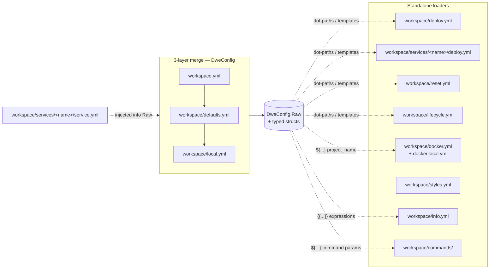

# Config Reference

Overview of all configuration files in the DWE system.

> New to DWE? Start with [Getting started](../concepts/getting-started.md) for an end-to-end walkthrough, then return here for the file-by-file reference.

## Contents

- [File inventory](#file-inventory)
- [Loader topology](#loader-topology)
- [Merged vs standalone](#merged-vs-standalone)
- [Pages](#pages)
- [Related commands](#related-commands)

## File inventory

| File | Tracked | Loader | Purpose |
|------|---------|--------|---------|
| `workspace.yml` | yes | layer 1 | Project identity and service structure |
| `workspace/defaults.yml` | yes | layer 2 | Versioned defaults: runtime, exports, service enabled toggles |
| `workspace/local.yml` | no (gitignored) | layer 3 | Per-user overrides: state, service enabled toggles |
| `workspace/services/<name>/service.yml` | yes | standalone | Per-service declaration (dirs, cli, configs, ports) |
| `workspace/deploy.yml` | yes | standalone | Orchestrator deploy pipeline (phases + steps) |
| `workspace/services/<name>/deploy.yml` | yes | standalone | Per-service deploy pipelines |
| `workspace/reset.yml` | yes | standalone | Reset pipeline |
| `workspace/lifecycle.yml` | yes | standalone | Run / stop pipelines (driving `dwe run`/`stop`/`restart`) |
| `workspace/docker.yml` | yes | standalone | Compose execution policy |
| `workspace/docker.local.yml` | no (gitignored) | merged into `docker.yml` | Local compose policy overrides |
| `workspace/styles.yml` | yes | standalone | ASCII header, color palette, separator |
| `workspace/info.yml` | yes | standalone | Info dashboard sections |
| `workspace/commands/` | yes | standalone | Declarative command definitions (per-file groups) |
| `workspace/validate.yml` | yes | standalone | Project readiness checks (preflight + `dwe validate`) |
| `workspace/snapshot.yml` | yes | standalone | Snapshot workflows: create / restore / remove (`dwe snapshot`) |
| `workspace/i18n/*.yml` | yes | standalone | User command and UI string translations (optional; one file per language) |

## Runtime artifacts

The `.dwe/` directory contains DWE-managed artifacts and is **gitignored**:

- `.dwe/logs/` — pipeline logs (deploy, reset, lifecycle run/stop)
- `.dwe/deploy/deploy.lock` — deployment lock file (Unix-only; prevents parallel deploys)
- `.dwe/deploy/state.yml` — deployment state journal (tracks service deploy status and hashes)
- `.dwe/snapshots/snapshot.lock` — snapshot lock file (Unix-only; serialises snapshot mutating commands and is co-acquired by deploy lifecycle commands)
- `.dwe/snapshots/current` — current snapshot pointer (last created or restored snapshot)
- `.dwe/snapshots/.pre-restore-backup/` — backup of `workspace/local.yml` + `.dwe/deploy/state.yml` taken before each restore; manual recovery target on restore failure

Add `.dwe/` to your project's `.gitignore` if not already present.

## Loader topology

## Merged vs standalone

**Merged (3-layer config)**: `workspace.yml` → `workspace/defaults.yml` → `workspace/local.yml` are deep-merged at startup. Later layers win; maps merge recursively. The result is the effective config used for `.env` generation, topology resolution, and export rules. Each `workspace/services/<name>/service.yml` is loaded separately and then injected into the merged raw map so dot-paths like `services.main.container` resolve.

**Standalone**: `workspace/services/<name>/service.yml`, `deploy.yml`, `workspace/services/<name>/deploy.yml`, `reset.yml`, `lifecycle.yml`, `docker.yml` (+ `docker.local.yml`), `styles.yml`, `info.yml`, and `commands/*.yml` are loaded by dedicated functions in `internal/core/project/config/` and `internal/core/usercommands/`. They are not part of the 3-layer merge but most of them resolve template expressions against the merged config.

## Files that support local overrides

Currently, only `docker.local.yml` supports a `.local.yml` variant for per-developer customization. The pattern is:

**Docker**: `workspace/docker.yml` (tracked, shared project-wide) + `workspace/docker.local.yml` (gitignored, per-developer). The local file is merged on top of the base file, allowing developers to customize their compose execution policy — e.g., add extra volumes, mount local source directories, or override platform/args without affecting teammates.

**Why only docker?** Docker setups are inherently personal — they depend on the developer's local environment (available binaries, volume mounts, platform differences). Other configs like `lifecycle.yml`, `info.yml`, and `styles.yml` are shared project-wide and don't benefit from per-developer overrides.

For more details on `docker.local.yml` semantics and examples, see [docker.yml](docker.md#dockerlocalyml).

## Pages

- [workspace / defaults / local](workspace.md) — the 3-layer merged config: merge order, precedence, dot-path resolution, field reference
- [vars](vars.md) — the `dwe vars` command: enumerate/read/edit/trace the `vars:` sandbox, comment-preserving writes, static usage scan, `bridge.vars_writable` container-write allowlist
- [services/<name>/service.yml](services/index.md) — per-service declarations, extends, dirs, cli config
- [deploy.yml / reset.yml](deploy/index.md) — deploy and reset pipelines, steps, builtins, file logging, idempotent deploy
- [state.yml](state/index.md) — deploy state tracking, skip-decision table, hashing, lock file, recovery from crashes
- [lifecycle.yml](lifecycle.md) — run/stop pipelines, update probe, hook phases, required service gate
- [Conditions and Actions](conditions.md) — typed conditions for `when:`, typed actions for `check:` and step bodies, predicate vs engine-builtin distinction
- [docker.yml](docker.md) — Compose execution policy, project name, env triggers
- [styles.yml](styles.md) — ASCII header, color palette, separator
- [info.yml](info.md) — info dashboard sections, template expressions
- [commands/](commands/index.md) — declarative commands: types, params, context, files, workflows, templates
- [validate.yml](validate.md) — project readiness checks: env probes, declarative checks, builtins, stages, preflight
- [snapshot.yml](snapshot.md) — snapshot workflows: create/restore/remove blocks, variants, `${snapshot.*}` namespace, manifest, lock interaction, archive safety
- [Localization (i18n)](i18n.md) — user command and UI string translations: locale resolution, file format, key reference, validation
- [User config](userconfig.md) — user-level preferences: file location, syntax, binary overrides, language, mermaid theme
- [Notifications](notifications.md) — user-level desktop notifications: config file locations, keys, gate matrix, environment overrides
- [UI](ui.md) — interactive command browser configuration: depth, collapse, badges, hotkeys, fallback ladder
- [Templates](../templates.md) — Go templates, `${...}` shorthand, sprout helpers (shared across info, commands, pipelines, render packs)

## Related commands

- `dwe render env` — generate `.env` from the merged config export rules
- `dwe render ide` — generate IDE configs
- `dwe render ai` — generate hub-level AGENTS.md and CLAUDE.md symlinks
- `dwe render git` — generate shell git hooks into `<svc.Dir>/src/.git/hooks/`
- `dwe info` — render the info dashboard from `info.yml`
- `dwe deploy plan` — show the resolved deploy pipeline
- `dwe compose files` — show active compose file list (diagnostic)
- `dwe status apps` — show app services with health and deploy status
- `dwe status tools` — show tool services table (read-only)
- `dwe status infra` — show infra services table (read-only)
