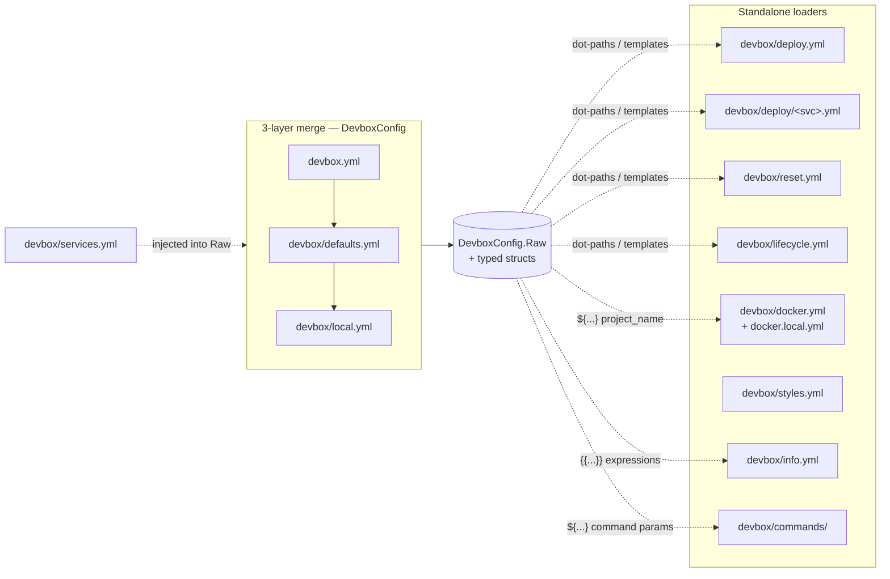

# Config Reference

Overview of all configuration files in the devbox system.

## Contents

- [File inventory](#file-inventory)
- [Loader topology](#loader-topology)
- [Merged vs standalone](#merged-vs-standalone)
- [Pages](#pages)
- [Related commands](#related-commands)

## File inventory

| File | Tracked | Loader | Purpose |
|------|---------|--------|---------|
| `devbox.yml` | yes | layer 1 | Project identity and service structure |
| `devbox/defaults.yml` | yes | layer 2 | Versioned defaults: tools, runtime, ports, exports |
| `devbox/local.yml` | no (gitignored) | layer 3 | Per-user overrides: state, ports, tools |
| `devbox/services.yml` | yes | standalone | Service declarations with dirs, cli, configs |
| `devbox/deploy.yml` | yes | standalone | Orchestrator deploy pipeline (phases + steps) |
| `devbox/deploy/<svc>.yml` | yes | standalone | Per-service deploy pipelines |
| `devbox/reset.yml` | yes | standalone | Reset pipeline |
| `devbox/lifecycle.yml` | yes | standalone | Run / stop pipelines (driving `devbox run`/`stop`/`restart`) |
| `devbox/docker.yml` | yes | standalone | Compose execution policy |
| `devbox/docker.local.yml` | no (gitignored) | merged into `docker.yml` | Local compose policy overrides |
| `devbox/styles.yml` | yes | standalone | ASCII header, color palette, separator |
| `devbox/info.yml` | yes | standalone | Info dashboard sections |
| `devbox/commands/` | yes | standalone | Declarative command definitions (per-file groups) |

## Loader topology

## Merged vs standalone

**Merged (3-layer config)**: `devbox.yml` → `devbox/defaults.yml` → `devbox/local.yml` are deep-merged at startup. Later layers win; maps merge recursively. The result is the effective config used for `.env` generation, topology resolution, and export rules. `devbox/services.yml` is loaded separately and then injected into the merged raw map so dot-paths like `services.main.container` resolve.

**Standalone**: `services.yml`, `deploy.yml`, `deploy/<svc>.yml`, `reset.yml`, `lifecycle.yml`, `docker.yml` (+ `docker.local.yml`), `styles.yml`, `info.yml`, and `commands/*.yml` are loaded by dedicated functions in `internal/config/` and `internal/usercommands/`. They are not part of the 3-layer merge but most of them resolve template expressions against the merged config.

## Pages

- [devbox / defaults / local](devbox.md) — the 3-layer merged config: merge order, precedence, dot-path resolution, field reference
- [services.yml](services.md) — service declarations, extends, dirs, cli config
- [deploy.yml / reset.yml](deploy.md) — deploy and reset pipelines, steps, builtins, file logging
- [lifecycle.yml](lifecycle.md) — run/stop pipelines, update probe, hook phases
- [Conditions and Actions](conditions.md) — typed conditions for `when:`, typed actions for `check:` and step bodies, predicate vs engine-builtin distinction
- [docker.yml](docker.md) — Compose execution policy, project name, env triggers
- [styles.yml](styles.md) — ASCII header, color palette, separator
- [info.yml](info.md) — info dashboard sections, template expressions
- [commands/](commands.md) — declarative commands: types, params, context, files, workflows, templates
- [Templates](../templates.md) — Go templates, `${...}` shorthand, sprout helpers (shared across info, commands, pipelines, render packs)

## Related commands

- `devbox render env` — generate `.env` from the merged config export rules
- `devbox render ide` — generate IDE configs
- `devbox render ai` — generate hub-level AGENTS.md and CLAUDE.md symlinks
- `devbox info` — render the info dashboard from `info.yml`
- `devbox deploy plan` — show the resolved deploy pipeline
- `devbox compose files` — show active compose file list (diagnostic)
- `devbox services list` — list services with enabled/disabled status
- `devbox tools list` — list tools with enabled/disabled status
