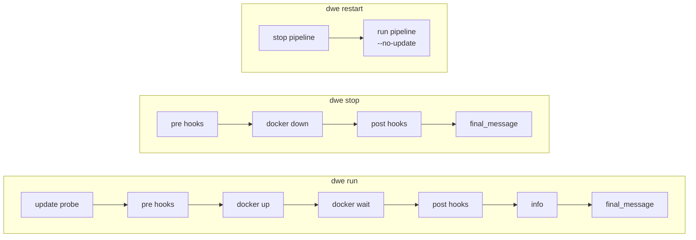

# lifecycle.yml

Run / stop pipeline declarations driving `dwe run`, `dwe stop`, and `dwe restart`.

## Contents

- [Purpose](#purpose)
- [Pipeline shape](#pipeline-shape)
- [Structure](#structure)
- [Self-update probe](#self-update-probe)
- [`run.show_info` / `run.final_message`](#runshow_info--runfinal_message)
- [`stop.final_message`](#stopfinal_message)
- [`log` (file logging)](#log-file-logging)
- [Hook phases](#hook-phases)
- [Minimal example](#minimal-example)
- [Validation](#validation)
- [Parallel step groups](#parallel-step-groups)
- [Common pitfalls](#common-pitfalls)
- [Related commands](#related-commands)

## Purpose

`workspace/lifecycle.yml` declares two pipelines:

- **`run:`** — executed by `dwe run` (and `dwe restart`, after stop). Wraps the standard `docker up` + `docker wait` sequence with optional pre/post hook phases. The self-update probe is configured separately in the top-level [`update:` block](workspace.md#the-update-block), not here.
- **`stop:`** — executed by `dwe stop` (and the first half of `dwe restart`). Wraps `docker down` with optional pre/post hook phases.

This file is loaded on its own and is **not** part of the 3-layer config merge.

The file is optional for all commands that use it.

When `lifecycle.yml` is absent or a section is absent, DWE substitutes a built-in default pipeline and prints one info line to stderr: `Using built-in default <run|stop> pipeline (override with workspace/lifecycle.yml).` The info line is suppressed in `--output json` mode.

**Default `run:` pipeline** (fires when `lifecycle.yml` is absent or has no `run:` section):

| Field | Value |
|-------|-------|
| `show_info` | `true` |
| `final_message` | `Project is ready for work!` |
| Phases | Single `start` phase: one `type: dwe` step with `cmd: "docker up --wait"` |

**Default `stop:` pipeline** (fires when `lifecycle.yml` is absent or has no `stop:` section):

| Field | Value |
|-------|-------|
| `final_message` | `Project is stopped. Have a nice day!` |
| Phases | Auto-reap phase (see below) + single `stop` phase: one `type: dwe` step with `cmd: "docker down"` |

Whenever a `stop:` pipeline runs (default or user-defined), the `_auto_reap_daemons` phase is prepended automatically; it has no opt-out and is visible in plan output for transparency. It stops any background daemons started via [`type: daemon`](commands/types.md#type-daemon) commands.

`dwe docker up` and `dwe docker down` are thin Docker Compose passthroughs and never use this pipeline; raw `docker compose stop` / `restart` remain accessible via `dwe docker stop` / `dwe docker restart`.

## Pipeline shape



`docker up` is issued as a `type: dwe` step with `cmd: "docker up"` inside the `start` phase. Container health waiting uses a `type: builtin` step with `cmd: docker_wait_healthy`. They are not magical — the pipeline executor invokes them like any other step, so they pick up policy from `docker.yml`.

## Structure

```yaml
run:
  show_info: true
  final_message: "Project is ready for work!"
  log: false            # tee status + child stdout/stderr to .dwe/logs/run.log
  phases:
    - name: <phase>
      description: <text>
      when:             # optional: typed condition (see deploy/conditions.md)
        type: builtin|shell|template
        cmd: <string>
        expr: <string>
      steps:
        - name: <step>
          type: shell|dwe|command|builtin
          cmd: <value>
          with:         # optional: parameters
            key: value

stop:
  final_message: "Project is stopped. Have a nice day!"
  log: false            # tee status + child stdout/stderr to .dwe/logs/stop.log
  phases:
    - name: <phase>
      description: <text>
      when:             # optional: typed condition
        type: builtin|shell|template
        cmd: <string>
        expr: <string>
      steps:
        - name: <step>
          type: shell|dwe|command|builtin
          cmd: <value>
          with:         # optional: parameters
            key: value
```

Phases and steps use the same shape as [deploy.yml](deploy/index.md): `name`, `description`, `when`, `untracked`, `steps[]`, plus per-step `type` / `cmd` / `with`, `when`, `check`, `files_gate`, `continue_on_error`. See the deploy reference for the complete step grammar, including [`files_gate:` (pre-condition for files)](deploy/conditions.md#files_gate-pre-condition-for-files).

`deploy_services: true` is **not** allowed in lifecycle pipelines.

## Self-update probe

The optional self-update probe runs before any phase. It can fetch from the upstream remote, detect drift, and (with consent) pull `--ff-only`. A successful pull triggers in-process reload of `DweConfig`, `LifecycleConfig`, and the command registry before phases execute.

The probe is **no longer configured here.** It is driven by the formalized top-level [`update:` block](workspace.md#the-update-block) in `workspace.yml` / `local.yml` (`mode: on | off`), which participates in the 3-layer merge. This was lifted out of `lifecycle.yml` so that enabling update is a one-liner that does not blank `run.phases`.

Runtime precedence at `dwe run`: `--no-update` flag > `--update <mode>` flag > `update.mode` from the merged config. See the [`update:` block reference](workspace.md#the-update-block) and [git integration → update probe](../concepts/git.md#update-probe-dwe-run) for full behaviour.

## `run.show_info` / `run.final_message`

| Field | Type | Default | Description |
|-------|------|---------|-------------|
| `show_info` | bool | `false` | Append a `dwe info` render after the last phase. |
| `final_message` | string | `Project is ready for work!` | Success message printed at the very end. |

## Required service deployment gate

`dwe run` automatically gates on required services being deployed. Before the run pipeline starts, the command checks that all **tracked** services (those appearing in the resolved deploy plan) have `status: deployed` in the state file.

If any tracked service is not yet deployed, `dwe run` exits with an error: "run `dwe deploy run` first". This prevents running against a partially-initialized environment — bypassing the gate would just hand `docker compose up` a service whose volumes/configs/database have never been provisioned, and the run would fail almost immediately with an unrelated error. Always deploy first.

For more details, see [state/index.md](state/index.md).

## `stop.final_message`

| Field | Type | Default | Description |
|-------|------|---------|-------------|
| `final_message` | string | `Project is stopped. Have a nice day!` | Success message printed at the very end. |

## `log` (file logging)

Top-level field on both `run:` and `stop:`. Defaults to `false` for lifecycle pipelines (in contrast to `deploy.yml`, where the default is `true`).

When enabled, dwe status messages and child-process stdout/stderr are teed to `.dwe/logs/<name>.log` (with ANSI codes stripped) — `.dwe/logs/run.log` for run, `.dwe/logs/stop.log` for stop.

```yaml
run:
  log: true     # tee to .dwe/logs/run.log
```

## Hook phases

Hook phases are conventional names (`pre` / `post`) used to wrap the standard start/stop work. Add `continue_on_error: true` on each step so a failed hook does not abort the main lifecycle:

```yaml
run:
  phases:
    - name: pre
      description: Before-run hooks (continue on failure)
      steps:
        - name: before-run
          type: command
          cmd: project.before-run
          continue_on_error: true

    - name: start
      description: Start containers and wait for health
      steps:
        - name: up
          type: dwe
          cmd: "docker up"
        - name: wait
          type: builtin
          cmd: docker_wait_healthy

    - name: post
      description: After-run hooks (continue on failure)
      steps:
        - name: after-run
          type: command
          cmd: project.after-run
          continue_on_error: true
```

`continue_on_error: true` causes the failure to be reported via `FailStep` (red ✗), but execution moves to the next step and the post-step `check` is not evaluated.

## Minimal example

```yaml
# workspace/lifecycle.yml
run:
  show_info: true
  final_message: "Project is ready for work!"
  phases:
    - name: start
      description: Start containers and wait for health
      steps:
        - name: up
          type: dwe
          cmd: "docker up"
        - name: wait
          type: builtin
          cmd: docker_wait_healthy

stop:
  final_message: "Project is stopped. Have a nice day!"
  phases:
    - name: stop
      description: Stop and remove containers
      steps:
        - name: down
          type: dwe
          cmd: "docker down"
```

## Validation

On load, the file is checked for:

- Each step in `run.phases` and `stop.phases` has a `type:` field with one of `shell`, `dwe`, `command`, `builtin`.
- A `run.update` block is rejected — the self-update probe moved to the top-level [`update:` block](workspace.md#the-update-block). The strict `lifecycle.yml` decoder hard-errors on the unknown `update` key under `run:`.
- `deploy_services: true` is rejected (only valid in `deploy.yml`).
- `final_message` and `log` are normalized to defaults when absent.

## Parallel step groups

Lifecycle phases use the same `parallel:` step-group container as `deploy.yml`. A step may declare `parallel: { max_concurrent, fail_fast, steps }` instead of a leaf body, and the inner sub-steps run concurrently with the same cancellation, journal, and reporter semantics. See [deploy → Parallel step groups](deploy/examples.md#parallel-step-groups) for the schema, defaults, validation rules, and execution model.

## Common pitfalls

- **Forgetting `continue_on_error: true` on hook steps** — without it, a failing pre-stop hook aborts the entire stop sequence and containers are never stopped.
- **Putting `update:` under `run:`** — the self-update probe no longer lives in `lifecycle.yml`. A `run.update` block is rejected at load time; move it to the top-level [`update:` block](workspace.md#the-update-block) in `workspace.yml` / `local.yml`.
- **Adding `deploy_services` phases** — they are deploy-only. Lifecycle pipelines call services via `type: command` references instead.
- **Editing `lifecycle.yml` to use direct `docker compose` calls** — the public API is `type: dwe` with `cmd: "docker up"`. Direct `docker compose` calls bypass policy from `docker.yml`.

## Related commands

- `dwe run` — execute the run pipeline (with optional update probe)
- `dwe run --no-update` — skip the update probe
- `dwe run --update <mode>` — override the configured mode
- `dwe stop` — execute the stop pipeline
- `dwe restart` — `stop`, then `run --no-update`
- `dwe docker up` / `dwe docker down` — raw Docker Compose passthrough (does not use this pipeline)
