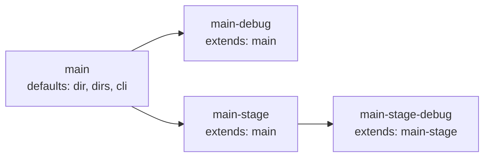

# services.yml

Service declarations for the devbox project.

## Contents

- [Purpose](#purpose)
- [Load behavior](#load-behavior)
- [Structure](#structure)
- [Field reference](#field-reference)
  - [Top-level service fields](#top-level-service-fields)
  - [`configs` field](#configs-field)
  - [`dirs` field](#dirs-field)
  - [`cli` block](#cli-block)
- [Inheritance via `extends`](#inheritance-via-extends)
- [Example: full service definition](#example-full-service-definition)
- [Common pitfalls](#common-pitfalls)
- [Related commands](#related-commands)

## Purpose

`devbox/services.yml` is the authoritative source for per-service structural config: container name, host directory, internal workdir, optional extensions, CLI execution defaults, config files, and additional hub directories.

It is loaded separately by `LoadServicesConfig()` and is not merged with the 3-layer config.

## Load behavior

- Loaded once at startup alongside the 3-layer config merge.
- Service inheritance via `extends:` is resolved in topological order (parents before children) so multi-level chains (`C → B → A`) merge correctly regardless of map iteration order. Cycles and unknown parents are reported as load errors.
- For each child, only zero-value fields are inherited from the parent; child fields take precedence on conflicts.
- The `dirs` field is deduplicated across parent and child (parent first, child appended).
- The `cli.env` map is recursively merged: parent provides defaults, child wins on key conflicts.
- After loading, `enabled` is resolved from the 3-layer merge (`services.<name>.enabled`); mandatory services force `enabled: true`. The result is then injected into `DevboxConfig.Raw["services"]` so dot-paths like `services.main.container` work in export rules and templates.

## Structure

```yaml
services:
  <service-key>:
    type: app
    container: <container-name>
    mandatory: true|false
    dir: ./services/<name>              # host-side hub directory
    dir_internal: /workspace            # container mount point
    work_dir_internal: /workspace/src   # workdir for exec/run
    extends: <parent-service-key>       # inherit parent fields
    depends_on:
      - <other-service-key>
    compose:
      - compose/services/<name>/overlay.yml
    configs:
      - <file>                          # shorthand: file copied to service configs dir
      - file: <src>
        mountpoint: <dest>              # explicit source and container path
    dirs:
      - logs
      - home
      - runtime
    cli:
      mode: auto|exec|run
      shell: bash
      user: www-data
      workdir: /workspace/src
      env:
        - KEY=value
```

## Field reference

### Top-level service fields

| Field | Type | Required | Description |
|-------|------|----------|-------------|
| `type` | string | no | Service type (currently always `app`) |
| `container` | string | yes | Docker container name |
| `mandatory` | bool | no | If true, service is always active; cannot be disabled via `defaults.yml` |
| `dir` | string | yes (non-extends) | Path to the service hub directory on the host |
| `dir_internal` | string | no | Container mount point for the hub |
| `work_dir_internal` | string | no | Default working directory for `exec`/`run` inside container |
| `extends` | string | no | Inherit fields from another service key |
| `depends_on` | list | no | Ordered dependency on other services (affects deploy order) |
| `compose` | list | no | Additional compose overlay files active when service is enabled |

### `configs` field

Lists config files that are copied into the service hub during deploy.

```yaml
configs:
  - .env                        # shorthand: copies src to configs/.env, mounts at default
  - file: .env
    mountpoint: src/.env        # explicit destination inside container
```

| Field | Description |
|-------|-------------|
| `file` (or shorthand string) | Source file name (relative to `configs/services/<service>/`) |
| `mountpoint` | Path relative to the service `dir` (e.g. `src/.env`) where the file is touched after copying. Used by the `service_configs_copy` builtin to create a stub for Docker Desktop virtiofs nested file bind mounts. Optional. |

The source directory `configs/services/<service>/` is owned by the project and committed to git; the destination `services/<service>/configs/` is created during deploy and is gitignored.

### `dirs` field

Additional directories to create inside the service hub directory beyond the mandatory `src` and `configs`.

```yaml
dirs:
  - logs
  - home
  - runtime
```

- Paths are relative to the service `dir` (e.g. `./services/main/logs`).
- Mandatory dirs (`src`, `configs`) are always created and are not listed here.
- When a service `extends` another, the child's `dirs` are appended to the parent's (deduplicated, parent first).
- Used by the `service_dirs_ensure` builtin during deploy.

### `cli` block

Controls how `devbox shell` and CLI execution behave for this service.

```yaml
cli:
  mode: auto        # auto | exec | run
  shell: bash
  user: www-data
  workdir: /workspace/src
  env:
    - XDEBUG_CONFIG="cli_color=1"
```

| Field | Default | Description |
|-------|---------|-------------|
| `mode` | `auto` | `auto` = exec when running, run when absent, error when stopped; `exec` = always `docker exec` (error if not running); `run` = always `docker compose run --rm` |
| `shell` | `bash` | Shell binary to invoke inside the container |
| `user` | current UID | User to run as inside the container |
| `workdir` | `work_dir_internal` (then `dir_internal`) | Working directory for the shell session |
| `env` | — | Extra env vars injected into the shell session |

CLI flags override `cli` config. Priority order (highest first): `--root`/`--user`/`--shell`/`--env` flags → `cli` config → built-in defaults.

#### `cli.env` map vs list form

`cli.env` accepts either YAML map or list-of-`KEY=VALUE` form; both produce the same internal map and are interchangeable.

```yaml
# Map form
cli:
  env:
    XDEBUG_CONFIG: "cli_color=1"
    PHP_IDE_CONFIG: serverName=devbox

# List form
cli:
  env:
    - XDEBUG_CONFIG="cli_color=1"
    - PHP_IDE_CONFIG=serverName=devbox
```

The list form is convenient when copy-pasting from a `.env` file; the map form is friendlier for inheriting and overriding individual keys via `extends:`.

## Inheritance via `extends`

A child service inherits all fields from the named parent. The child then overrides only the fields it declares. Multi-level chains are supported and resolved in topological order — a grandchild gets the parent's defaults indirectly via its direct parent.



Resolution rules:

- Scalar fields (`type`, `dir`, `dir_internal`, `work_dir_internal`, `cli.mode`, `cli.shell`, `cli.user`, `cli.workdir`) — child wins when set, parent fills in only when child's value is empty.
- `dirs` — parent's list comes first; child entries are appended; duplicates are removed (parent order preserved).
- `configs` — child wholly replaces parent when set (child has its own list); parent's list is used only when child omits the key.
- `cli.env` — recursive map merge: parent provides defaults, child overrides per key.
- `container`, `mandatory`, `compose`, `depends_on` — never inherited. A child that omits `container` keeps an empty value, which is rejected at runtime; declare it explicitly. The same applies to `compose` and `depends_on`: each child specifies its own.

```yaml
services:
  main:
    container: app-main
    mandatory: true
    dir: ./services/main
    dirs: [logs, home, runtime]
    cli:
      shell: bash
      user: www-data

  main-debug:
    extends: main            # inherits dir, dirs, cli, etc.
    container: app-main-debug
    mandatory: false
    compose:
      - compose/services/main/debug.yml
    cli:
      env:
        - XDEBUG_CONFIG="cli_color=1"
```

`main-debug` gets `dir`, `dirs`, and base `cli` fields from `main`, and adds its own `compose` overlay and extra env.

## Example: full service definition

```yaml
services:
  main:
    type: app
    container: app-main
    mandatory: true
    dir: ./services/main
    dir_internal: /workspace
    work_dir_internal: /workspace/src
    configs:
      - .env
    dirs:
      - logs
      - home
      - runtime
    cli:
      mode: auto
      shell: bash
      user: www-data
      workdir: /workspace/src
```

## Common pitfalls

- **Editing `dir` in `extends` child** — a child that sets `dir` completely replaces the parent's `dir` (not merged). This is intentional for services that live in a different host directory.
- **Absolute paths in `dirs`** — dirs entries must be relative paths. Absolute paths or paths containing `..` are rejected by `service_dirs_ensure` as a security check.
- **Missing `container` in child** — `container` is **not** inherited via `extends:`. A child without an explicit `container` carries an empty value, which fails at runtime. Always declare `container` per service.
- **Forgetting `compose:` and `depends_on:` on a child** — also not inherited. Optional services that need their own overlay or dependency must declare it explicitly.

## Related commands

- `devbox shell [service]` — open shell in service container
- `devbox services list` — list all services with status
- `devbox services enable/disable <service>` — toggle optional services
- `devbox deploy run` — runs the full deploy pipeline, including `service_dirs_ensure` in the setup phase
