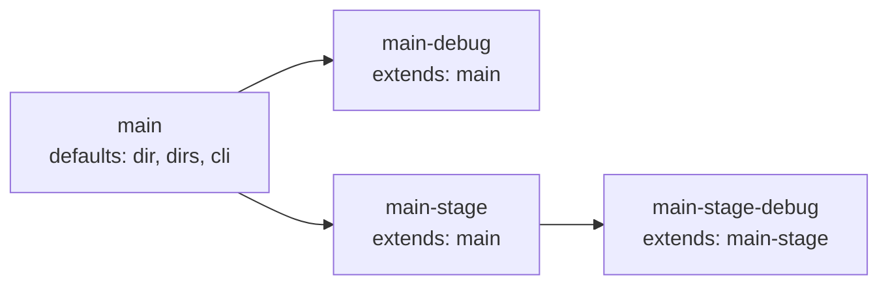

# services.yml

Service declarations for the devbox project.

## Contents

- [Purpose](#purpose)
- [Service types](#service-types)
- [Per-type field allowlist](#per-type-field-allowlist)
- [Load behavior](#load-behavior)
- [Structure](#structure)
- [Field reference](#field-reference)
  - [Top-level service fields](#top-level-service-fields)
  - [`ports` field](#ports-field)
  - [`hosts` field](#hosts-field)
  - [`configs` field](#configs-field)
  - [`dirs` field](#dirs-field)
  - [`cli` block](#cli-block)
  - [`status` block](#status-block)
  - [`render` block](#render-block)
- [Inheritance via `extends`](#inheritance-via-extends)
- [Example: full service definition](#example-full-service-definition)
- [Common pitfalls](#common-pitfalls)
- [Related commands](#related-commands)

## Purpose

`devbox/services.yml` is the single authoritative source for every container the project orchestrates — apps (with deploy lifecycle), tools (ephemeral utility UIs), and infra (databases, caches, queues). Each entry declares its container name, ports, hosts, compose overlay, and optional structural fields. The `type:` discriminator selects which fields are legal for the entry.

It is loaded separately by `LoadServicesConfig()` with strict decoding (`KnownFields(true)`) and is not merged with the 3-layer config. Per-developer toggles live under `services.<name>.enabled` in the 3-layer overlay.

## Service types

Every entry under `services:` requires a `type:` key. Three values are supported:

| `type:` | Semantics | Deploy lifecycle | `depends_on:` target | App-only fields |
|---------|-----------|------------------|----------------------|-----------------|
| `app`   | Service with source code under `dir:`; renders IDE/AI/git templates; runs through `devbox deploy`. | yes (a `devbox/deploy/<name>.yml` may exist) | yes | yes (`dir`, `dir_internal`, `work_dir_internal`, `configs`, `dirs`, `extends`, `cli`, `render`) |
| `tool`  | Ephemeral utility container (adminer, mailpit, redis-insight). Cannot be a dependency target of any service. | no | **no** | no |
| `infra` | Backing service (db, cache, queue, search). Can be a dependency target of `app` / other `infra`. | no | yes | no |

Locked rules:

- `extends:` is **app-only**. A `tool` / `infra` entry with `extends:` is rejected at load.
- `depends_on:` may not reference a `type: tool` entry. This is enforced at load (`ErrDependsOnTool`), not only at validate time.
- `devbox/deploy/<name>.yml` is **app-only**. A deploy file whose stem matches a `tool` / `infra` entry (or no declared service at all) is rejected at load (`ErrDeployFileForNonApp`).
- `ports:` is always `map[string]int` and `hosts:` is always `map[string]string`. There is no `port:` / `host:` scalar shorthand. A single-port entry writes `ports: { http: 8025 }`.
- Type semantics also filter `devbox deploy` enumeration to `app` only and partition `docker compose` file emission to `tool → infra → app` order.

## Per-type field allowlist

| Field             | `app` | `tool` | `infra` |
|-------------------|:-----:|:------:|:-------:|
| `type`            |   ✓   |   ✓    |    ✓    |
| `container`       |   ✓   |   ✓    |    ✓    |
| `mandatory`       |   ✓   |   ✓    |    ✓    |
| `compose`         |   ✓   |   ✓    |    ✓    |
| `ports`           |   ✓   |   ✓    |    ✓    |
| `hosts`           |   ✓   |   ✓    |    ✓    |
| `depends_on`      |   ✓   |   —    |    ✓    |
| `status`          |   ✓   |   ✓    |    ✓    |
| `dir`             |   ✓   |   —    |    —    |
| `dir_internal`    |   ✓   |   —    |    —    |
| `work_dir_internal` | ✓   |   —    |    —    |
| `configs`         |   ✓   |   —    |    —    |
| `dirs`            |   ✓   |   —    |    —    |
| `extends`         |   ✓   |   —    |    —    |
| `cli`             |   ✓   |   —    |    —    |
| `render`          |   ✓   |   —    |    —    |

A disallowed field is a hard load error (`ErrServiceFieldNotAllowed`). Validation aggregates per-file violations via `errors.Join` so a single parse pass surfaces every issue at once.

## Load behavior

- Loaded once at startup alongside the 3-layer config merge. Strict-decoded — unknown / per-type-disallowed fields are hard errors.
- Service inheritance via `extends:` is resolved in topological order (parents before children) so multi-level chains (`C → B → A`) merge correctly regardless of map iteration order. Cycles and unknown parents are reported as load errors. `extends:` is **app-only**.
- For each child, only zero-value fields are inherited from the parent; child fields take precedence on conflicts. Inherited slices / maps are defensively copied (`slices.Clone` / `maps.Clone`) so mutating a child never corrupts the parent.
- The `dirs` field is deduplicated across parent and child (parent first, child appended). `cli.env` is recursively merged: parent provides defaults, child wins on key conflicts.
- After loading, `enabled` is resolved from the 3-layer merge (`services.<name>.enabled`); mandatory services force `enabled: true`.
- Overlays under `services.<name>` may set **only** `enabled:`, `ports:`, and `hosts:`. Any other field there is a layer-aware overlay error — structural fields (`container`, `dir`, `configs`, `compose`, `extends`, …) belong in `devbox/services.yml`. The overlay validator also enforces shape: `ports:` must be a map of name → integer in `1..65535`; `hosts:` must be a map of name → string.
- `ports:` and `hosts:` are **deep-merged by entry name** on top of the declared map: a per-developer override under `devbox/local.yml` only touches the listed keys; declared entries the overlay does not mention are preserved. New entries may also be introduced via overlay. This is a first-class devbox feature: developers routinely need to remap a port that clashes with something already bound on their host, or switch their `*.local` hostname, without editing the shared `devbox/services.yml`.
- Each resolved service (including the post-overlay `ports` / `hosts` nested maps) is injected into `DevboxConfig.Raw["services"]` so dot-paths like `services.main.ports.http` and `services.adminer.hosts.web` resolve in export rules, `docker.yml` templates, command `default_from:`, and `info.yml` references.
- Port values are bounded `1..65535` at load time (both in `services.yml` and in overlay layers).

Example: a developer whose host already binds 8027 remaps adminer locally without touching the shared config —

```yaml
# devbox/local.yml (not tracked by git)
services:
  adminer:
    ports:
      http: 9027        # overrides declared 8027
  main:
    hosts:
      api: api.dev.local   # adds a new entry; web stays as declared
```

## Structure

```yaml
services:
  # type: app — owns source under dir:, has deploy lifecycle, renders templates
  main:
    type: app
    container: app-main
    mandatory: true
    dir: ./services/main
    dir_internal: /workspace
    work_dir_internal: /workspace/src
    extends: <parent-app-key>           # app-only
    depends_on: [db, redis]             # may target app or infra (never tool)
    ports:
      http: 80
    hosts:
      web: app.localhost
    compose:
      - compose/services/main/overlay.yml
    configs:
      - file: .env
        mountpoint: src/.env
    dirs: [logs, home, runtime]
    cli:
      mode: auto|exec|run
      shell: bash
      user: www-data
      workdir: /workspace/src
      env:
        - KEY=value
    render:
      ide:    { enabled: true, template: <pack> }
      ai:     { enabled: true, template: <pack> }
      git:    { enabled: true, template: <pack> }

  # type: infra — backing service, may be a depends_on target
  db:
    type: infra
    container: db
    mandatory: true
    ports:
      mysql: 13306

  # type: tool — ephemeral utility container, never a depends_on target
  adminer:
    type: tool
    container: adminer
    compose:
      - compose/tools/adminer.yml
    ports:
      http: 8027
    hosts:
      web: db.localhost
```

## Field reference

### Top-level service fields

| Field | Type | Required | Allowed for | Description |
|-------|------|----------|-------------|-------------|
| `type` | string | yes | app / tool / infra | Discriminator — selects the field allowlist for this entry. |
| `container` | string | yes | all | Docker container name. |
| `mandatory` | bool | no | all | When true, the service is always enabled; the overlay cannot disable it. |
| `compose` | list | no | all | Additional compose overlay files activated when the service is enabled. |
| `ports` | `map[string]int` | no | all | Named container ports. See [`ports` field](#ports-field). |
| `hosts` | `map[string]string` | no | all | Named hostnames. See [`hosts` field](#hosts-field). |
| `depends_on` | list | no | app / infra | Ordered dependency on other services (affects deploy order). A `type: tool` target is rejected at load. |
| `status` | list | no | all | Custom columns for the per-type `devbox status apps` / `tools` / `infra` table — see [`status` block](#status-block). |
| `dir` | string | yes (non-extends) | **app** | Path to the service hub directory on the host. |
| `dir_internal` | string | no | **app** | Container mount point for the hub. |
| `work_dir_internal` | string | no | **app** | Default working directory for `exec`/`run` inside the container. |
| `extends` | string | no | **app** | Inherit fields from another `type: app` entry. Cross-type extends is rejected. |
| `configs` | list | no | **app** | See [`configs` field](#configs-field). |
| `dirs` | list | no | **app** | Extra hub-relative directories — see [`dirs` field](#dirs-field). |
| `cli` | block | no | **app** | `devbox shell` defaults — see [`cli` block](#cli-block). |
| `render` | block | no | **app** | Nested template-render policy — see [`render` block](#render-block). |

### `ports` field

`ports:` is always a map from a port name to a container port. Single-port services need a chosen name (recommendation: `http` for web, `tcp` for raw TCP, role-specific like `mysql` / `amqp` for infra). Port values are defined here in `devbox/services.yml`; `devbox/local.yml` overlays may only toggle `enabled:` — per-developer port changes are not supported.

```yaml
services:
  rabbitmq:
    type: infra
    container: rabbitmq
    ports:
      amqp: 5672
      admin: 15672
```

Values are bounded `1..65535` at load time. Scalar shapes (`ports: 80`, `ports: "80"`) are rejected with `ErrServicePortsShape`.

### `hosts` field

`hosts:` is always a map from a host name to a hostname. Symmetric with `ports`. A single hostname is conventionally `web`.

```yaml
services:
  main:
    type: app
    hosts:
      web: app.localhost
```

Host values are defined here in `devbox/services.yml`; `devbox/local.yml` overlays may only toggle `enabled:` — per-developer host changes are not supported.

### `configs` field

Lists config files that are copied into the service hub during deploy.

```yaml
configs:
  - .env                        # shorthand: copies src to configs/.env, mounts at default
  - file: .env
    mountpoint: src/.env        # explicit destination inside container
```

| Field | Description |
|-------|-------------|
| `file` (or shorthand string) | Source file name (relative to `configs/services/<service>/`) |
| `mountpoint` | Path relative to the service `dir` (e.g. `src/.env`) where the file is touched after copying. Used by the `service_configs_copy` builtin to create a stub for Docker Desktop virtiofs nested file bind mounts. Optional. |

The source directory `configs/services/<service>/` is owned by the project and committed to git; the destination `services/<service>/configs/` is created during deploy and is gitignored.

### `dirs` field

Additional directories to create inside the service hub directory beyond the mandatory `src` and `configs`.

```yaml
dirs:
  - logs
  - home
  - runtime
```

- Paths are relative to the service `dir` (e.g. `./services/main/logs`).
- Mandatory dirs (`src`, `configs`) are always created and are not listed here.
- When a service `extends` another, the child's `dirs` are appended to the parent's (deduplicated, parent first).
- Used by the `service_dirs_ensure` builtin during deploy.

### `cli` block

Controls how `devbox shell` and CLI execution behave for this service.

```yaml
cli:
  mode: auto        # auto | exec | run
  shell: bash
  user: www-data
  workdir: /workspace/src
  env:
    - XDEBUG_CONFIG="cli_color=1"
```

| Field | Default | Description |
|-------|---------|-------------|
| `mode` | `auto` | `auto` = exec when running, run when absent, error when stopped; `exec` = always `docker exec` (error if not running); `run` = always `docker compose run --rm` |
| `shell` | `bash` | Shell binary to invoke inside the container |
| `user` | current UID | User to run as inside the container |
| `workdir` | `work_dir_internal` (then `dir_internal`) | Working directory for the shell session |
| `env` | — | Extra env vars injected into the shell session |

CLI flags override `cli` config. Priority order (highest first): `--root`/`--user`/`--shell`/`--env` flags → `cli` config → built-in defaults.

#### `cli.env` map vs list form

`cli.env` accepts either YAML map or list-of-`KEY=VALUE` form; both produce the same internal map and are interchangeable.

```yaml
# Map form
cli:
  env:
    XDEBUG_CONFIG: "cli_color=1"
    PHP_IDE_CONFIG: serverName=devbox

# List form
cli:
  env:
    - XDEBUG_CONFIG="cli_color=1"
    - PHP_IDE_CONFIG=serverName=devbox
```

The list form is convenient when copy-pasting from a `.env` file; the map form is friendlier for inheriting and overriding individual keys via `extends:`.

### `status` block

Optional list of custom columns appended to the type-specific status table — `devbox status apps` for `type: app`, `devbox status tools` for `type: tool`, `devbox status infra` for `type: infra` (and the default `devbox status` composite). Each entry declares a column name and a hermetic Go template that is evaluated per row against the merged config.

```yaml
services:
  main:
    type: app
    container: app-main
    dir: ./services/main
    status:
      - name: CONTAINER
        value: "{{ .ServiceCfg.Container }}"
      - name: TAG
        value: "{{ .Globals.baseImageTag }}"
```

| Field | Type | Required | Description |
|-------|------|----------|-------------|
| `name` | string | yes | Column header (uppercased in the rendered table). |
| `value` | string | yes | Go template evaluated via `tpl.Render`. Hermetic — no env / FS / network access. |

**Template data contract** (Go templates are case-sensitive):

| Path | Source | Casing |
|------|--------|--------|
| `.ServiceCfg.<Field>` | typed `ServiceConfig` for this row's service | PascalCase Go field names (`.ServiceCfg.Container`, `.ServiceCfg.Dir`) |
| `.Globals.<key>` | `cfg.Raw["globals"]` if present, else `nil` | lowercase YAML keys (`.Globals.baseImageTag`) |
| `.Raw.<key>...` | full `cfg.Raw` map | lowercase YAML keys (`.Raw.services.main.ports.http`, `.Raw.project.name`) |

The data root has only those three keys — there are no `.Project` / `.Runtime` aliases at the root. Drill into `.Raw.project.*`, `.Raw.runtime.*`, `.Raw.services.*` instead.

**Failure handling**: a template that errors out renders as `—` in the table and contributes to a single aggregated warning (`warning: N custom status expression(s) failed to render`) on stderr. The command still exits 0.

**Column ordering**: within a single type-keyed status section (apps / tools / infra), when multiple services declare overlapping columns the column order in the rendered table is "first appearance" during deterministic alphabetical iteration over services of that type. Services declaring fewer columns leave missing cells as `—`.

### `render` block

Nested block controlling whether and how rendering generates files for this service from template packs. Contains three sub-blocks: `ide`, `ai`, and `git`, each with the same structure.

#### `render.ide` block

Controls whether and how IDE rendering generates config files for this service from template packs.

```yaml
render:
  ide:
    enabled: true          # opt in to IDE rendering for this service
    template: main-debug   # use custom template pack
```

| Field | Default | Description |
|-------|---------|-------------|
| `enabled` | `true` for `type: app`; `false` otherwise | Include this service in IDE rendering. `devbox render ide` respects this setting; see **Activation** below. |
| `template` | — | Optional custom template pack directory name. Must be a single directory key under `devbox/templates/ide/` (no path separators, no `..`, no absolute paths, no leading `.`). If omitted, rendering falls back to service-name-specific then global packs. Explicit packs are strict: a typo will fail rather than silently using a fallback. |

#### IDE activation rules

IDE rendering requires **both** activation and policy conditions:

1. **Project activation**: The service must be enabled at the project level (via the 3-layer config merge; mandatory services are always enabled).
2. **IDE policy**: The `render.ide.enabled` setting must be `true`.

A service is rendered only if both are satisfied. Disabling either suppresses rendering.

**Default policy**: `type: app` services default to `render.ide.enabled: true` (opt-out); `tool` / `infra` cannot carry a `render:` block at all (per-type field allowlist). To render IDE files for a non-app service, the service must be retyped — there is no per-pack escape hatch.

#### Template pack resolution

`devbox render ide` searches for template packs in this order; the first match is used:

1. `devbox/templates/ide/<template>/` (if `template` is set) — **strict**: pack must exist or rendering fails
2. `devbox/templates/ide/<service-name>/` (if `template` is not set)
3. `devbox/templates/ide/default/` (final fallback)

When an explicit `template:` is specified and the pack is not found, rendering fails with an error (catches typos). When no explicit template is set and the implicit chain exhausts without finding a pack, rendering is skipped with a warning.

Once a pack is selected, the command reads the pack's `manifest.yml` to determine what files to render and what symlinks to create. The manifest declares:

- `render`: source template files (must end in `.tmpl`) and their destination paths
- `symlinks`: relative symlinks to create inside the service directory (optional)

All destinations are relative to the service directory (e.g. `services/main/`). Nested paths are allowed (e.g. `.devcontainer/devcontainer.json`).

This manifest-based model lets you add support for any IDE or tool (`.cursor/`, `.zed/`, `.envrc`, etc.) without modifying the code — add the template files and declare them in `manifest.yml`.

#### Collision resolution

When multiple services share the same `dir` (e.g., `main` and `main-debug` both pointing to `./services/main`), only the most-derived service (deepest in the `extends` chain) renders IDE files. The others are reported as skipped with a collision warning.

The explicit positional form `devbox render ide <service>` treats the argument as a **hub anchor**: it is validated as a real service, but then resolved through the same collision policy. So `devbox render ide main` actually renders `main-debug` whenever `main-debug` is enabled — useful from per-service deploy pipelines, which pass the canonical service name and expect the variant-aware result.

```yaml
services:
  main:
    type: app
    dir: ./services/main
    # render.ide.enabled defaults to true

  main-debug:
    type: app
    extends: main      # same dir as parent
    dir: ./services/main
    render:
      ide:
        template: main-debug  # use a different template pack
    # IDE files go to ./services/main/ with content from main-debug pack
    # (main-debug wins because it extends main)
```

In this example, `devbox render ide` produces files in `./services/main/` using the `main-debug` template pack, and emits a warning that `main` was skipped due to collision.

#### Worked example: template pack layout

This example shows how template packs are organized and the resulting files generated in the service directory.

**Project structure:**

```
devbox/services.yml
devbox/templates/ide/
  default/
    manifest.yml
    .devcontainer/devcontainer.json.tmpl
    .vscode/settings.json.tmpl
  main-debug/
    manifest.yml
    .devcontainer/devcontainer.json.tmpl
    .vscode/settings.json.tmpl
    .vscode/launch.json.tmpl
```

**Service definitions (devbox/services.yml):**

```yaml
services:
  main:
    type: app
    dir: ./services/main
    # render.ide.enabled defaults to true; renders using default pack

  main-debug:
    extends: main
    container: app-main-debug
    dir: ./services/main
    render:
      ide:
        template: main-debug  # override to use main-debug pack
```

**After `devbox render ide`:**

```
services/main/
  .devcontainer/
    devcontainer.json    ← rendered from main-debug/.devcontainer/devcontainer.json.tmpl
  .vscode/
    settings.json        ← rendered from main-debug/.vscode/settings.json.tmpl
    launch.json          ← rendered from main-debug/.vscode/launch.json.tmpl
```

Note that `main` is skipped due to collision (same `dir` as `main-debug`), so only `main-debug`'s template pack is rendered.

#### `render.ai` block

Controls whether and how agentic documentation rendering generates hub-level docs for this service from template packs.

```yaml
render:
  ai:
    enabled: true          # opt in to agent docs rendering for this service
    template: custom-docs  # use custom template pack
```

| Field | Default | Description |
|-------|---------|-------------|
| `enabled` | `true` (for all service types) | Include this service in `devbox render ai` output. When `true`, agent-oriented documentation is generated in the service hub. |
| `template` | — | Optional custom template pack directory name. Must be a single directory key under `devbox/templates/ai/` (no path separators, no `..`, no absolute paths, no leading `.`). If omitted, rendering falls back to service-name-specific then default packs. Explicit packs are strict: a typo will fail rather than silently using a fallback. |

#### Agent docs activation rules

Agent docs rendering requires **both** activation and policy conditions:

1. **Project activation**: The service must be enabled at the project level (via the 3-layer config merge; mandatory services are always enabled).
2. **Agent docs policy**: The `render.ai.enabled` setting must be `true`.

A service is rendered only if both are satisfied. Disabling either suppresses rendering.

**Default policy**: All services default to `render.ai.enabled: true` (opt-out). Set `render.ai.enabled: false` to suppress agent docs generation for a service.

#### Template pack resolution

`devbox render ai` searches for template packs in this order; the first match is used:

1. `devbox/templates/ai/<template>/` (if `template` is set) — **strict**: pack must exist or rendering fails
2. `devbox/templates/ai/<service-name>/` (if `template` is not set)
3. `devbox/templates/ai/default/` (final fallback)

When an explicit `template:` is specified and the pack is not found, rendering fails with an error (catches typos). When no explicit template is set and the implicit chain exhausts without finding a pack, rendering is skipped with a warning.

Once a pack is selected, the command reads the pack's `manifest.yml` to determine what files to render and what symlinks to create. The manifest declares:

- `render`: source template files (must end in `.tmpl`) and their destination paths
- `symlinks`: relative symlinks to create inside the service hub (must reference outputs from `render`)

All destinations are relative to the service hub directory (e.g. `services/main/`). Nested paths are allowed (e.g. `.claude/CLAUDE.md`).

#### Collision resolution

When multiple services share the same `dir` (e.g., `main` and `main-debug` both pointing to `./services/main`), only the canonical hub owner — the **least-derived** service (shallowest in the `extends` chain) — renders agent docs. The rationale: agent docs describe the hub's identity, and when a child `extends` a parent and shares its `dir`, the parent owns the hub; the child is a runtime variant of the same workspace. The losing variants are reported as skipped with a collision warning.

The explicit positional form `devbox render ai <service>` treats the argument as a **hub anchor** (same as `render ide`): the argument is validated as a real service, then resolved through the collision policy. So `devbox render ai main-debug` still renders `main` whenever both are enabled — the variant resolves to the canonical hub owner.

(Note: this differs from `devbox render ide`, where the *deepest* extends chain wins because IDE configs are about per-variant overrides.)

#### Worked example: template pack layout

This example shows how agent template packs are organized and the resulting files generated in the service directory.

**Project structure:**

```
devbox/services.yml
devbox/templates/ai/
  default/
    manifest.yml
    AGENTS.md.tmpl
    .claude/CLAUDE.md.tmpl
```

**Manifest (`devbox/templates/ai/default/manifest.yml`):**

```yaml
render:
  - from: AGENTS.md.tmpl
    to: AGENTS.md
  - from: .claude/CLAUDE.md.tmpl
    to: .claude/CLAUDE.md

symlinks:
  - link: CLAUDE.md
    to: AGENTS.md
```

**Template example (`AGENTS.md.tmpl`):**

```markdown
# {{.Service}} Service Hub

This is the {{.Service}} service running inside a devbox-managed hub.
The application source code is at `src/`.

Service container: {{.ServiceCfg.Container}}
Workspace root: {{.ServiceCfg.DirInternal}}
```

**Service definitions (devbox/services.yml):**

```yaml
services:
  main:
    type: app
    dir: ./services/main
    # render.ai.enabled defaults to true; renders using default pack
```

**After `devbox render ai`:**

```
services/main/
  AGENTS.md          ← rendered from AGENTS.md.tmpl
  CLAUDE.md          ← symlink to AGENTS.md
  .claude/
    CLAUDE.md        ← rendered from .claude/CLAUDE.md.tmpl
```

#### `render.git` block

Controls whether and how shell git hooks are rendered into the service's `src/.git/hooks/` directory from template packs.

```yaml
render:
  git:
    enabled: true          # opt in to git hooks rendering for this service
    template: custom-hooks # use custom template pack
```

| Field | Default | Description |
|-------|---------|-------------|
| `enabled` | `true` for `type: app`; `false` otherwise | Include this service in `devbox render git` output. Mirrors the `render.ide` default policy. |
| `template` | — | Optional custom template pack directory name. Must be a single directory key under `devbox/templates/git/` (no path separators, no `..`, no absolute paths, no leading `.`). If omitted, rendering falls back to service-name-specific then `default` packs. Explicit packs are strict: a typo will fail rather than silently using a fallback. |

`extends` inheritance for `render.git.enabled` and `render.git.template` follows the same rules as `render.ide` and `render.ai`: child explicit values override the parent's; omitted values inherit. Collision resolution on shared `dir` uses **deepest-extends-wins** (same as `render.ide`).

Hooks are written to `<svc.Dir>/src/.git/hooks/<basename>` with mode `0755`. Services whose `src/.git` is missing (no git checkout) or is a file (worktree/submodule pointer) are skipped with a warning. See [render git](../render/git.md) for the full reference, manifest schema, and examples.

## Inheritance via `extends`

A child service inherits all fields from the named parent. The child then overrides only the fields it declares. Multi-level chains are supported and resolved in topological order — a grandchild gets the parent's defaults indirectly via its direct parent.



Resolution rules:

- Scalar fields (`type`, `dir`, `dir_internal`, `work_dir_internal`, `cli.mode`, `cli.shell`, `cli.user`, `cli.workdir`) — child wins when set, parent fills in only when child's value is empty.
- `dirs` — parent's list comes first; child entries are appended; duplicates are removed (parent order preserved).
- `configs` — child wholly replaces parent when set (child has its own list); parent's list is used only when child omits the key.
- `cli.env` — recursive map merge: parent provides defaults, child overrides per key.
- `render.ide.enabled`, `render.ide.template`, `render.ai.enabled`, `render.ai.template`, `render.git.enabled`, and `render.git.template` — inherited like scalar fields. Child's explicit `enabled: true|false` or non-empty `template` override the parent's; omitted values inherit from parent. This allows grandchildren to inherit settings indirectly.
- `container`, `mandatory`, `compose`, `depends_on` — never inherited. A child that omits `container` keeps an empty value, which is rejected at runtime; declare it explicitly. The same applies to `compose` and `depends_on`: each child specifies its own.

```yaml
services:
  main:
    container: app-main
    mandatory: true
    dir: ./services/main
    dirs: [logs, home, runtime]
    cli:
      shell: bash
      user: www-data
    render:
      ide:
        enabled: true

  main-debug:
    extends: main            # inherits dir, dirs, cli, render, etc.
    container: app-main-debug
    mandatory: false
    compose:
      - compose/services/main/debug.yml
    cli:
      env:
        - XDEBUG_CONFIG="cli_color=1"
    render:
      ide:
        template: main-debug  # override template, keep enabled: true from parent
```

`main-debug` gets `dir`, `dirs`, base `cli`, and `render.ide.enabled: true` from `main`. It overrides `render.ide.template` to use a custom template subdirectory (`devbox/templates/ide/main-debug/`), and adds its own `compose` overlay and extra env. When `devbox render ide` runs, both services share `dir: ./services/main`, so the most-derived (`main-debug`) wins and renders its custom template; `main` is skipped with a collision warning.

## Example: full service definition

```yaml
services:
  main:
    type: app
    container: app-main
    mandatory: true
    dir: ./services/main
    dir_internal: /workspace
    work_dir_internal: /workspace/src
    configs:
      - .env
    dirs:
      - logs
      - home
      - runtime
    cli:
      mode: auto
      shell: bash
      user: www-data
      workdir: /workspace/src
    render:
      ide:
        enabled: true
      ai:
        enabled: true
```

## Common pitfalls

- **Editing `dir` in `extends` child** — a child that sets `dir` completely replaces the parent's `dir` (not merged). This is intentional for services that live in a different host directory.
- **Absolute paths in `dirs`** — dirs entries must be relative paths. Absolute paths or paths containing `..` are rejected by `service_dirs_ensure` as a security check.
- **Missing `container` in child** — `container` is **not** inherited via `extends:`. A child without an explicit `container` carries an empty value, which fails at runtime. Always declare `container` per service.
- **Forgetting `compose:` and `depends_on:` on a child** — also not inherited. Optional services that need their own overlay or dependency must declare it explicitly.
- **`render:` block under a `tool` / `infra` service** — the `render:` block is app-only. Tool / infra entries that declare it fail to load. To attach a template pack to a non-app service it must first be retyped to `app` (with the prerequisite `dir:`).
- **Pre-existing non-symlink at a managed symlink path** — if `CLAUDE.md` (or another `symlinks[].link` path) already exists as a regular file, `devbox render ai` refuses to overwrite it and exits with an error: `refuse to overwrite non-symlink file at <path>; remove it or disable via render.ai.enabled: false`. Delete the file first, or set `render.ai.enabled: false` for that service.

## Related commands

- `devbox shell [service]` — open shell in a service container (`type: app` only).
- `devbox status` — composite read-only view: apps + tools + infra sections, each with custom `status:` columns.
- `devbox status apps` / `devbox status tools` / `devbox status infra` — per-type tables.
- `devbox services` — interactive multi-select toggle for every optional service across all types.
- `devbox services enable <name>` / `devbox services disable <name>` — toggle by name (type looked up internally).
- `devbox deploy run` — runs the full deploy pipeline; enumerates `type: app` services only.
