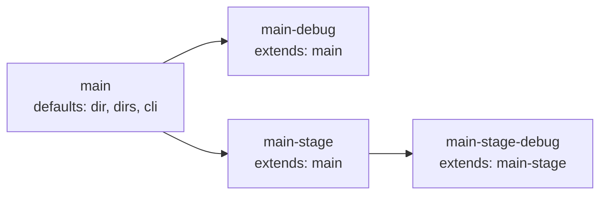

# services.yml

Service declarations for the devbox project.

## Contents

- [Purpose](#purpose)
- [Load behavior](#load-behavior)
- [Structure](#structure)
- [Field reference](#field-reference)
  - [Top-level service fields](#top-level-service-fields)
  - [`configs` field](#configs-field)
  - [`dirs` field](#dirs-field)
  - [`cli` block](#cli-block)
  - [`ide` block](#ide-block)
  - [`ai_docs` block](#ai_docs-block)
- [Inheritance via `extends`](#inheritance-via-extends)
- [Example: full service definition](#example-full-service-definition)
- [Common pitfalls](#common-pitfalls)
- [Related commands](#related-commands)

## Purpose

`devbox/services.yml` is the authoritative source for per-service structural config: container name, host directory, internal workdir, optional extensions, CLI execution defaults, config files, and additional hub directories.

It is loaded separately by `LoadServicesConfig()` and is not merged with the 3-layer config.

## Load behavior

- Loaded once at startup alongside the 3-layer config merge.
- Service inheritance via `extends:` is resolved in topological order (parents before children) so multi-level chains (`C → B → A`) merge correctly regardless of map iteration order. Cycles and unknown parents are reported as load errors.
- For each child, only zero-value fields are inherited from the parent; child fields take precedence on conflicts.
- The `dirs` field is deduplicated across parent and child (parent first, child appended).
- The `cli.env` map is recursively merged: parent provides defaults, child wins on key conflicts.
- After loading, `enabled` is resolved from the 3-layer merge (`services.<name>.enabled`); mandatory services force `enabled: true`. The result is then injected into `DevboxConfig.Raw["services"]` so dot-paths like `services.main.container` work in export rules and templates.

## Structure

```yaml
services:
  <service-key>:
    type: app
    container: <container-name>
    mandatory: true|false
    dir: ./services/<name>              # host-side hub directory
    dir_internal: /workspace            # container mount point
    work_dir_internal: /workspace/src   # workdir for exec/run
    extends: <parent-service-key>       # inherit parent fields
    depends_on:
      - <other-service-key>
    compose:
      - compose/services/<name>/overlay.yml
    configs:
      - <file>                          # shorthand: file copied to service configs dir
      - file: <src>
        mountpoint: <dest>              # explicit source and container path
    dirs:
      - logs
      - home
      - runtime
    cli:
      mode: auto|exec|run
      shell: bash
      user: www-data
      workdir: /workspace/src
      env:
        - KEY=value
    ide:
      enabled: true|false          # enable IDE rendering for this service
      template: <template-dir-name> # service-specific template directory
    ai_docs:
      enabled: true|false          # enable agentic docs rendering for this service
      template: <template-dir-name> # service-specific template directory
```

## Field reference

### Top-level service fields

| Field | Type | Required | Description |
|-------|------|----------|-------------|
| `type` | string | no | Service type (currently always `app`) |
| `container` | string | yes | Docker container name |
| `mandatory` | bool | no | If true, service is always active; cannot be disabled via `defaults.yml` |
| `dir` | string | yes (non-extends) | Path to the service hub directory on the host |
| `dir_internal` | string | no | Container mount point for the hub |
| `work_dir_internal` | string | no | Default working directory for `exec`/`run` inside container |
| `extends` | string | no | Inherit fields from another service key |
| `depends_on` | list | no | Ordered dependency on other services (affects deploy order) |
| `compose` | list | no | Additional compose overlay files active when service is enabled |
| `ide` | block | no | IDE rendering configuration (see [`ide` block](#ide-block)) |
| `ai_docs` | block | no | Agent docs rendering configuration (see [`ai_docs` block](#ai_docs-block)) |

### `configs` field

Lists config files that are copied into the service hub during deploy.

```yaml
configs:
  - .env                        # shorthand: copies src to configs/.env, mounts at default
  - file: .env
    mountpoint: src/.env        # explicit destination inside container
```

| Field | Description |
|-------|-------------|
| `file` (or shorthand string) | Source file name (relative to `configs/services/<service>/`) |
| `mountpoint` | Path relative to the service `dir` (e.g. `src/.env`) where the file is touched after copying. Used by the `service_configs_copy` builtin to create a stub for Docker Desktop virtiofs nested file bind mounts. Optional. |

The source directory `configs/services/<service>/` is owned by the project and committed to git; the destination `services/<service>/configs/` is created during deploy and is gitignored.

### `dirs` field

Additional directories to create inside the service hub directory beyond the mandatory `src` and `configs`.

```yaml
dirs:
  - logs
  - home
  - runtime
```

- Paths are relative to the service `dir` (e.g. `./services/main/logs`).
- Mandatory dirs (`src`, `configs`) are always created and are not listed here.
- When a service `extends` another, the child's `dirs` are appended to the parent's (deduplicated, parent first).
- Used by the `service_dirs_ensure` builtin during deploy.

### `cli` block

Controls how `devbox shell` and CLI execution behave for this service.

```yaml
cli:
  mode: auto        # auto | exec | run
  shell: bash
  user: www-data
  workdir: /workspace/src
  env:
    - XDEBUG_CONFIG="cli_color=1"
```

| Field | Default | Description |
|-------|---------|-------------|
| `mode` | `auto` | `auto` = exec when running, run when absent, error when stopped; `exec` = always `docker exec` (error if not running); `run` = always `docker compose run --rm` |
| `shell` | `bash` | Shell binary to invoke inside the container |
| `user` | current UID | User to run as inside the container |
| `workdir` | `work_dir_internal` (then `dir_internal`) | Working directory for the shell session |
| `env` | — | Extra env vars injected into the shell session |

CLI flags override `cli` config. Priority order (highest first): `--root`/`--user`/`--shell`/`--env` flags → `cli` config → built-in defaults.

#### `cli.env` map vs list form

`cli.env` accepts either YAML map or list-of-`KEY=VALUE` form; both produce the same internal map and are interchangeable.

```yaml
# Map form
cli:
  env:
    XDEBUG_CONFIG: "cli_color=1"
    PHP_IDE_CONFIG: serverName=devbox

# List form
cli:
  env:
    - XDEBUG_CONFIG="cli_color=1"
    - PHP_IDE_CONFIG=serverName=devbox
```

The list form is convenient when copy-pasting from a `.env` file; the map form is friendlier for inheriting and overriding individual keys via `extends:`.

### `ide` block

Controls whether and how IDE rendering generates config files for this service from template packs.

```yaml
ide:
  enabled: true          # opt in to IDE rendering for this service
  template: main-debug   # use custom template pack
```

| Field | Default | Description |
|-------|---------|-------------|
| `enabled` | `true` for `type: app`; `false` otherwise | Include this service in IDE rendering. `devbox render ide` respects this setting; see **Activation** below. |
| `template` | — | Optional custom template pack directory name. Must be a single directory key under `devbox/templates/ide/` (no path separators, no `..`, no absolute paths, no leading `.`). If omitted, rendering falls back to service-name-specific then global packs. Explicit packs are strict: a typo will fail rather than silently using a fallback. |

#### IDE activation rules

IDE rendering requires **both** activation and policy conditions:

1. **Project activation**: The service must be enabled at the project level (via the 3-layer config merge; mandatory services are always enabled).
2. **IDE policy**: The `ide.enabled` setting must be `true`.

A service is rendered only if both are satisfied. Disabling either suppresses rendering.

**Default policy**: `type: app` services default to `ide.enabled: true` (opt-out); all other types default to `false` (opt-in).

#### Template pack resolution

`devbox render ide` searches for template packs in this order; the first match is used:

1. `devbox/templates/ide/<template>/` (if `template` is set) — **strict**: pack must exist
2. `devbox/templates/ide/<service-name>/` (if `template` is not set)
3. `devbox/templates/ide/default/` (final fallback)

If none exist, rendering is skipped with an error.

Once a pack is selected, the command walks every `*.tpl` file in the pack and renders it to the matching relative path in the service directory. For example:

```
devbox/templates/ide/default/.devcontainer/devcontainer.json.tpl
→ services/main/.devcontainer/devcontainer.json

devbox/templates/ide/default/.vscode/settings.json.tpl
→ services/main/.vscode/settings.json
```

This pack-based model lets you add support for any IDE or tool (`.cursor/`, `.zed/`, `.envrc`, etc.) without modifying the code — just add the corresponding `*.tpl` file to your template pack.

#### Collision resolution

When multiple services share the same `dir` (e.g., `main` and `main-debug` both pointing to `./services/main`), only the most-derived service (deepest in the `extends` chain) renders IDE files. The others are reported as skipped with a collision warning.

```yaml
services:
  main:
    type: app
    dir: ./services/main
    # ide.enabled defaults to true

  main-debug:
    type: app
    extends: main      # same dir as parent
    dir: ./services/main
    ide:
      template: main-debug  # use a different template pack
    # IDE files go to ./services/main/ with content from main-debug pack
    # (main-debug wins because it extends main)
```

In this example, `devbox render ide` produces files in `./services/main/` using the `main-debug` template pack, and emits a warning that `main` was skipped due to collision.

#### Worked example: template pack layout

This example shows how template packs are organized and the resulting files generated in the service directory.

**Project structure:**

```
devbox/services.yml
devbox/templates/ide/
  default/
    .devcontainer/devcontainer.json.tpl
    .vscode/settings.json.tpl
  main-debug/
    .devcontainer/devcontainer.json.tpl
    .vscode/settings.json.tpl
    .vscode/launch.json.tpl
```

**Service definitions (devbox/services.yml):**

```yaml
services:
  main:
    type: app
    dir: ./services/main
    # ide.enabled defaults to true; renders using default pack

  main-debug:
    extends: main
    container: app-main-debug
    dir: ./services/main
    ide:
      template: main-debug  # override to use main-debug pack
```

**After `devbox render ide`:**

```
services/main/
  .devcontainer/
    devcontainer.json    ← rendered from main-debug/.devcontainer/devcontainer.json.tpl
  .vscode/
    settings.json        ← rendered from main-debug/.vscode/settings.json.tpl
    launch.json          ← rendered from main-debug/.vscode/launch.json.tpl
```

Note that `main` is skipped due to collision (same `dir` as `main-debug`), so only `main-debug`'s template pack is rendered.

### `ai_docs` block

Controls whether and how agentic documentation rendering generates hub-level docs for this service from template packs.

```yaml
ai_docs:
  enabled: true          # opt in to agent docs rendering for this service
  template: custom-docs  # use custom template pack
```

| Field | Default | Description |
|-------|---------|-------------|
| `enabled` | `true` (for all service types) | Include this service in `devbox render ai` output. When `true`, agent-oriented documentation is generated in the service hub. |
| `template` | — | Optional custom template pack directory name. Must be a single directory key under `devbox/templates/agents/` (no path separators, no `..`, no absolute paths, no leading `.`). If omitted, rendering falls back to service-name-specific then default packs. Explicit packs are strict: a typo will fail rather than silently using a fallback. |

#### Agent docs activation rules

Agent docs rendering requires **both** activation and policy conditions:

1. **Project activation**: The service must be enabled at the project level (via the 3-layer config merge; mandatory services are always enabled).
2. **Agent docs policy**: The `ai_docs.enabled` setting must be `true`.

A service is rendered only if both are satisfied. Disabling either suppresses rendering.

**Default policy**: All services default to `ai_docs.enabled: true` (opt-out). Set `enabled: false` to suppress agent docs generation for a service.

#### Template pack resolution

`devbox render ai` searches for template packs in this order; the first match is used:

1. `devbox/templates/agents/<template>/` (if `template` is set) — **strict**: pack must exist
2. `devbox/templates/agents/<service-name>/` (if `template` is not set)
3. `devbox/templates/agents/default/` (final fallback)

If none exist, rendering is skipped with an error.

Once a pack is selected, the command reads the pack's `manifest.yml` to determine what files to render and what symlinks to create. The manifest declares:

- `render`: source template files (must end in `.tmpl`) and their destination paths
- `symlinks`: relative symlinks to create inside the service hub (must reference outputs from `render`)

All destinations are relative to the service hub directory (e.g. `services/main/`). Nested paths are allowed (e.g. `.claude/CLAUDE.md`).

#### Collision resolution

When multiple services share the same `dir` (e.g., `main` and `main-debug` both pointing to `./services/main`), only the most-derived service (deepest in the `extends` chain) renders agent docs. The others are reported as skipped with a collision warning.

#### Worked example: template pack layout

This example shows how agent template packs are organized and the resulting files generated in the service directory.

**Project structure:**

```
devbox/services.yml
devbox/templates/agents/
  default/
    manifest.yml
    AGENTS.md.tmpl
    .claude/CLAUDE.md.tmpl
```

**Manifest (`devbox/templates/agents/default/manifest.yml`):**

```yaml
render:
  - from: AGENTS.md.tmpl
    to: AGENTS.md
  - from: .claude/CLAUDE.md.tmpl
    to: .claude/CLAUDE.md

symlinks:
  - link: CLAUDE.md
    to: AGENTS.md
```

**Template example (`AGENTS.md.tmpl`):**

```markdown
# {{.Service}} Service Hub

This is the {{.Service}} service running inside a devbox-managed hub.
The application source code is at `src/`.

Service container: {{.ServiceCfg.Container}}
Workspace root: {{.ServiceCfg.DirInternal}}
```

**Service definitions (devbox/services.yml):**

```yaml
services:
  main:
    type: app
    dir: ./services/main
    # ai_docs.enabled defaults to true; renders using default pack
```

**After `devbox render ai`:**

```
services/main/
  AGENTS.md          ← rendered from AGENTS.md.tmpl
  CLAUDE.md          ← symlink to AGENTS.md
  .claude/
    CLAUDE.md        ← rendered from .claude/CLAUDE.md.tmpl
```

## Inheritance via `extends`

A child service inherits all fields from the named parent. The child then overrides only the fields it declares. Multi-level chains are supported and resolved in topological order — a grandchild gets the parent's defaults indirectly via its direct parent.



Resolution rules:

- Scalar fields (`type`, `dir`, `dir_internal`, `work_dir_internal`, `cli.mode`, `cli.shell`, `cli.user`, `cli.workdir`) — child wins when set, parent fills in only when child's value is empty.
- `dirs` — parent's list comes first; child entries are appended; duplicates are removed (parent order preserved).
- `configs` — child wholly replaces parent when set (child has its own list); parent's list is used only when child omits the key.
- `cli.env` — recursive map merge: parent provides defaults, child overrides per key.
- `ide.enabled`, `ide.template`, `ai_docs.enabled`, and `ai_docs.template` — inherited like scalar fields. Child's explicit `enabled: true|false` or non-empty `template` override the parent's; omitted values inherit from parent. This allows grandchildren to inherit settings indirectly.
- `container`, `mandatory`, `compose`, `depends_on` — never inherited. A child that omits `container` keeps an empty value, which is rejected at runtime; declare it explicitly. The same applies to `compose` and `depends_on`: each child specifies its own.

```yaml
services:
  main:
    container: app-main
    mandatory: true
    dir: ./services/main
    dirs: [logs, home, runtime]
    cli:
      shell: bash
      user: www-data
    ide:
      enabled: true

  main-debug:
    extends: main            # inherits dir, dirs, cli, ide, etc.
    container: app-main-debug
    mandatory: false
    compose:
      - compose/services/main/debug.yml
    cli:
      env:
        - XDEBUG_CONFIG="cli_color=1"
    ide:
      template: main-debug  # override template, keep enabled: true from parent
```

`main-debug` gets `dir`, `dirs`, base `cli`, and `ide.enabled: true` from `main`. It overrides `ide.template` to use a custom template subdirectory (`devbox/templates/ide/main-debug/`), and adds its own `compose` overlay and extra env. When `devbox render ide` runs, both services share `dir: ./services/main`, so the most-derived (`main-debug`) wins and renders its custom template; `main` is skipped with a collision warning.

## Example: full service definition

```yaml
services:
  main:
    type: app
    container: app-main
    mandatory: true
    dir: ./services/main
    dir_internal: /workspace
    work_dir_internal: /workspace/src
    configs:
      - .env
    dirs:
      - logs
      - home
      - runtime
    cli:
      mode: auto
      shell: bash
      user: www-data
      workdir: /workspace/src
    ide:
      enabled: true
    ai_docs:
      enabled: true
```

## Common pitfalls

- **Editing `dir` in `extends` child** — a child that sets `dir` completely replaces the parent's `dir` (not merged). This is intentional for services that live in a different host directory.
- **Absolute paths in `dirs`** — dirs entries must be relative paths. Absolute paths or paths containing `..` are rejected by `service_dirs_ensure` as a security check.
- **Missing `container` in child** — `container` is **not** inherited via `extends:`. A child without an explicit `container` carries an empty value, which fails at runtime. Always declare `container` per service.
- **Forgetting `compose:` and `depends_on:` on a child** — also not inherited. Optional services that need their own overlay or dependency must declare it explicitly.
- **Non-`app` services no longer get IDE files by default** — Previously, `devbox render ide` rendered files for all enabled services regardless of type. Now only `type: app` services default to `ide.enabled: true`; other types (`db`, `cache`, `queue`, `tool`) default to `false`. If IDE rendering is needed for a non-`app` service, set `ide.enabled: true` explicitly. This is a breaking change; existing projects using IDE files for non-`app` services must be updated.
- **Pre-existing non-symlink at a managed symlink path** — if `CLAUDE.md` (or another `symlinks[].link` path) already exists as a regular file, `devbox render ai` refuses to overwrite it and exits with an error: `refuse to overwrite non-symlink file at <path>; remove it or disable via ai_docs.enabled: false`. Delete the file first, or set `ai_docs.enabled: false` for that service.

## Related commands

- `devbox shell [service]` — open shell in service container
- `devbox services list` — list all services with status
- `devbox services enable/disable <service>` — toggle optional services
- `devbox deploy run` — runs the full deploy pipeline, including `service_dirs_ensure` in the setup phase
