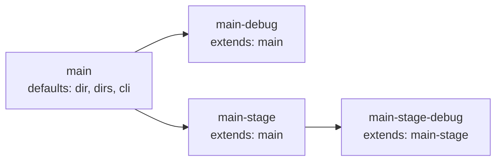

# Inheritance via `extends`

A child `type: app` service inherits all fields from the named parent. The child then overrides only the fields it declares. Multi-level chains are supported and resolved in topological order — a grandchild gets the parent's defaults indirectly via its direct parent.

## Contents

- [App-only guard](#app-only-guard)
- [Resolution rules](#resolution-rules)
- [Topological sort](#topological-sort)
- [Worked example](#worked-example)

## App-only guard

`extends:` is rejected at load on any `type: tool` or `type: infra` entry. The discriminator is enforced before merge so cross-type chains never resolve.



## Resolution rules

- Scalar fields (`dir`, `dir_internal`, `work_dir_internal`, `cli.mode`, `cli.shell`, `cli.user`, `cli.workdir`) — child wins when set, parent fills in only when child's value is empty. `type` is required in every `service.yml` and is never inherited.
- `dirs` — parent's list comes first; child entries are appended; duplicates are removed (parent order preserved).
- `configs` — child wholly replaces parent when set (child has its own list); parent's list is used only when child omits the key.
- `cli.env` — recursive map merge: parent provides defaults, child overrides per key.
- `render.ide.enabled`, `render.ide.template`, `render.ai.enabled`, `render.ai.template`, `render.git.enabled`, and `render.git.template` — inherited like scalar fields. Child's explicit `enabled: true|false` or non-empty `template` override the parent's; omitted values inherit from parent. This allows grandchildren to inherit settings indirectly.
- `compose` — inherited when the child declares no `compose:` list of its own (parent's list is cloned); the child's own list wholly replaces the parent's, not merged.
- `container`, `required`, `depends_on` — never inherited. A child that omits `container` defaults to its service folder name at load time. Each child specifies its own `depends_on`.

## Topological sort

`LoadServices` resolves the `extends:` graph in topological order so multi-level chains (`C → B → A`) merge correctly regardless of map iteration order. Cycles and unknown parents are reported as load errors. For each child, only zero-value fields are inherited from the parent; child fields take precedence on conflicts. Inherited slices / maps are defensively copied (`slices.Clone` / `maps.Clone`) so mutating a child never corrupts the parent.

## Worked example

```yaml
# workspace/services/main/service.yml
type: app
container: app-main
required: true
dir: ./services/main
dirs: [logs, home, runtime]
cli:
  shell: bash
  user: www-data
render:
  ide:
    enabled: true
```

```yaml
# workspace/services/main-debug/service.yml
type: app
extends: main            # inherits dir, dirs, cli, render, etc.
container: app-main-debug
required: false
compose:
  - compose/services/main/debug.yml
cli:
  env:
    - XDEBUG_CONFIG="cli_color=1"
render:
  ide:
    template: main-debug  # override template, keep enabled: true from parent
```

`main-debug` gets `dir`, `dirs`, base `cli`, and `render.ide.enabled: true` from `main`. It overrides `render.ide.template` to use a custom template subdirectory (`workspace/templates/ide/main-debug/`), and adds its own `compose` overlay and extra env. When `dwe render ide` runs, both services share `dir: ./services/main`, so the most-derived (`main-debug`) wins and renders its custom template; `main` is skipped with a collision warning.
