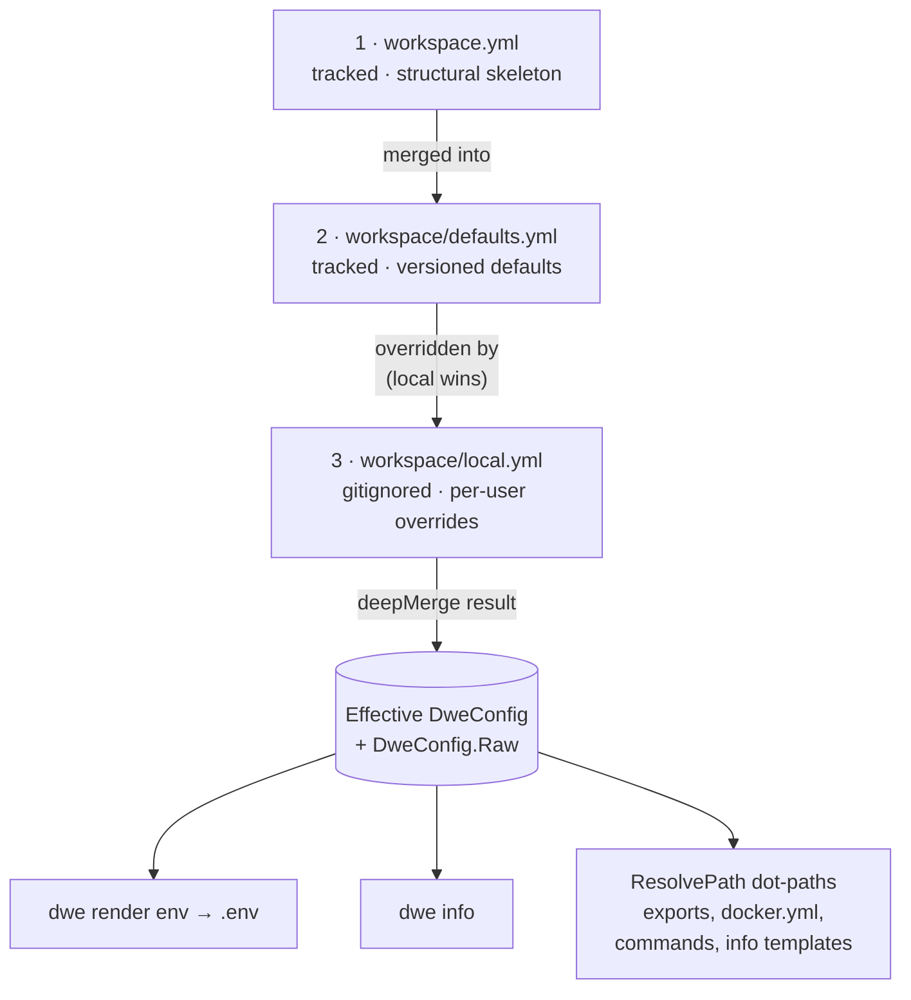

# workspace.yml / defaults.yml / local.yml

The three layers of the merged DWE config.

## Contents

- [Merge overview](#merge-overview)
- [What belongs in each layer](#what-belongs-in-each-layer)
- [Dot-path resolution](#dot-path-resolution)
  - [Where service fields come from](#where-service-fields-come-from)
- [workspace.yml](#workspaceyml)
  - [Field reference](#field-reference)
  - [Project convention keys](#project-convention-keys)
- [workspace/defaults.yml](#workspacedefaultsyml)
  - [`services` overlay](#services-overlay)
  - [`runtime`](#runtime)
  - [`state`](#state)
  - [`exports.env`](#exportsenv)
  - [`compose`](#compose)
  - [`ide`](#ide)
- [workspace/local.yml](#workspacelocalyml)
  - [Compose overlays](#compose-overlays)
- [Common pitfalls](#common-pitfalls)
- [Related commands](#related-commands)

## Merge overview



Read top-to-bottom: each arrow is "next layer applied on top". `local.yml` sits at the end, so any key it sets shadows the same key from `defaults.yml` or `workspace.yml`. Keys absent from `local.yml` fall through to `defaults.yml`, then to `workspace.yml`, then to the typed Go zero value.

The three files share a single namespace — the same key in different layers is the same setting. Layer 1 establishes structure, Layer 2 fills in defaults, Layer 3 overrides for the local machine. None of the three is required to declare every key; missing keys simply fall through to whatever lower layer set them, with type-zero values as the ultimate fallback.

`workspace/local.yml` is optional: when absent, the merge silently skips layer 3.

## What belongs in each layer

| Concern | Layer |
|---------|-------|
| Project name and prefix | `workspace.yml` |
| Service ports / hosts (apps, tools, infra) | [`workspace/services/<name>/service.yml`](services/index.md) (per-entry `ports:` / `hosts:` maps) |
| Service structural definitions (container / compose / status / render) | [`workspace/services/<name>/service.yml`](services/index.md) |
| Optional service enabled state (across all types) | `defaults.yml` (overrideable in `local.yml`) |
| Export rules (`exports.env`) | `defaults.yml` |
| IDE config defaults | `defaults.yml` |
| `db` block defaults | `defaults.yml` |
| Active state | `local.yml` |
| Service port / host values | [`workspace/services/<name>/service.yml`](services/index.md) (project-level definitions) and `local.yml` (per-developer overrides, deep-merged by entry name) |
| Personal credentials (`db.user`, `db.password`) | `local.yml` |
| Enabling debug / optional services | `local.yml` |
| Per-developer Docker Compose overlay files (`compose.extra`) | `local.yml` only — rejected with an error in all other layers |
| Wizard-generated configuration | `local.yml` (written by `dwe deploy` when answering setup questions or port conflicts) |

Service definitions themselves (apps, tools, infra — including their ports / hosts) live in [`workspace/services/<name>/service.yml`](services/index.md) per-folder files, which are loaded separately and not part of this merge. The 3-layer overlay carries `services.<name>.enabled`, `services.<name>.ports`, and `services.<name>.hosts`. Port and host maps are deep-merged by entry name so a partial override only touches the listed keys.

The `dwe deploy` command includes an interactive wizard that runs on fresh projects (when `workspace/local.yml` is missing or empty). The wizard collects answers to questions declared in [`workspace/setup.yml`](setup.md) and prompts for port overrides when conflicts exist. All answers are deep-merged into `local.yml` and written atomically before deployment proceeds. See [`workspace/setup.yml`](setup.md) for schema details.

## Dot-path resolution

The CLI stores the merged result in two places: a typed `DweConfig` struct (with fields like `DweConfig.Services` and `DweConfig.Runtime.UseHTTPS`) and a plain `DweConfig.Raw` map. The Raw map drives dot-path resolution.

A dot-path is a `.`-separated key chain that navigates the merged YAML map. Examples:

- `services.main.ports.http` → `80`
- `services.adminer.enabled` → `false`
- `services.main.container` → `"app-main"`
- `services.main.hosts.web` → `"app.localhost"`

Dot-paths are consumed by:

- export rules in `defaults.yml` (`from:`, `when:`)
- `${...}` template expressions in `docker.yml` (`project_name`)
- `${...}` template expressions in declarative commands (`workspace/commands/`)
- `{{ ... }}` Go templates in `info.yml` (via the typed struct, not Raw)

### Where service fields come from

`services.<name>.*` paths in the merged map are populated from each `workspace/services/<name>/service.yml` (the canonical service declaration, which carries `type:`). Every overlay layer is validated against the declared field set, the 3 layers are merged, then `enabled` is resolved per service (required wins; otherwise the merged overlay value, defaulting to `false`). Each resolved service — including its nested `ports` / `hosts` maps and resolved fields like `container`, `dir`, `compose` — becomes available under `services.<name>` in the merged config. Export rules and templates can therefore use `services.main.container`, `services.main.ports.http`, `services.adminer.hosts.web`, `services.catalog.enabled`, etc. without separate awareness of the per-service folder structure.

## workspace.yml

**Purpose**: Project identity and structural skeleton. Tracked by git. Rarely changes after initial setup.

**Load order**: Layer 1 (base).

**Example**:
```yaml
project:
  name: laravel
  prefix: myprefix
```

### Field reference

| Field | Type | Description |
|-------|------|-------------|
| `project.name` | string | Short project identifier (used in container names, `.env`) |
| `project.prefix` | string | Prefix for Docker project name and container labels |

`project.prefix` and `project.name` combine to form the Docker Compose project name via the template in `docker.yml` (`${project.prefix}-${project.name}`).

## Project convention keys

Beyond the typed fields documented above, `workspace.yml`, `defaults.yml`, and `local.yml` support an open namespace of convention keys. These keys are not interpreted by the CLI directly — they are exposed via dot-paths in the merged config and consumed by export rules, templates, and custom commands.

Common convention keys include:

- `db.*` — Database credentials and metadata (e.g., `db.database`, `db.user`, `db.password`) — consumed by export rules to populate `DB_*` env variables.
- Custom project settings — Any top-level key you add is accessible via dot-path (e.g., `my_setting.value` in a template).

Example:

```yaml
db:
  database: myapp
  user: root
  password: secret

my_custom:
  timeout: 30
  retries: 3
```

These can be referenced in export rules (`from: db.user`), templates (`${db.database}`), and used by custom commands or scripts. The open namespace allows projects to extend the config schema without CLI changes.

### `docs`

Configure documentation rendering and caching behavior for `dwe docs` commands.

```yaml
docs:
  mermaid: auto        # auto | mmdc | off (default: auto)
  cache_size_mb: 100   # cache size in MB (default: 100)
```

**`docs.mermaid`**: Controls how mermaid diagrams in documentation are rendered.

- `auto` (default): Use `mmdc` (mermaid-cli) if found on `$PATH`, otherwise show diagrams as code blocks.
- `mmdc`: Require `mmdc` to be available; if missing, emit an error placeholder but continue.
- `off`: Never render diagrams; always show code blocks.

**`docs.cache_size_mb`**: Maximum size in MB for the mermaid diagram cache (PNG files stored in `$XDG_CACHE_HOME/dwe/mermaid/`). Cache uses LRU eviction when over the limit. Default is 100 MB. Must be non-negative; zero defaults to 100.

---

## workspace/defaults.yml

**Purpose**: Versioned defaults for the entire project. Tracked by git. Provides all runtime configuration that is not structural identity.

**Load order**: Layer 2 (merged on top of `workspace.yml`).

**Sections**:

### `services` overlay

Toggle optional services of any type (services declared in [`workspace/services/<name>/service.yml`](services/index.md) without `required: true`). Apps, tools, and infra share one overlay namespace — the `type:` discriminator lives in each service's `service.yml`, not here.

```yaml
services:
  main-debug:        # type: app
    enabled: false
  catalog:           # type: app
    enabled: true
  adminer:           # type: tool
    enabled: false
  mailpit:           # type: tool
    enabled: true
```

Allowed fields under `services.<name>` in any overlay layer are `enabled`, `ports`, and `hosts`. Adding structural fields like `container:`, `compose:`, `extends:`, etc. is a layer-aware overlay error — those fields live in `workspace/services/<name>/service.yml`. Port and host maps are deep-merged by entry name. Required services are always active and have no toggle.

### `runtime`

Runtime settings that affect `.env` generation and the info dashboard but are not per-service. Per-service ports / hosts live in [`workspace/services/<name>/service.yml`](services/index.md) under each entry's `ports:` / `hosts:` maps (and are reachable as `services.<name>.ports.<port-name>` / `services.<name>.hosts.<host-name>` dot-paths).

```yaml
runtime:
  use_https: false
  spx:
    path: ""
```

| Field | Description |
|-------|-------------|
| `runtime.use_https` | Whether URLs use HTTPS (exported as `USE_HTTPS`). |
| `runtime.spx.path` | SPX profiler URL path (empty = disabled). |

### `state`

```yaml
state: ""
```

Active state name. Empty string means no state. Exported as `STATE` in `.env`. Override in `local.yml` (e.g. `state: staging`).

### `exports.env`

Declarative export rules that drive `.env` generation. Each rule maps a dot-path in the merged config to an env variable name. All per-service fields — `container`, `enabled`, `ports.<name>`, `hosts.<name>` — live under `services.<name>.*`.

```yaml
exports:
  env:
    - name: APP_PORT
      from: services.main.ports.http
      format: int
    - name: TOOL_ADMINER_ENABLED
      from: services.adminer.enabled
      format: bool
    - name: ADMINER_PORT
      from: services.adminer.ports.http
      format: int
      when: services.adminer.enabled
    - name: ADMINER_HOST
      from: services.adminer.hosts.web
      when: services.adminer.enabled
```

| Rule field | Type | Description |
|------------|------|-------------|
| `name` | string | Env variable name in `.env` |
| `from` | string | Dot-path into the merged config |
| `default` | string | Fallback value when path is absent |
| `required` | bool | Error if path absent and no default |
| `format` | string | `string` (default), `bool`, `int` |
| `when` | string | Dot-path; rule skipped when value is falsy |
| `comment` | string | Written as `# comment` above the variable |

#### Implicit system variables

`dwe render env` always emits three variables before any rule runs, regardless of `exports.env`:

| Variable | Source | Notes |
|----------|--------|-------|
| `PROJECT` | `project.name` | Used by Docker labels and Make targets |
| `UID` | host UID | Hard-coded to `1000` on macOS, real UID on Linux/WSL — keeps container builds deterministic across hosts |
| `GID` | host GID | Same logic as `UID` |

These are managed by the CLI; do not redeclare them as export rules.

### `compose`

Compose file configuration used by the Docker control plane.

```yaml
compose:
  base: compose.yaml
```

| Field | Description |
|-------|-------------|
| `compose.base` | Base compose file (always included) |
| `compose.extra` | **Not valid here.** Per-developer overlay files belong in `local.yml`. See [Compose overlays](#compose-overlays). |

Service-specific overlays live under `services.<name>.compose` (a list of file paths per service entry) in [`workspace/services/<name>/service.yml`](services/index.md). The full compose-file emission order (including per-developer overlays) is documented under [Compose overlays](#compose-overlays) in `local.yml`.

---

## workspace/local.yml

**Purpose**: Per-user overrides. Gitignored, never committed. Template in `workspace/local.example.yml`.

**Load order**: Layer 3 (merged last — highest precedence).

**Example overrides**:
```yaml
state: staging

services:
  main-debug:
    enabled: true
  redis_insight:
    enabled: false

runtime:
  use_https: true
```

> Per-developer port / host overrides are supported via `local.yml`. Use `services.<name>.ports` or `services.<name>.hosts` to override specific entries; the values are deep-merged by key on top of the project-level declarations in `workspace/services/<name>/service.yml`.

If `local.yml` does not exist, layer 3 is silently skipped.

### Compose overlays

`local.yml` is the only place that can inject extra Docker Compose overlay files into the `docker compose -f …` chain assembled by `dwe`. Two layers are available:

- **Project-wide** — `compose.extra: [<path>, …]` appended last to every `dwe docker` invocation, regardless of which services are enabled.
- **Per-service** — `services.<name>.compose.extra: [<path>, …]` appended right after that service's own compose files (from `workspace/services/<name>/service.yml`). The per-service block reuses the same enabled-gate: a disabled service's overlays do **not** appear in the active `-f` list, but they do appear under `dwe docker --all`.

```yaml
# workspace/local.yml — gitignored, per-developer

compose:
  extra:
    - compose.local.yml             # appended last (project-wide)

services:
  dev:
    compose:
      extra:
        - compose/dev.local.yml     # appended after services/dev/compose files
```

Final emission order assembled by `composeFiles()`:

```
compose.base
  → tools  (alpha-sorted) — each: svc.compose… + svc.local-extras…
  → infra  (alpha-sorted) — each: svc.compose… + svc.local-extras…
  → apps   (alpha-sorted) — each: svc.compose… + svc.local-extras…
  → compose.extra…                  (project-wide, always last)
```

Docker Compose merges later `-f` files on top of earlier ones — the project-wide layer therefore can override per-service overlays. If that is unwanted, scope the override to a per-service block instead.

**Schema rules:**

- Both layers accept **only** the `extra:` key under `compose:` — anything else is a hard error.
- Paths are **relative to the project root** (the directory holding `workspace.yml`) and stored as written; downstream resolution sets `cmd.Dir` to the project root.
- **Absolute paths are rejected** (`/etc/...` / `~/...` — would bypass containment).
- **`..` escapes are rejected** by `pathsafe.ContainedRel`.
- **Each path must exist** at config-load time; missing files are a hard error showing both the as-written and resolved absolute paths.
- Duplicate paths between layers (or within a layer) are **not** deduplicated — Docker Compose tolerates duplicates; let it surface any issue.
- `compose.extra` in `workspace.yml`, `defaults.yml`, or `service.yml` is rejected with a diagnostic pointing at `workspace/local.yml`.

**Don't confuse with `docker.local.yml`:** `docker.local.yml` overrides compose execution **policy** (project name, per-subcommand args, process env). `local.yml → compose.extra` adds compose **service overlays** (env, volumes, ports on containers). They are independent surfaces — see [`docker.md`](docker.md) for the policy file.

**Inheritance:** when a service has `extends: <parent>` in its `service.yml`, the child inherits the parent's `services.<parent>.compose.extra` from `local.yml` only when the child does not declare its own. If the child has its own `services.<child>.compose.extra`, the child's list wins (no merge).

**Motivating example — per-developer git identity inside the `dev` container:**

```yaml
# workspace/compose/dev.local.yml — also gitignored
services:
  dev:
    environment:
      GIT_CONFIG_COUNT: "2"
      GIT_CONFIG_KEY_0: user.name
      GIT_CONFIG_VALUE_0: Jane Doe
      GIT_CONFIG_KEY_1: user.email
      GIT_CONFIG_VALUE_1: jane@example.com
```

```yaml
# workspace/local.yml
services:
  dev:
    compose:
      extra:
        - compose/dev.local.yml
```

Commits made inside the `dev` container now use the developer's project-specific identity without touching `~/.gitconfig` on the host or any git-tracked file in the repo.

**Gitignore the overlay files** along with `local.yml` itself — they are per-developer artifacts.

## Common pitfalls

- **Editing `defaults.yml` for personal settings** — changes are tracked and affect every team member. Personal overrides always go in `local.yml`.
- **Committing `local.yml`** — it is gitignored for a reason (may contain credentials).
- **Setting `state:` in `defaults.yml`** — state is inherently per-user, put it in `local.yml`.
- **Scalar collision** — if `defaults.yml` sets `state: ""` and `local.yml` sets `state: staging`, the effective value is `staging`. If `local.yml` omits `state`, the `defaults.yml` value wins.
- **Lists replace, maps merge** — maps are deep-merged: redeclaring `services` in `local.yml` only overrides the keys you list, the rest fall through from `defaults.yml`. Lists, by contrast, are replaced wholesale: setting `args.global: ["--ansi", "always"]` in `local.yml` discards every entry the lower layers had, so include the full list you want.

## Optional `ui:` block

`workspace.yml` may carry an optional top-level `ui:` block that configures the interactive command browser. See [`ui.md`](ui.md) for the schema, defaults, and the `*bool` omit-vs-`false` semantics. Behaviour is unchanged for projects that omit the block.

## Related commands

- `dwe render env --out .env` — regenerate `.env` from the merged config
- `dwe render ide` / `dwe render ai` / `dwe render git` — pack-based renderers; see [render reference](../render/index.md)
- `dwe info` — show dashboard (uses merged config + `info.yml`)
- `dwe status` — composite read-only view (apps + tools + infra + deploy + topology + git + daemons)
- `dwe status apps` / `dwe status tools` / `dwe status infra` — per-type tables
- `dwe compose argv` — show the effective compose command with all flags (useful for debugging dot-path resolution into `docker.yml`)
