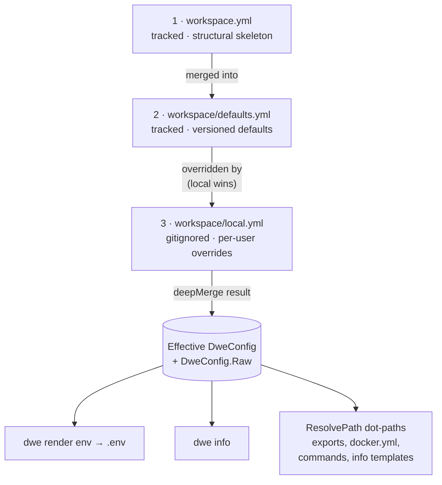

# workspace.yml / defaults.yml / local.yml

The three layers of the merged DWE config.

## Contents

- [Merge overview](#merge-overview)
- [What belongs in each layer](#what-belongs-in-each-layer)
- [Dot-path resolution](#dot-path-resolution)
  - [Where service fields come from](#where-service-fields-come-from)
- [Strict root + the `vars:` sandbox](#strict-root--the-vars-sandbox)
- [workspace.yml](#workspaceyml)
  - [Field reference](#field-reference)
  - [The `secrets:` block](#the-secrets-block)
  - [The `update:` block](#the-update-block)
  - [The `stop:` block](#the-stop-block)
- [Recommended file-layout convention](#recommended-file-layout-convention)
- [workspace/defaults.yml](#workspacedefaultsyml)
  - [`services` overlay](#services-overlay)
  - [`runtime`](#runtime)
  - [`state`](#state)
  - [`exports.env`](#exportsenv)
  - [`compose`](#compose)
- [workspace/local.yml](#workspacelocalyml)
  - [Compose overlays](#compose-overlays)
- [Common pitfalls](#common-pitfalls)
- [Related commands](#related-commands)

## Merge overview



Read top-to-bottom: each arrow is "next layer applied on top". `local.yml` sits at the end, so any key it sets shadows the same key from `defaults.yml` or `workspace.yml`. Keys absent from `local.yml` fall through to `defaults.yml`, then to `workspace.yml`, then to the typed Go zero value.

The three files share a single namespace — the same key in different layers is the same setting. Layer 1 establishes structure, Layer 2 fills in defaults, Layer 3 overrides for the local machine. None of the three is required to declare every key; missing keys simply fall through to whatever lower layer set them, with type-zero values as the ultimate fallback.

`workspace/local.yml` is optional: when absent, the merge silently skips layer 3.

## What belongs in each layer

| Concern | Layer |
|---------|-------|
| Project name and prefix | `workspace.yml` |
| Service ports / hosts (apps, tools, infra) | [`workspace/services/<name>/service.yml`](services/index.md) (per-entry `ports:` / `hosts:` maps) |
| Service structural definitions (container / compose / status / render) | [`workspace/services/<name>/service.yml`](services/index.md) |
| Optional service enabled state (across all types) | `defaults.yml` (overrideable in `local.yml`) |
| Export rules (`exports.env`) | `defaults.yml` |
| `vars.db.*` block defaults | `defaults.yml` |
| Active state | `local.yml` |
| Service port / host values | [`workspace/services/<name>/service.yml`](services/index.md) (project-level definitions) and `local.yml` (per-developer overrides, deep-merged by entry name) |
| Personal credentials (`vars.db.user`, `vars.db.password`) | `local.yml` |
| Team-shared credentials (a bot token, a service-account JSON) | `defaults.yml`, encrypted — see [`secrets.md`](secrets.md) |
| The project's age recipient (`secrets.recipient`) | `workspace.yml` only — rejected with an error in all other layers |
| Enabling debug / optional services | `local.yml` |
| Per-developer Docker Compose overlay files (`compose.extra`) | `local.yml` only — rejected with an error in all other layers |
| Wizard-generated configuration | `local.yml` (written by `dwe deploy` when answering setup questions or port conflicts) |

Service definitions themselves (apps, tools, infra — including their ports / hosts) live in [`workspace/services/<name>/service.yml`](services/index.md) per-folder files, which are loaded separately and not part of this merge. The 3-layer overlay carries `services.<name>.enabled`, `services.<name>.ports`, and `services.<name>.hosts`. Port and host maps are deep-merged by entry name so a partial override only touches the listed keys.

The `dwe deploy` command includes an interactive wizard that runs on fresh projects (when `workspace/local.yml` is missing or empty). The wizard collects answers to questions declared in [`workspace/setup.yml`](setup.md) and prompts for port overrides when conflicts exist. All answers are deep-merged into `local.yml` and written atomically before deployment proceeds. See [`workspace/setup.yml`](setup.md) for schema details.

## Dot-path resolution

The CLI stores the merged result in two places: a typed `DweConfig` struct (with fields like `DweConfig.Services` and `DweConfig.Runtime.UseHTTPS`) and a plain `DweConfig.Raw` map. The Raw map drives dot-path resolution.

A dot-path is a `.`-separated key chain that navigates the merged YAML map. Examples:

- `services.main.ports.http` → `80`
- `services.adminer.enabled` → `false`
- `services.main.container` → `"app-main"`
- `services.main.hosts.web` → `"app.localhost"`
- `vars.db.user` → `"root"` (free-form values live under [`vars:`](#strict-root--the-vars-sandbox))

Dot-paths are consumed by:

- export rules in `defaults.yml` (`from:`, `when:`)
- `${...}` template expressions in `docker.yml` (`project_name`)
- `${...}` template expressions in declarative commands (`workspace/commands/`)
- `{{ ... }}` Go templates in `info.yml` (via the typed struct, not Raw)

### Where service fields come from

`services.<name>.*` paths in the merged map are populated from each `workspace/services/<name>/service.yml` (the canonical service declaration, which carries `type:`). Every overlay layer is validated against the declared field set, the 3 layers are merged, then `enabled` is resolved per service (required wins; otherwise the merged overlay value, defaulting to `false`). Each resolved service — including its nested `ports` / `hosts` maps and resolved fields like `container`, `dir`, `compose` — becomes available under `services.<name>` in the merged config. Export rules and templates can therefore use `services.main.container`, `services.main.ports.http`, `services.adminer.hosts.web`, `services.catalog.enabled`, etc. without separate awareness of the per-service folder structure.

## Strict root + the `vars:` sandbox

The **root** of the merged 3-layer config is strict. After the three layers are merged, DWE checks the top-level keys against a fixed allowlist:

```text
project · runtime · state · exports · compose · ui · docs · services · vars · update · bridge · stop · secrets
```

(`schema_version` is also included in the allowlist as reserved forward-compat metadata — a plain member, not a special-cased exception.) Any other top-level key — in *any* layer — is a hard load-time error:

```text
workspace.yml: unknown top-level key "db" — move custom values under "vars:" (e.g. vars.db.*)
```

This makes typos in formalized keys (`runtim:`, `exprots:`) fail loudly instead of being silently swallowed, and lets the schema tighten without colliding with project-specific values. The same error is surfaced as a `dwe validate` error diagnostic.

### `vars:` — the home for free-form values

Arbitrary, project-specific values live under a single typed block, `vars:`. The root is strict, but **inside `vars:` anything goes** — any keys, any nesting, no validation:

```yaml
vars:
  db:
    database: myapp
    user: root
    password: secret
  app:
    timeout: 30
    retries: 3
```

`vars` is a normal merged key, so its contents are reachable by dot-path under the `vars.` prefix:

- Export rules: `from: vars.db.user`
- `${...}` templates: `${vars.db.database}`
- Custom commands / `config_keys_present` checks: `vars.db.api_key`

`vars.*` resolves through `DweConfig.Raw` by dot-path just like `services.*`.

The [`dwe vars`](vars.md) command enumerates, reads, edits, and traces every value under this block — see [`vars.md`](vars.md) for the subcommands, the author/local/effective layer model, comment-preserving `local.yml` writes, the static usage scan, and the `bridge.vars_writable` container-write allowlist.

A `vars.*` value may also be an **encrypted `ENC[age:…]` marker** committed to a tracked layer, decrypted in memory at load time. That is how a team-shared credential lives in git without sitting there in the open; see [`secrets.md`](secrets.md).

### `bridge.vars_writable` — container-write allowlist

When the [host bridge](../concepts/bridge.md) is enabled, `dwe vars set` becomes reachable from inside a dev container. To stop a compromised or careless container from rewriting arbitrary project values on the host, the top-level `bridge.vars_writable` block is a **deny-by-default** allowlist of the `vars.*` paths a containerized `vars set` may mutate. From the host the command is unrestricted; this gate applies **only** when the call comes in over the bridge.

```yaml
# workspace/defaults.yml
bridge:
  vars_writable:
    - vars.app.timeout       # exact path — only this leaf is writable
    - vars.feature_flags.*   # dot-boundary wildcard — any leaf strictly beneath it
```

Matching is **dot-boundary**, never a naive prefix:

- An exact pattern (`vars.db.host`) matches only that identical path.
- A trailing-wildcard pattern (`vars.db.*`) matches a path *strictly beneath* the base — it allows `vars.db.host` but **denies** `vars.db` itself, and denies look-alikes like `vars.dbx.host` and `vars.database.host`.
- An empty or absent list means **no var is container-writable** — the safe default. Malformed patterns (a bare `*`, an interior `*`) fail closed.

`bridge.vars_writable` is value-merged across the three layers and read nil-safe, so it behaves like every other formalized top-level key.

> **Recommendation: declare it in `workspace/defaults.yml`.** This is a project-wide, team-shared security policy — it should be tracked in git and identical for everyone, not a per-developer setting. Putting it in the gitignored `workspace/local.yml` would make each machine's container-write surface diverge silently and would not travel with the repo. Reserve `local.yml` for per-developer values (ports, credentials, enabled flags).

This block governs only *what a container may write*; it is distinct from the per-service [`services.<name>.bridge`](services/fields.md#bridge-block) block, which governs *whether a service is bridged at all*. See [Host bridge → command policy](../concepts/bridge.md#command-policy-inside-containers) for the full container surface.

## workspace.yml

**Purpose**: Project identity and structural skeleton. Tracked by git. Rarely changes after initial setup.

**Load order**: Layer 1 (base).

**Example**:
```yaml
project:
  name: laravel
  prefix: myprefix
```

### Field reference

| Field | Type | Description |
|-------|------|-------------|
| `project.name` | string | Short project identifier (used in container names, `.env`) |
| `project.prefix` | string | Prefix for Docker project name and container labels |

`project.prefix` and `project.name` combine to form the Docker Compose project name via the template in `docker.yml` (`${project.prefix}-${project.name}`).

### The `secrets:` block

The optional top-level `secrets:` block declares the project's public age recipient — the key that `ENC[age:…]` markers and `*.age` config-pack sources are encrypted to.

```yaml
secrets:
  recipient: age1qyqszqgpqyqszqgpqyqszqgpqyqszqgpqyqszqgpqyqszqgpqyqs3fgh2p
```

| Field | Type | Description |
|-------|------|-------------|
| `secrets.recipient` | string | The project's public age recipient (`age1…`), written by `dwe secrets init`. Commit it. |

Unlike every other formalized block, `secrets:` is legal in **`workspace.yml` only**. Declaring it in `defaults.yml` or `local.yml` is a hard load error naming the file: a per-developer recipient would silently split the team into groups that cannot read each other's secrets. A `secrets:` value that is not a mapping, or a `recipient` that is not a valid `age1…`, is likewise a load error.

The matching private identity is never in git — it lives in `~/.config/dwe/keys/<recipient>.key` or in `DWE_AGE_KEY` / `DWE_AGE_KEY_FILE`. Encryption needs only the recipient, so anyone with the repository can add a secret; reading one back needs the identity. See [`secrets.md`](secrets.md) for the full model and the `dwe secrets` command surface.

### The `update:` block

The optional top-level `update:` block controls the self-update probe that `dwe run` performs against the project-root git repository before executing any lifecycle phase. It is a formalized block that participates in the 3-layer merge (scalar `mode` is last-layer-wins), so a project author can set policy in `workspace.yml` and a developer can override it in `local.yml`.

```yaml
update:
  mode: on            # on | off
```

| Field | Type | Default | Description |
|-------|------|---------|-------------|
| `update.mode` | string | `off` when the block is absent; `on` when the block is present but `mode` is unset or empty | One of `on`, `off`. Writing the `update:` key is itself the opt-in. |

Mode behaviour:

| Mode | Fetches | Pulls | Behaviour when behind |
|------|---------|-------|------------------------|
| `on` | yes | with consent | Interactive TTY: prompts before `git pull --ff-only`. Non-TTY / CI: warns "behind, skipping" and continues. |
| `off` | no | no | Probe disabled (same as the `--no-update` flag). |

Resolution semantics (`UpdateConfig.EffectiveMode()`): a missing block (`nil`) → `off`; a present block whose `mode` is unset or empty → `on`; otherwise the literal `mode`. A bad value (e.g. `update: { mode: yes }`) is a hard error at config-load time and a `dwe validate` error diagnostic.

Runtime precedence at `dwe run`: `--no-update` flag > `--update <mode>` flag > `update.mode` from the merged config.

This block decouples *enabling update* from the lifecycle phases. (See [`lifecycle.md`](lifecycle.md) and [git integration → update probe](../concepts/git.md#update-probe-dwe-run).)

### The `stop:` block

The optional top-level `stop:` block tunes whole-stack stop behaviour. It is a formalized block that participates in the 3-layer merge, so a project author can set a default in `workspace.yml` and a developer can override it in `local.yml`.

```yaml
stop:
  port_release_timeout: 60s   # Go duration ("60s", "2m", "1m30s") or bare seconds ("90"); "0" disables
```

| Field | Type | Default | Description |
|-------|------|---------|-------------|
| `stop.port_release_timeout` | duration string | `60s` | How long `dwe stop` (and the stop leg of `dwe restart`) waits for the stack's published host ports to be released after `docker compose down`. `0` disables the wait. |

**Why this exists.** On Docker Desktop / OrbStack (macOS) the host port-forwarder releases a published port (e.g. caddy's `:80`) a beat *after* the container disappears from `docker ps` — and the lag grows the longer the container ran. Without a wait, the run leg of a `dwe restart` races that release and the `ports_free` preflight check falsely reports a self-conflict on the project's own just-freed port. `dwe stop` therefore waits for the ports to actually free before returning, showing a live spinner + timer naming the port(s) still pending.

Only a port that is busy **and** owned by no live container is waited on. This is usually a lingering forward of a just-downed container; a non-Docker host process holding the port is indistinguishable at this layer, so it is also waited on until the timeout (then warned about). A port still held by a live (foreign) container is never waited on, so a stop cannot hang on someone else's container. On native Linux, ports free synchronously, so the wait returns immediately. Exceeding the timeout only emits a warning and proceeds (the next start's preflight retry is the final backstop) — it never fails the stop.

Raise it if the project has slow-terminating services; set `0` to opt out entirely. A malformed or negative value (e.g. `1minute`, `-5s`) is a hard error at config-load time — `0` is the only disable sentinel.

### `docs`

Configure documentation rendering and caching behavior for `dwe docs` commands.

```yaml
docs:
  mermaid: auto        # auto | mmdc | off (default: auto)
  cache_size_mb: 100   # cache size in MB (default: 100)
```

**`docs.mermaid`**: Controls how mermaid diagrams in documentation are rendered.

- `auto` (default): Use `mmdc` (mermaid-cli) if found on `$PATH`, otherwise show diagrams as code blocks.
- `mmdc`: Require `mmdc` to be available; if missing, emit an error placeholder but continue.
- `off`: Never render diagrams; always show code blocks.

**`docs.cache_size_mb`**: Maximum size in MB for the mermaid diagram cache (PNG files stored in `$XDG_CACHE_HOME/dwe/mermaid/`). Cache uses LRU eviction when over the limit. Default is 100 MB. Must be non-negative; zero defaults to 100.

---

## Recommended file-layout convention

All three layers share the same strict key set, so any block *can* appear in any layer. The following split is a **convention only** — violating it is not an error — but it keeps the layers readable:

| Layer | Holds | Why |
|-------|-------|-----|
| `workspace.yml` | Compact formalized blocks: `project`, `ui`, `update` | Small, structural, rarely changes |
| `defaults.yml` | The bulky blocks: `vars`, `exports`, `services` overlay, `runtime`, `bridge.vars_writable` | Versioned team defaults; the biggest content. `bridge.vars_writable` is a team-shared security policy — keep it here, not in `local.yml` (see [the allowlist note above](#bridgevars_writable--container-write-allowlist)) |
| `local.yml` | Personal overrides: `state`, `vars.db.password`, service toggles, `compose.extra`, `update.mode` | Per-developer, gitignored |

For example, a project author enables update policy in `workspace.yml` (`update: { mode: on }`) and a developer who wants to skip the probe locally overrides it in `local.yml` (`update: { mode: off }`).

---

## workspace/defaults.yml

**Purpose**: Versioned defaults for the entire project. Tracked by git. Provides all runtime configuration that is not structural identity.

**Load order**: Layer 2 (merged on top of `workspace.yml`).

**Sections**:

### `services` overlay

Toggle optional services of any type (services declared in [`workspace/services/<name>/service.yml`](services/index.md) without `required: true`). Apps, tools, and infra share one overlay namespace — the `type:` discriminator lives in each service's `service.yml`, not here.

```yaml
services:
  main-debug:        # type: app
    enabled: false
  catalog:           # type: app
    enabled: true
  adminer:           # type: tool
    enabled: false
  mailpit:           # type: tool
    enabled: true
```

Allowed fields under `services.<name>` in any overlay layer are `enabled`, `ports`, and `hosts`. Adding structural fields like `container:`, `compose:`, `extends:`, etc. is a layer-aware overlay error — those fields live in `workspace/services/<name>/service.yml`. Port and host maps are deep-merged by entry name. Required services are always active and have no toggle.

### `runtime`

Runtime settings that affect `.env` generation and the info dashboard but are not per-service. Per-service ports / hosts live in [`workspace/services/<name>/service.yml`](services/index.md) under each entry's `ports:` / `hosts:` maps (and are reachable as `services.<name>.ports.<port-name>` / `services.<name>.hosts.<host-name>` dot-paths).

```yaml
runtime:
  use_https: false
  spx:
    path: ""
```

| Field | Description |
|-------|-------------|
| `runtime.use_https` | Whether URLs use HTTPS (exported as `USE_HTTPS`). |
| `runtime.spx.path` | SPX profiler URL path (empty = disabled). |

### `state`

```yaml
state: ""
```

Active state name. Empty string means no state. Exported as `STATE` in `.env`. Override in `local.yml` (e.g. `state: staging`).

### `exports.env`

Declarative export rules that drive `.env` generation. Each rule maps a dot-path in the merged config to an env variable name. All per-service fields — `container`, `enabled`, `ports.<name>`, `hosts.<name>` — live under `services.<name>.*`.

```yaml
exports:
  env:
    - name: APP_PORT
      from: services.main.ports.http
      format: int
    - name: TOOL_ADMINER_ENABLED
      from: services.adminer.enabled
      format: bool
    - name: ADMINER_PORT
      from: services.adminer.ports.http
      format: int
      when: services.adminer.enabled
    - name: ADMINER_HOST
      from: services.adminer.hosts.web
      when: services.adminer.enabled
```

| Rule field | Type | Description |
|------------|------|-------------|
| `name` | string | Env variable name in `.env` |
| `from` | string | Dot-path into the merged config |
| `default` | string | Fallback value when path is absent |
| `required` | bool | Error if path absent and no default |
| `format` | string | `string` (default), `bool`, `int` |
| `when` | string | Dot-path; rule skipped when value is falsy |
| `comment` | string | Written as `# comment` above the variable |

#### Implicit system variables

`dwe render env` always emits three variables before any rule runs, regardless of `exports.env`:

| Variable | Source | Notes |
|----------|--------|-------|
| `PROJECT` | `project.name` | Used by Docker labels and Make targets |
| `UID` | host UID | Hard-coded to `1000` on macOS, real UID on Linux/WSL — keeps container builds deterministic across hosts |
| `GID` | host GID | Same logic as `UID` |

These are managed by the CLI; do not redeclare them as export rules.

#### Single-line values only

Values are written unquoted, so a resolved value containing a line break cannot be represented: compose would parse the second and later lines as further `.env` entries, truncating the value and possibly defining variables nobody declared. `dwe render env` refuses such a value and names the rule and its source path. Deliver multi-line material — a PEM key, a service-account JSON — through a [`render config`](../render/config.md) pack file instead, which has no such constraint and which [encrypted secrets](secrets.md) support natively via `*.age` sources.

### `compose`

Compose file configuration used by the Docker control plane.

```yaml
compose:
  base: compose.yaml
```

| Field | Description |
|-------|-------------|
| `compose.base` | Base compose file (always included) |
| `compose.extra` | **Not valid here.** Per-developer overlay files belong in `local.yml`. See [Compose overlays](#compose-overlays). |

Service-specific overlays live under `services.<name>.compose` (a list of file paths per service entry) in [`workspace/services/<name>/service.yml`](services/index.md). The full compose-file emission order (including per-developer overlays) is documented under [Compose overlays](#compose-overlays) in `local.yml`.

---

## workspace/local.yml

**Purpose**: Per-user overrides. Gitignored, never committed. Template in `workspace/local.example.yml`.

**Load order**: Layer 3 (merged last — highest precedence).

**Example overrides**:
```yaml
state: staging

services:
  main-debug:
    enabled: true
  redis_insight:
    enabled: false

runtime:
  use_https: true
```

> Per-developer port / host overrides are supported via `local.yml`. Use `services.<name>.ports` or `services.<name>.hosts` to override specific entries; the values are deep-merged by key on top of the project-level declarations in `workspace/services/<name>/service.yml`.

If `local.yml` does not exist, layer 3 is silently skipped.

### Compose overlays

`local.yml` is the only place that can inject extra Docker Compose overlay files into the `docker compose -f …` chain assembled by `dwe`. Two layers are available:

- **Project-wide** — `compose.extra: [<path>, …]` appended last to every `dwe docker` invocation, regardless of which services are enabled.
- **Per-service** — `services.<name>.compose.extra: [<path>, …]` appended right after that service's own compose files (from `workspace/services/<name>/service.yml`). The per-service block reuses the same enabled-gate: a disabled service's overlays do **not** appear in the active `-f` list, but they do appear under `dwe docker --all`.

```yaml
# workspace/local.yml — gitignored, per-developer

compose:
  extra:
    - compose.local.yml             # appended last (project-wide)

services:
  dev:
    compose:
      extra:
        - compose/dev.local.yml     # appended after services/dev/compose files
```

Final emission order assembled by `composeFiles()`:

```
compose.base
  → tools  (alpha-sorted) — each: svc.compose… + svc.local-extras…
  → infra  (alpha-sorted) — each: svc.compose… + svc.local-extras…
  → apps   (alpha-sorted) — each: svc.compose… + svc.local-extras…
  → compose.extra…                  (project-wide, always last)
```

Docker Compose merges later `-f` files on top of earlier ones — the project-wide layer therefore can override per-service overlays. If that is unwanted, scope the override to a per-service block instead.

**Schema rules:**

- Both layers accept **only** the `extra:` key under `compose:` — anything else is a hard error.
- Paths are **relative to the project root** (the directory holding `workspace.yml`) and stored as written; downstream resolution sets `cmd.Dir` to the project root.
- **Absolute paths are rejected** (`/etc/...` / `~/...` — would bypass containment).
- **`..` escapes are rejected** by `pathsafe.ContainedRel`.
- **Each path must exist** at config-load time; missing files are a hard error showing both the as-written and resolved absolute paths. **Exception:** existence is not checked for disabled services — developers may stage overlay entries in `local.yml` before creating the file, and disabled services are excluded from `ComposeFiles()` at runtime. Structural safety checks (absolute-path rejection, containment, symlink) still run for disabled-service overlays because `ComposeFilesAll()` (used by `dwe docker --all`) includes them.
- Duplicate paths between layers (or within a layer) are **not** deduplicated — Docker Compose tolerates duplicates; let it surface any issue.
- `compose.extra` in `workspace.yml`, `defaults.yml`, or `service.yml` is rejected with a diagnostic pointing at `workspace/local.yml`.

**Don't confuse with `docker.local.yml`:** `docker.local.yml` overrides compose execution **policy** (project name, per-subcommand args, process env). `local.yml → compose.extra` adds compose **service overlays** (env, volumes, ports on containers). They are independent surfaces — see [`docker.md`](docker.md) for the policy file.

**Inheritance:** when a service has `extends: <parent>` in its `service.yml`, the child inherits the parent's `services.<parent>.compose.extra` from `local.yml` only when the child does not declare its own. If the child has its own `services.<child>.compose.extra`, the child's list wins (no merge).

**Motivating example — per-developer git identity inside the `dev` container:**

```yaml
# workspace/compose/dev.local.yml — also gitignored
services:
  dev:
    environment:
      GIT_CONFIG_COUNT: "2"
      GIT_CONFIG_KEY_0: user.name
      GIT_CONFIG_VALUE_0: Jane Doe
      GIT_CONFIG_KEY_1: user.email
      GIT_CONFIG_VALUE_1: jane@example.com
```

```yaml
# workspace/local.yml
services:
  dev:
    compose:
      extra:
        - compose/dev.local.yml
```

Commits made inside the `dev` container now use the developer's project-specific identity without touching `~/.gitconfig` on the host or any git-tracked file in the repo.

**Gitignore the overlay files** along with `local.yml` itself — they are per-developer artifacts.

## Common pitfalls

- **Editing `defaults.yml` for personal settings** — changes are tracked and affect every team member. Personal overrides always go in `local.yml`.
- **Committing `local.yml`** — it is gitignored for a reason (may contain credentials).
- **Setting `state:` in `defaults.yml`** — state is inherently per-user, put it in `local.yml`.
- **Scalar collision** — if `defaults.yml` sets `state: ""` and `local.yml` sets `state: staging`, the effective value is `staging`. If `local.yml` omits `state`, the `defaults.yml` value wins.
- **Lists replace, maps merge** — maps are deep-merged: redeclaring `services` in `local.yml` only overrides the keys you list, the rest fall through from `defaults.yml`. Lists, by contrast, are replaced wholesale: setting `bridge.vars_writable: ["vars.db.*"]` in `local.yml` discards every entry the lower layers had, so include the full list you want.

## Optional `ui:` block

`workspace.yml` may carry an optional top-level `ui:` block that configures the interactive command browser. See [`ui.md`](ui.md) for the schema, defaults, and the `*bool` omit-vs-`false` semantics. Behaviour is unchanged for projects that omit the block.

## Related commands

- `dwe secrets status` — report every encrypted value in the layers and whether it can be read here
- `dwe render env --out .env` — regenerate `.env` from the merged config
- `dwe render ide` / `dwe render ai` / `dwe render git` — pack-based renderers; see [render reference](../render/index.md)
- `dwe info` — show dashboard (uses merged config + `info.yml`)
- `dwe status` — composite read-only view (apps + tools + infra + deploy + topology + git + daemons)
- `dwe status apps` / `dwe status tools` / `dwe status infra` — per-type tables
- `dwe compose argv` — show the effective compose command with all flags (useful for debugging dot-path resolution into `docker.yml`)
