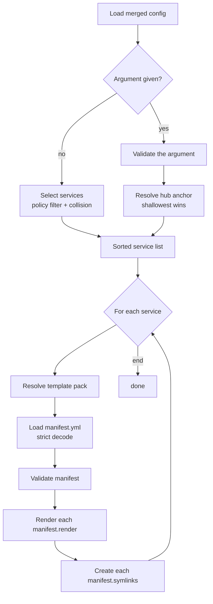
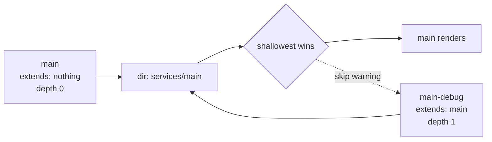
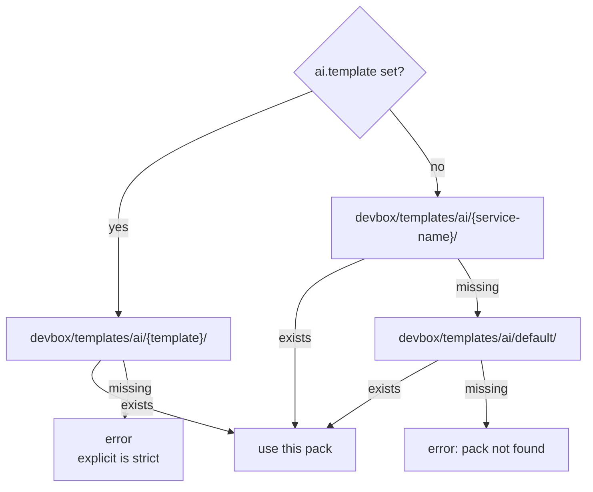

# devbox render ai

Generate hub-level agent documentation for each enabled service from a template pack. The pack declares a `manifest.yml` listing files to render and symlinks to create inside the service's hub directory (e.g. `services/main/AGENTS.md` plus `services/main/CLAUDE.md → AGENTS.md`).

`render ai` and [`render ide`](ide.md) share most of the per-service plumbing — selection, template resolution, path-safety guards. They differ in two important places: the **collision policy** is inverted (shallowest wins, not deepest) and the pack contents are driven by an explicit **manifest** rather than a directory walk.

## Contents

- [Pipeline](#pipeline)
- [Service selection](#service-selection)
  - [Activation gate](#activation-gate)
  - [Directory normalization](#directory-normalization)
  - [Collision resolution: shallowest-wins](#collision-resolution-shallowest-wins)
  - [Explicit `[service]` argument](#explicit-service-argument)
- [Template pack resolution](#template-pack-resolution)
- [Manifest schema](#manifest-schema)
  - [`render` entries](#render-entries)
  - [`symlinks` entries](#symlinks-entries)
  - [Manifest validation rules](#manifest-validation-rules)
- [Per-file rendering](#per-file-rendering)
  - [Template variables](#template-variables)
  - [Path-safety guards](#path-safety-guards)
- [Symlink creation](#symlink-creation)
- [Worked example](#worked-example)
- [Output messages](#output-messages)
- [Common pitfalls](#common-pitfalls)
- [Related references](#related-references)

## Pipeline



## Service selection

### Activation gate

A service participates in agent-docs rendering only when **both** flags are true:

| Gate | Source | Default |
|------|--------|---------|
| Project-level | `services.<name>.enabled` (3-layer merged + mandatory override) | depends on service |
| Agent docs policy | `services.<name>.ai.enabled` | `true` for **all** service types |

Note the contrast with IDE rendering: agent docs default to `true` for every type. The rationale is that hub identity (what this directory *is* and how an AI agent should approach it) is useful for every service, not only `app` services.

If either gate is false, the service is skipped. Skips fall into two groups:

| Group | When | Reported as warning? |
|-------|------|----------------------|
| Policy skips | The service is disabled at the project level, or `ai.enabled` is `false`. | no — these are the documented opt-out behavior |
| Actionable skips | The service has no hub directory, or another service won a directory collision. | yes — these usually indicate a misconfiguration |

### Directory normalization

Same as `render ide`: services without a hub directory are dropped — either `dir` is empty or it resolves to the project root. Agent docs need a real hub directory to write to and must not target the project root.

### Collision resolution: shallowest-wins

When more than one surviving service points at the same `dir`, exactly one wins:

1. Walk each service's `extends` chain to compute a depth.
2. The service with the **shallowest** chain wins. The chain depth is capped (currently at 32 hops) as a cycle guard.
3. Ties at the same depth are broken lexicographically by service name, so the result is deterministic.

The losing services emit a warning naming the winner and the contested directory.



Rationale: the agent docs describe the **hub's identity**. When a child `extends` a parent and shares its `dir`, the parent is the canonical hub owner; the child is a runtime variant of the same workspace, not a separate workspace with its own identity. Picking the parent keeps the AGENTS.md content stable across variant toggles.

This is the **opposite** of `render ide`'s deepest-wins policy. The reason is the difference in what is being rendered:

| Command | What is rendered | Whose viewpoint? |
|---------|------------------|------------------|
| `render ide` | per-variant editor configs (debugger, launch profile) | the variant being worked on right now |
| `render ai` | hub identity and orientation for an AI agent | the canonical owner of the hub |

### Explicit `[service]` argument

`devbox render ai <name>` treats `<name>` as a **hub anchor** (same model as `render ide`).

Validation order (first failure wins):

1. Service not in config.
2. Service is disabled at the project level.
3. Service has no hub directory, or its hub is the project root.
4. `ai.enabled` is `false`.

After validation, the same shallowest-wins resolution is applied scoped to siblings sharing the hub. If the winner differs, an info line announces the substitution.

So `devbox render ai main-debug` still renders the parent `main` whenever both are enabled — the variant resolves to the canonical hub owner.

## Template pack resolution

For each selected service, the renderer picks one pack directory under `devbox/templates/ai/`. The resolution chain mirrors IDE pack resolution exactly, only the base directory differs.



Rules:

- **Explicit is strict.** A set `ai.template` that doesn't exist is a hard error — no silent fallback.
- **Implicit chain** (when `ai.template` is unset): `<service-name>` → `default`.
- A pack must be a real directory; symlinks at the pack root or in any parent component are rejected.
- Template-key validation rejects path separators, leading dots, and `..`.

## Manifest schema

Each pack must contain a `manifest.yml` at its root. The manifest declares what the pack produces; unlike IDE rendering, there is **no implicit walk**. If a file in the pack is not referenced by `render`, it is ignored.

```yaml
render:
  - from: AGENTS.md.tmpl
    to: AGENTS.md
  - from: .claude/CLAUDE.md.tmpl
    to: .claude/CLAUDE.md

symlinks:
  - link: CLAUDE.md
    to: AGENTS.md
```

The manifest is loaded with **strict YAML decode**: unknown fields are a hard error so typos like `renders:` are caught early. An empty file or a manifest with both lists empty is also rejected.

### `render` entries

| Field | Required | Description |
|-------|----------|-------------|
| `from` | yes | Path to the template file relative to the pack root. Must end in `.tmpl` and must not be absolute. The file must exist as a regular file (not symlink, not directory). |
| `to` | yes | Destination path relative to the **service hub directory**. May be nested (e.g. `.claude/CLAUDE.md`). Must not escape the hub. Empty or `..` is rejected. |

### `symlinks` entries

| Field | Required | Description |
|-------|----------|-------------|
| `link` | yes | Path of the symlink to create, relative to the service hub directory. May be nested. Must not escape the hub. |
| `to` | yes | The symlink target, relative to the service hub directory. **Must match the `to` of one of the `render` entries** — symlinks may only point at files this manifest produces. |

Symlinks are written as **relative paths** computed from the link's directory to the target's absolute path inside the hub. They never reach outside the hub.

### Manifest validation rules

The manifest is validated before any file is written:

| Rule | Applies to |
|------|-----------|
| At least one `render` or `symlinks` entry | manifest |
| `from` non-empty, relative, ends in `.tmpl` | each render |
| `from` does not escape the pack and contains no symlink in any parent | each render |
| `from` exists as a regular file (not a symlink, not a directory) | each render |
| `to` non-empty, relative, does not resolve to `.` or `..` | each render |
| `to` unique within the manifest | each render |
| `link` non-empty, relative, does not escape the hub | each symlink |
| `link` unique among symlinks | each symlink |
| `link` does not collide with any render `to` (one path cannot be both a rendered file and a symlink) | each symlink |
| `to` matches a known render destination | each symlink |

Path comparisons are performed on cleaned paths, so `AGENTS.md` and `./AGENTS.md` are treated as the same destination.

## Per-file rendering

For each `render` entry the source is the template file inside the pack and the destination is the entry's `to` path joined with the service hub directory. The renderer:

1. Reads the template file.
2. Parses it as a Go text template, with strict mode enabled — any reference to a missing field aborts rendering instead of writing a `<no value>` placeholder.
3. Executes the template against the [template variables](#template-variables).
4. Resolves the destination and runs the [path-safety guards](#path-safety-guards).
5. Creates any missing parent directories.
6. Refuses to overwrite the destination if it is a pre-existing symlink.
7. Writes the rendered bytes.

### Template variables

Templates receive the same object shape as IDE templates:

| Variable | Source |
|----------|--------|
| `.Project` | `project:` block from `devbox.yml` |
| `.Service` | service name (the map key in `services:`) |
| `.ServiceCfg` | effective service config after `extends` resolution |
| `.Runtime` | merged `runtime` block |

Strict-mode rendering means a typo like `{{.Servic.Name}}` aborts rendering instead of producing `<no value>`. Use `{{if ...}}` for fields that may legitimately be empty.

### Path-safety guards

The renderer applies the same boundary checks as IDE rendering:

1. **Path cleanup.** Manifest validation already rejected absolute paths, `..` escapes, and `.` results.
2. **Hub containment.** The resolved destination must be inside the absolute hub directory.
3. **No symlinks in the destination path.** Existing path components are checked before any directory is created.
4. **Real-path boundaries after creation.** After parent directories are created, the destination directory is resolved through any symlinks and must be inside both the real project root and the real hub. This catches a race where a symlink is dropped between checks.
5. **No symlink at the destination file.** A pre-existing symlink at the target path is refused (rather than following the link and overwriting whatever it points at).

The pack itself is also guarded: pack-root parent path checks reject any symlinked component, and the manifest validator forbids symlinks in any `from` path.

## Symlink creation

For each `symlinks` entry, the renderer creates a symlink at `link` pointing to `to`. Both paths are interpreted as relative to the service hub directory.

Steps:

1. Validate that both `link` and `to` stay inside the hub.
2. Create the parent directory of the link with the same path-safety guards used for rendered files.
3. Compute the relative path from the link's directory to the target inside the hub. The symlink stored on disk is always **relative**, so the hub stays portable across machines.
4. Inspect any existing path at the link location:
   - Symlink already pointing at the correct relative target — no-op (idempotent).
   - Symlink pointing somewhere else — remove and recreate.
   - Regular file or directory — refuse with an error suggesting either deleting the file or setting `ai.enabled: false` for the service.
   - Path absent — create the symlink.

The result is **content-idempotent**: re-running `devbox render ai` produces a hub directory in the same final state. Note that rendered files are always rewritten on each run (so file modification times advance), but the bytes are determined entirely by the templates and the merged config. Symlinks, by contrast, are only re-created when the existing one is missing or points at the wrong target.

## Worked example

Layout:

```
devbox/services.yml
devbox/templates/ai/
  default/
    manifest.yml
    AGENTS.md.tmpl
    .claude/CLAUDE.md.tmpl
```

Manifest `devbox/templates/ai/default/manifest.yml`:

```yaml
render:
  - from: AGENTS.md.tmpl
    to: AGENTS.md
  - from: .claude/CLAUDE.md.tmpl
    to: .claude/CLAUDE.md

symlinks:
  - link: CLAUDE.md
    to: AGENTS.md
```

Template `devbox/templates/ai/default/AGENTS.md.tmpl`:

```markdown
# {{.Service}} Service Hub

This is the {{.Service}} service running inside a devbox-managed hub.
The application source code is at `src/`.

Service container: {{.ServiceCfg.Container}}
Workspace root: {{.ServiceCfg.DirInternal}}
```

`devbox/services.yml`:

```yaml
services:
  main:
    type: app
    container: app-main
    dir: ./services/main

  main-debug:
    extends: main
    container: app-main-debug
    dir: ./services/main          # same hub as parent — collision
```

`devbox render ai`:

1. Selection: both services pass the activation gate (default `ai.enabled: true`). They share `dir: ./services/main`. `main` has the shallower extends chain (depth 0 vs `main-debug`'s 1), so **`main` wins**. `main-debug` is reported as a collision skip.
2. Pack resolution for `main`: `ai.template` is unset; the implicit chain tries `devbox/templates/ai/main/` (not found), then `devbox/templates/ai/default/` (used).
3. Manifest is loaded and validated: two render entries, one symlink. The symlink targets `AGENTS.md`, which is one of the render destinations.
4. Each render entry is processed: `AGENTS.md` and `.claude/CLAUDE.md` are written into `services/main/`.
5. The symlink `services/main/CLAUDE.md → AGENTS.md` is created.

Result:

```
services/main/
  AGENTS.md           ← rendered from AGENTS.md.tmpl
  CLAUDE.md           ← symlink to AGENTS.md
  .claude/
    CLAUDE.md         ← rendered from .claude/CLAUDE.md.tmpl
```

`devbox render ai main-debug` produces the same files — the explicit argument is validated, but the hub-anchor resolution picks `main` (shallowest) and prints `ai [main-debug] — resolved to main (hub services/main)`.

## Output messages

| Stream | Trigger |
|--------|---------|
| info | Explicit argument resolved to a different sibling — names the chosen winner and the shared hub directory. |
| warning | A selected service was skipped because it has no hub directory (or its hub is the project root). |
| warning | A selected service was skipped because another service won the directory collision — the winner is named. |
| success | One line per rendered file, naming the relative path inside the project. |
| success | One line per symlink (whether newly created or already correct), showing both the link and its target. |
| info | Nothing was selected after applying policy and collision rules. |

Errors are returned as command failures and name the offending service so the source of the problem is clear.

## Common pitfalls

- **Pre-existing non-symlink at a managed symlink path.** If `CLAUDE.md` already exists as a regular file (perhaps from a previous manual edit), `render ai` refuses to overwrite it. Delete the file or set `ai.enabled: false` for the service.
- **Symlink `to` must reference a render destination.** The manifest validator enforces this; you cannot symlink to an arbitrary file outside the manifest.
- **Manifest typos are hard errors.** Strict YAML decode means a misspelled key like `renders:` or `symlink:` aborts loading. Fix the spelling.
- **Empty manifest is rejected.** A manifest with both `render: []` and `symlinks: []` is almost always a mistake.
- **Variants share the parent's identity.** This is intentional. If a runtime variant truly needs its own AGENTS.md, give it a different `dir`.
- **Templates referencing missing fields fail.** Strict-mode rendering aborts on any reference to a missing field. Guard optional fields with `{{if ...}}`.
- **`render ai` does not walk the pack.** Files inside the pack that are not referenced by `manifest.yml` are silently ignored at render time. Add an entry to `render:` to include them.

## Related references

- [`services.<name>.ai` block](../config/services.md#ai-block) — `enabled`, `template`, inheritance via `extends`
- [`render ide`](ide.md) — companion command with the opposite (deepest-wins) collision policy
- CLI reference: [`devbox render ai`](../cli/devbox_render_ai.md)
