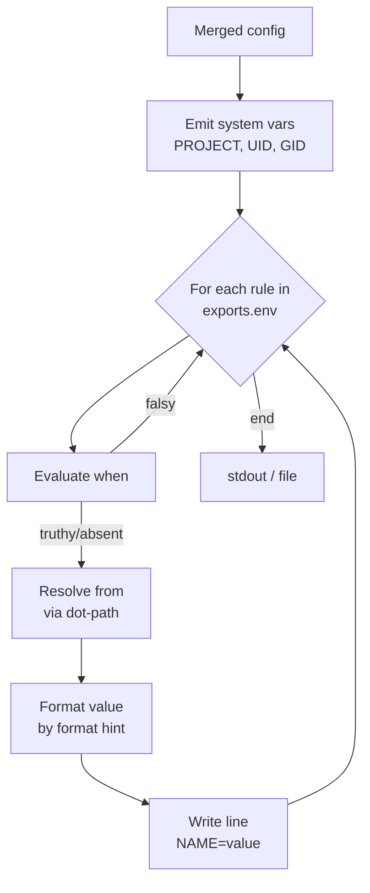
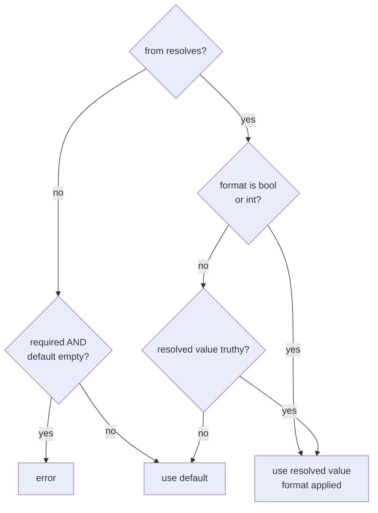

# dwe render env

Generate `.env` content from the merged config. Output goes to stdout by default; pass `--out <path>` to write to a file (parent directories are created).

## Contents

- [Pipeline](#pipeline)
- [System variables](#system-variables)
- [Export rules](#export-rules)
  - [Rule fields](#rule-fields)
  - [Evaluation order](#evaluation-order)
- [Value resolution](#value-resolution)
- [Truthiness](#truthiness)
- [Output format](#output-format)
- [Worked example](#worked-example)
- [Common pitfalls](#common-pitfalls)
- [Related references](#related-references)

## Pipeline

`render env` does not iterate services or read template files from disk. It walks the ordered list of export rules in the merged config and emits one line per rule.



The export rule list lives under `exports.env` in `workspace/defaults.yml` (see [exports.env reference](../config/workspace.md#exportsenv)). The rule order in the YAML file determines the line order in the output.

## System variables

Three variables are always emitted before any rule, regardless of `exports.env`:

| Variable | Source | Notes |
|----------|--------|-------|
| `PROJECT` | `project.name` from `workspace.yml` | Used by Docker labels, Compose project name, and Make targets |
| `UID` | host UID — `1000` on macOS, the real host UID on Linux/WSL | Hard-coded `1000` on macOS because Docker Desktop runs containers in a Linux VM where host UIDs do not map directly |
| `GID` | host GID — same platform logic as `UID` | Same rationale as `UID` |

The names `PROJECT`, `UID`, and `GID` are **reserved**: any export rule that tries to use one of them as `name` is rejected at config-load time with a clear error. This applies to every command that loads the project config, not only `dwe render env` — so a typo is caught the first time you run any command after editing `defaults.yml`.

## Export rules

Each rule maps a dot-path in the merged config to an env variable name. All per-service values — `enabled`, `container`, `ports.<port-name>`, `hosts.<host-name>` — are reachable under `services.<name>.*` regardless of type (`app` / `tool` / `infra`).

```yaml
exports:
  env:
    - name: APP_PORT
      from: services.main.ports.http
      format: int

    - name: APP_HOST
      from: services.main.hosts.web

    - name: TOOL_ADMINER_ENABLED
      from: services.adminer.enabled
      format: bool

    - name: ADMINER_PORT
      from: services.adminer.ports.http
      format: int
      when: services.adminer.enabled

    - name: ADMINER_HOST
      from: services.adminer.hosts.web
      when: services.adminer.enabled

    - name: APP_URL
      from: runtime.urls.app
      default: http://localhost
      comment: Public application URL
```

### Rule fields

| Field | Type | Required | Description |
|-------|------|----------|-------------|
| `name` | string | yes | Env variable name written to `.env` |
| `from` | string | yes | Dot-path navigated against the merged config (e.g. `services.main.ports.http`, `services.main.container`) |
| `default` | string | no | Fallback when `from` resolves to nothing or to a falsy string (see [Value resolution](#value-resolution)) |
| `required` | bool | no | If `true` and `from` is absent and `default` is empty, rendering fails with an error |
| `format` | string | no | One of `string` (default), `bool`, `int` — controls how the resolved value is rendered |
| `when` | string | no | Dot-path; the rule is skipped entirely when this path resolves to a falsy value |
| `comment` | string | no | Written as `# comment` on the line above the variable |

### Evaluation order

For each rule, in source order:

1. **`when` gate** — if `when` is set, resolve its dot-path against the merged config. If the value is falsy, skip the rule entirely (no line emitted, no comment).
2. **Resolve `from`** — fetch the value at the dot-path.
3. **Pick value** — see [Value resolution](#value-resolution).
4. **Required check** — if the path was absent and no `default` is set and `required: true`, fail with an error naming the missing path.
5. **Comment** — if `comment` is set, emit `# <comment>` on its own line.
6. **Emit** — write `<name>=<value>`.

## Value resolution

The picked value depends on three things: whether `from` resolved, the `format` hint, and the truthiness of the resolved value.



The asymmetry matters:

- `format: bool` and `format: int` always use the resolved value, even when it is `false` or `0`. This guarantees that `TOOL_ADMINER=false` and `PORT=0` survive through to `.env` instead of silently falling back to a default.
- `format: string` (the default) treats falsy resolved values as "not really set" and falls back to `default`. So a YAML `""` at `runtime.urls.app` falls through to `default: http://localhost`.

`format` shapes the output:

| Format | Behavior |
|--------|----------|
| `string` (default) | Stringify the resolved value as-is. |
| `bool` | A boolean value is rendered as the literal `true` or `false`. Other types fall back to a plain stringification. |
| `int` | The resolved number is stringified directly (YAML numbers are already int-like). |

## Truthiness

The same truthiness rule applies to both `when` and the string-format fallback:

| Value | Truthy? |
|-------|---------|
| absent path | no |
| `false` | no |
| `0` (any numeric type) | no |
| `""` | no |
| `"false"` | no |
| `"0"` | no |
| anything else | yes |

Example: `when: services.adminer.enabled` skips the rule whenever the service is unset, explicitly false, or a string `"false"` / `"0"`.

**Dot-path syntax note:** Export rule `from:` / `when:` fields use **bare dot-paths** into the merged config, not the `{{ ... }}` template syntax. Per-service values live under `services.<name>.*` for every type — e.g. `from: services.adminer.ports.http`, `from: services.mailpit.hosts.web`, `from: services.main.container`, `when: services.adminer.enabled`.

## Output format

```text
# Generated by dwe — do not edit manually

PROJECT=<project.name>
UID=<host UID or 1000>
GID=<host GID or 1000>
# <comment from rule, if any>
<NAME>=<value>
...
```

A blank line follows the header banner, then system variables, then rules.

When `--out <path>` is supplied:

- The path is interpreted relative to the current working directory, not the project root. Pass an absolute path if you want a deterministic location regardless of where the command is invoked from (for example, when running with `-c /path/to/workspace.yml` from a different directory).
- Missing parent directories are created.
- The full content replaces any existing file (no merging, no comments preserved).

## Worked example

`workspace/services/main/service.yml`:

```yaml
type: app
container: app-main
required: true
dir: ./services/main
ports:
  http: 8080
```

`workspace/services/adminer/service.yml`:

```yaml
type: tool
container: adminer
ports:
  http: 8027
```

`workspace/defaults.yml`:

```yaml
services:
  adminer:
    enabled: true
runtime:
  urls:
    app: ""
exports:
  env:
    - name: APP_PORT
      from: services.main.ports.http
      format: int
    - name: APP_URL
      from: runtime.urls.app
      default: http://localhost
    - name: TOOL_ADMINER
      from: services.adminer.enabled
      format: bool
      when: services.adminer.enabled
    - name: TOOL_REDIS
      from: services.redis_insight.enabled
      format: bool
      when: services.redis_insight.enabled
```

`workspace.yml`:

```yaml
project:
  name: demo
```

`dwe render env` on macOS produces:

```text
# Generated by dwe — do not edit manually

PROJECT=demo
UID=1000
GID=1000
APP_PORT=8080
APP_URL=http://localhost
TOOL_ADMINER=true
```

Walk-through:

- `APP_PORT` — `format: int`, value `8080`, emitted directly.
- `APP_URL` — `from` resolves to empty string (falsy under `format: string`), so `default` is used.
- `TOOL_ADMINER` — `when` resolves truthy, value `true` rendered as literal `true`.
- `TOOL_REDIS` — `when` resolves to absent (no `redis_insight` entry), rule skipped, no line emitted.

## Common pitfalls

- **`format: string` swallows `false`/`0`/`""`** — if you need a literal `false` or `0` in the output, pick `format: bool` or `format: int`. Otherwise the value silently falls through to `default` (or to an empty string).
- **`when` and `from` are independent dot-paths** — `when` does not have to point at the same key as `from`. Use it to gate one variable on another setting (e.g. `from: services.second.container`, `when: services.second.enabled`).
- **`required: true` without `default`** — produces a hard error if the path is absent. Use it for variables your runtime cannot start without; otherwise rely on `default` to keep the file complete.
- **Editing `.env` by hand** — the file is regenerated by `dwe render env --out .env` and by lifecycle hooks. Edit `workspace/defaults.yml` exports or `workspace/local.yml` overrides instead.
- **`--out` has no short form.** The flag is spelled `--out`; there is no `-o` alias. Use `dwe render env --out .env`.
- **Redeclaring `PROJECT`/`UID`/`GID`** — these names are reserved and validated at config load. An export rule that uses one of them produces a hard error when any command loads the project config; remove the rule and reach the same value via the system variable instead.

## Related references

- [`exports.env` rule schema](../config/workspace.md#exportsenv) — full field reference, formats
- [Dot-path resolution](../config/workspace.md#dot-path-resolution) — how `from` and `when` paths navigate the merged config
- CLI reference: [`dwe render env`](../cli/dwe_render_env.md)
