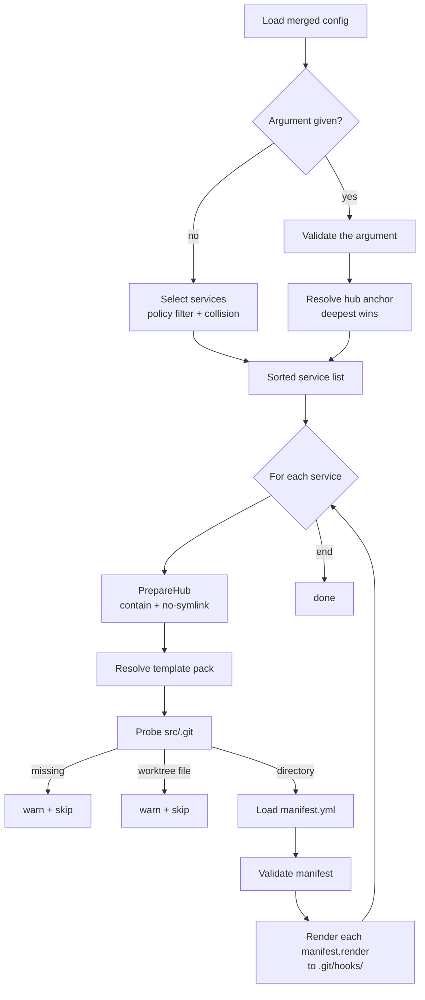

# dwe render git

Generate shell git hooks for each enabled service from a template pack. Output goes into the service's git hooks directory (e.g. `services/main/src/.git/hooks/pre-commit`), with executable mode `0755`.

`render git` shares the per-service plumbing with [`render ide`](ide.md) and [`render ai`](ai.md) — same selection model, same pack resolution chain, same path-safety guards, same manifest-driven schema. It differs in two places: the destination is inside the service's `.git/` directory (which is never tracked by git), and the manifest's `to` paths are restricted to basenames (no subdirectories under `hooks/`).

## Contents

- [Pipeline](#pipeline)
- [Service selection](#service-selection)
  - [Activation gate](#activation-gate)
  - [Hub preflight and git directory probe](#hub-preflight-and-git-directory-probe)
  - [Collision resolution: deepest-wins](#collision-resolution-deepest-wins)
  - [Explicit `[service]` argument](#explicit-service-argument)
- [Template pack resolution](#template-pack-resolution)
- [Manifest schema](#manifest-schema)
- [Per-file rendering](#per-file-rendering)
  - [Template variables](#template-variables)
  - [Path-safety guards](#path-safety-guards)
  - [File mode normalization](#file-mode-normalization)
- [Worked example](#worked-example)
- [Output messages](#output-messages)
- [Worktrees and submodules](#worktrees-and-submodules)
- [Common pitfalls](#common-pitfalls)
- [Related references](#related-references)

## Pipeline



## Service selection

### Activation gate

A service participates in git-hook rendering only when **both** flags are true:

| Gate | Source | Default |
|------|--------|---------|
| Project-level | `services.<name>.enabled` (3-layer merged + required service override) | depends on service |
| Git policy | `services.<name>.render.git.enabled` | `true` for `type: app`; `false` otherwise |

The default policy is the same as [`render ide`](ide.md) and `render ai`: only `type: app` services render hooks by default, because that is where developers typically commit code. Other service types must opt in explicitly with `render.git.enabled: true`.

Inheritance through `extends` follows the same rules as `render.ide` and `render.ai`: a child without an explicit value inherits the parent's `render.git.enabled` and `render.git.template`.

### Hub preflight and git directory probe

Before any disk write, each selected service goes through two preflight checks:

1. **Hub containment.** `svc.Dir` must resolve inside the project root and must not be reached through a symlink. A service with `dir: ../outside` or a symlinked `services/<name>` directory is rejected with a hard error — the renderer never creates a `src/.git/hooks/` outside the project tree.
2. **Git directory probe.** `<absHub>/src/.git` is inspected:
   - **directory** → proceed; hooks are written to `<absHub>/src/.git/hooks/`.
   - **regular file** (worktree or submodule `gitdir:` pointer) → warn and skip this service. See [Worktrees and submodules](#worktrees-and-submodules).
   - **missing** → warn and skip this service.

Path-component symlinks anywhere in `<absHub>/src/.git/{hooks}` are rejected.

### Collision resolution: deepest-wins

When more than one surviving service points at the same `dir`, exactly one wins via the same deepest-extends-wins rule as [`render ide`](ide.md): chain depth is computed, the deepest service wins, lexicographic name breaks ties. The losing services emit a warning naming the winner.

Rationale matches IDE: git hooks reflect the variant being worked on right now (a `main-debug` variant may want extra checks the canonical `main` does not), and the most-specialized service in the chain owns the rendered hooks for the shared `.git/`.

### Explicit `[service]` argument

`dwe render git <name>` treats `<name>` as a hub anchor. The argument is validated against the service map and the activation gate, then the same deepest-wins resolution is applied — so `dwe render git main` may end up rendering from the `main-debug` config when both share `dir`.

## Template pack resolution

For each selected service the renderer picks one pack directory under `workspace/templates/git/`. The chain matches [`render ai`](ai.md#template-pack-resolution) and [`render ide`](ide.md#template-pack-resolution) exactly, only the base directory differs:

1. If `render.git.template` is set, only `workspace/templates/git/<render.git.template>/` is tried. Missing pack is a hard error.
2. Otherwise, try `workspace/templates/git/<service-name>/`. If missing, fall through.
3. Otherwise, walk the service's `extends:` chain ancestor-by-ancestor — `workspace/templates/git/<ancestor>/`. The first existing pack wins.
4. Otherwise, use `workspace/templates/git/default/`. If missing, skip with a warning (implicit missing pack).

Pack-name characters are restricted (`^[A-Za-z0-9][A-Za-z0-9_-]*$`); an unsafe name (leading dot, leading hyphen, path separators) silently skips that candidate and the walk continues with the next ancestor or `default/`.

## Manifest schema

Each pack must contain a `manifest.yml` at its root using the [shared schema](index.md#shared-manifest-schema):

```yaml
render:
  - { from: pre-commit.tmpl,         to: pre-commit }
  - { from: prepare-commit-msg.tmpl, to: prepare-commit-msg }
  - { from: commit-msg.tmpl,         to: commit-msg }
  - { from: pre-push.tmpl,           to: pre-push }
```

`symlinks` is not used for git packs and must be empty or absent — git's hook discovery does not follow symlinks created inside `.git/hooks/`.

Git-specific validation rules (on top of the shared shape rules):

| Rule | Behavior |
|------|----------|
| `to` is a basename — no path separators, no `..`, no `.` segments | hard error |
| `symlinks` list is non-empty | hard error |
| Every `from` resolves either in the canonical pack or in the `<pack>.local/` override | hard error if missing |

Strict YAML decode means a misspelled key (`renders:`, `symlink:`) is rejected at load time.

## Per-file rendering

For each `render` entry the source is resolved via the shared [packroot resolver](index.md#local-overrides) (`<pack>.local/<rel>` → canonical `<pack>/<rel>`). The renderer:

1. Reads the resolved template file.
2. Parses it as a [Go text template](../templates.md) with strict mode enabled — any reference to a missing field aborts rendering instead of writing a `<no value>` placeholder.
3. Executes the template against the [template variables](#template-variables).
4. Refuses to overwrite the destination if it already exists as a symlink (a symlinked hook would be silently ignored by git on many platforms).
5. Writes the rendered bytes to `<svc.Dir>/src/.git/hooks/<basename>`.
6. Sets the file mode to `0755` explicitly via `chmod` — see [File mode normalization](#file-mode-normalization).

### Template variables

Same shape as `render ide` and `render ai`:

| Variable | Source |
|----------|--------|
| `.Project` | `project:` block from `workspace.yml` |
| `.Service` | **canonical config identity** — the root of the rendering service's `extends:` chain. Use this for raw-config lookups keyed by service name (e.g. `(index .Cfg.Raw.git.hooks .Service)`). Equals `.Resolved` when the rendering service has no `extends:`. |
| `.Resolved` | **rendering identity** — the name of the service whose hub is actually being rendered (the deepest-extends collision winner). Equals `.Service` in the no-collision case. |
| `.ServiceCfg` | effective service config of `.Resolved` (the rendering service), after `extends` resolution. Fields like `.ServiceCfg.Container` reflect the extender's overlay. |
| `.Runtime` | merged `runtime` block |
| `.Cfg` | merged `DweConfig` (advanced). `.Cfg.Raw` is the post-merge config map after DWE normalization (`services.*` injected from per-service `service.yml` files) — see [Templates](../templates.md#render-context-per-site). Prefer the dedicated fields above for common cases. |

> **Why `.Service` and `.Resolved` differ.** When two services share the same `dir:` (typically a base + an `extends:` child like `main` and `main-debug`), the collision policy picks the deepest extender as the hub owner — that's `.Resolved`. But user-facing config sections keyed by service name (`git.hooks.<svc>`, `cs.<svc>`, …) are populated only on the base by convention, so raw-config lookups must use `.Service` (the chain root) to resolve. The two fields keep the *behavioral identity* (which container to attach to, which overlay applies) and the *config identity* (where to look up user values) distinguishable.

Strict-mode rendering means a typo like `{{.Servic.Name}}` aborts rendering instead of producing `<no value>`. Use `{{if ...}}` for fields that may legitimately be empty.

#### Accessing `.Cfg.Raw`

Go's `text/template` resolves dot-segments only when each segment matches `[A-Za-z_][A-Za-z0-9_]*`. Keys with hyphens, dots, leading digits, or any other non-identifier character cannot be reached with dot syntax — use `index` instead.

```gotemplate
JIRA_PREFIX="{{ .Cfg.Raw.git.project_prefix }}"                  {{- /* dot — identifier-safe keys */ -}}
TOKEN='{{ index .Cfg.Raw "my-tool" "api-key" }}'                {{- /* index — hyphenated keys */ -}}
{{- $hooks := index .Cfg.Raw.git.hooks .Service }}{{ index $hooks "pre_commit" }}
```

Git hooks render under `<svc.Dir>/src/.git/hooks/` (gitignored), so `local.yml`-sourced values in `.Cfg.Raw` produce per-developer hook variation that is not committed — that's the intended use case here, unlike `render ide` / `render ai` which write tracked files.

The full set of helper functions available inside `*.tmpl` files (`appURL`, sprout registries, `text/template` built-ins) is documented in [Templates](../templates.md).

### Path-safety guards

The renderer applies the same boundary chain as IDE/AI, adapted for the `.git/hooks/` destination:

1. **Hub preflight.** `svc.Dir` containment and no-symlink check before any `MkdirAll`.
2. **Git directory probe.** `<absHub>/src/.git` must be a real directory; any symlink component in the path is rejected.
3. **Manifest `to` is a basename.** No subdirectory under `hooks/` is allowed (git does not recurse into `hooks/` subdirectories).
4. **Real-path boundary after creation.** After `MkdirAll(<hooksDir>)`, the resolved real path of the hooks directory must be inside both the real project root and the real `.git/` directory. This catches a pre-existing `hooks -> /tmp/...` symlink in `.git/`.
5. **No symlink at the destination file.** A pre-existing `<hooksDir>/<basename>` symlink is refused rather than followed.

### File mode normalization

`os.WriteFile` only sets the file mode on creation. To guarantee that re-rendering an existing hook restores executable bits even if it landed as `0644` (for example, from a previous tool or a checkout via Windows), the renderer issues an explicit `chmod 0755` on every rendered hook on every run.

## Worked example

Layout:

```
workspace/services/
  main/
    service.yml
workspace/templates/git/
  default/
    manifest.yml
    pre-commit.tmpl
    pre-push.tmpl
```

Manifest `workspace/templates/git/default/manifest.yml`:

```yaml
render:
  - { from: pre-commit.tmpl, to: pre-commit }
  - { from: pre-push.tmpl,   to: pre-push }
```

Template `workspace/templates/git/default/pre-commit.tmpl`:

```sh
#!/usr/bin/env sh
# pre-commit hook for {{.Resolved}} ({{.ServiceCfg.Container}})
exec dwe cmd lint
```

`workspace/services/main/service.yml`:

```yaml
type: app
container: app-main
dir: ./services/main
# render.git.enabled defaults to true (type: app)
```

`dwe render git`:

1. Selection: `main` passes the activation gate. Hub preflight succeeds.
2. Pack resolution: implicit chain — `workspace/templates/git/main/` is missing, so `workspace/templates/git/default/` is used.
3. `services/main/src/.git/` is a directory → probe succeeds.
4. Manifest validated: two render entries, no symlinks, basename `to` values, sources exist.
5. Each entry rendered into `services/main/src/.git/hooks/` with mode `0755`.

Result:

```
services/main/src/.git/hooks/
  pre-commit       (0755)
  pre-push         (0755)
```

If `services/main/src/.git` had been a file (worktree/submodule pointer) or missing entirely, `render git` would have emitted a warning and exited successfully without writing anything.

## Output messages

| Stream | Trigger |
|--------|---------|
| info | Explicit argument resolved to a different sibling — names the chosen winner and the shared hub directory. |
| info | A `<pack>.local/<rel>` override was used in place of the canonical pack file. |
| warning | A selected service has no `src/.git` directory — skipped. |
| warning | A selected service's `src/.git` is a worktree/submodule pointer file — skipped (see [Worktrees and submodules](#worktrees-and-submodules)). |
| warning | A selected service was skipped because another service won the directory collision — the winner is named. |
| success | One line per rendered hook, naming the relative path inside the project. |
| info | Nothing was selected after applying policy and collision rules. |

Errors are returned as command failures and name the offending service so the source of the problem is clear.

## Worktrees and submodules

When `<svc.Dir>/src/.git` is a regular file rather than a directory, it is a `gitdir:` pointer used by `git worktree` checkouts and submodules. Following such pointers requires reading the file, resolving a relative path to the real git directory, and re-applying the path-safety guards on the resolved target. This iteration does **not** follow `gitdir:` pointers — the service is skipped with a warning and no hooks are rendered.

A follow-up plan will add worktree support. Until then, services with worktree checkouts need their hooks installed manually, or by pointing `core.hooksPath` at a tracked directory inside the repo.

## Common pitfalls

- **Non-`app` services do not render by default.** Set `services.<name>.render.git.enabled: true` explicitly to opt in.
- **Manifest `to` must be a basename.** Hooks live directly inside `hooks/`; git does not recurse. A `to: subdir/pre-commit` is rejected.
- **`symlinks` is not used for git.** Many git installations ignore symlinked hooks. Move the content into a separate render entry instead.
- **The render output is inside `.git/`.** It is never tracked. Re-rendering is the source of truth — do not hand-edit `src/.git/hooks/<name>` and expect changes to survive.
- **Worktrees and submodules are skipped.** See [Worktrees and submodules](#worktrees-and-submodules).
- **Pre-existing non-executable hook.** Re-rendering normalizes the mode back to `0755` on every run.

## Related references

- [`services.<name>.render.git` block](../config/services/fields.md#rendergit-block) — `enabled`, `template`, inheritance via `extends`
- [`render ide`](ide.md) — companion command with the same deepest-wins collision policy
- [`render ai`](ai.md) — companion command (shallowest-wins) sharing the manifest schema
- [Render overview](index.md) — shared manifest schema and local-override mechanism
- Run `dwe render git --help` for the live CLI surface
