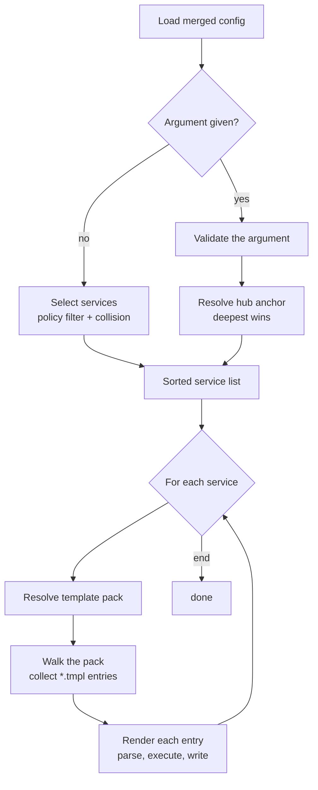
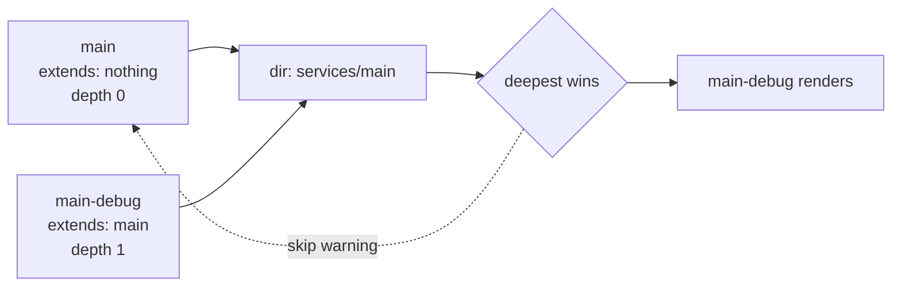
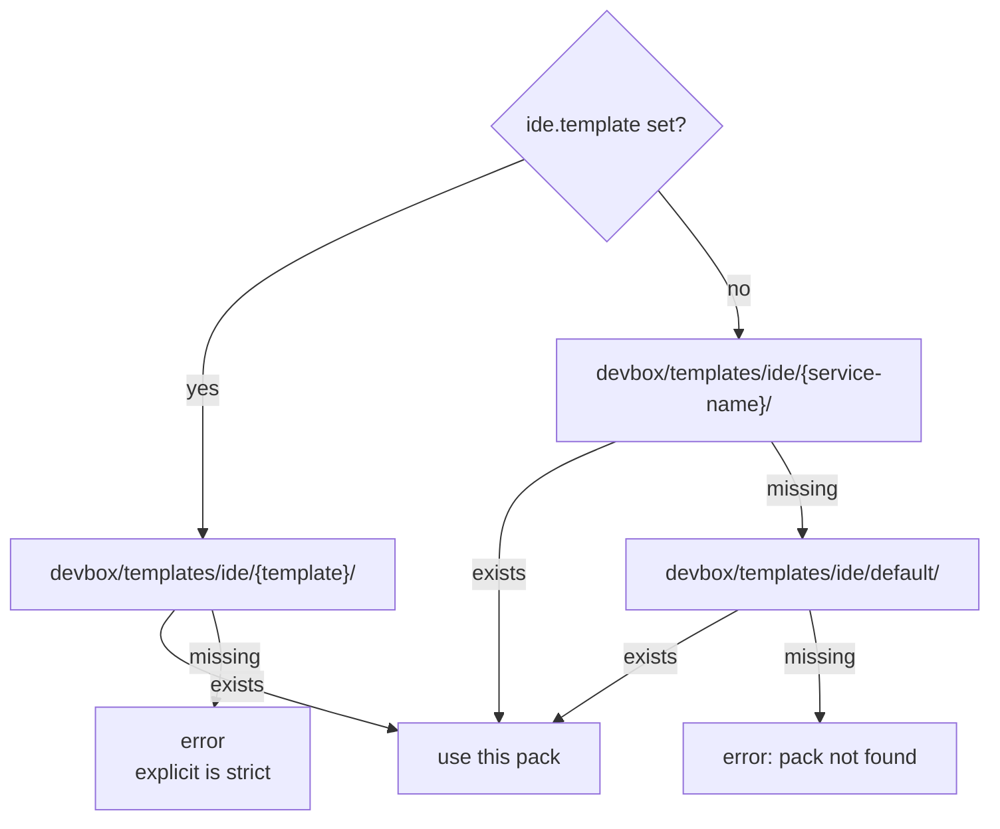

# devbox render ide

Generate IDE-specific config files for each enabled service from a template pack. Output goes into the service's hub directory (e.g. `services/main/.vscode/settings.json`).

## Contents

- [Pipeline](#pipeline)
- [Service selection](#service-selection)
  - [Activation gate](#activation-gate)
  - [Directory normalization](#directory-normalization)
  - [Collision resolution: deepest-wins](#collision-resolution-deepest-wins)
  - [Explicit `[service]` argument](#explicit-service-argument)
- [Template pack resolution](#template-pack-resolution)
- [Pack walk and template filter](#pack-walk-and-template-filter)
- [Per-file rendering](#per-file-rendering)
  - [Template variables](#template-variables)
  - [Path-safety guards](#path-safety-guards)
- [Worked example](#worked-example)
- [Output messages](#output-messages)
- [Common pitfalls](#common-pitfalls)
- [Related references](#related-references)

## Pipeline



## Service selection

### Activation gate

A service participates in IDE rendering only when **both** flags are true:

| Gate | Source | Default |
|------|--------|---------|
| Project-level | `services.<name>.enabled` (3-layer merged + mandatory override) | depends on service |
| IDE policy | `services.<name>.ide.enabled` | `true` for `type: app`; `false` otherwise |

If either gate is false, the service is skipped. Skips fall into two groups:

| Group | When | Reported as warning? |
|-------|------|----------------------|
| Policy skips | The service is disabled at the project level, or `ide.enabled` is `false` (explicitly or by type default). | no — these are the documented opt-in/opt-out behavior |
| Actionable skips | The service has no hub directory, or another service won a directory collision. | yes — these usually indicate a misconfiguration |

### Directory normalization

After the activation gate, services without a hub directory are dropped — either because `dir` is empty or because it resolves to the project root. A service with no hub has nowhere to write, and a hub equal to the project root would let the renderer scribble over `devbox.yml` itself.

### Collision resolution: deepest-wins

When more than one surviving service points at the same `dir`, exactly one wins:

1. Walk each service's `extends` chain to compute a depth.
2. The service with the **deepest** chain wins. The chain depth is capped (currently at 32 hops) as a cycle guard.
3. Ties at the same depth are broken lexicographically by service name, so the result is deterministic.

The losing services emit a warning that names the winning service and the contested directory.



Rationale: IDE configs are about per-variant overrides (different debugger settings for `main-debug`, different launch profiles for a stage variant), so the most-specialized service in the chain owns the rendered files.

### Explicit `[service]` argument

`devbox render ide <name>` treats `<name>` as a **hub anchor**: it must be a real, eligible service, but the deepest-wins policy is then applied to figure out which sibling actually renders.

Validation order (first failure wins):

1. Service not in config.
2. Service is disabled at the project level.
3. Service has no hub directory, or its hub is the project root.
4. `ide.enabled` evaluates to `false` — either explicitly or by the type's default (non-`app` types are off by default; the error message tells you which case applies and how to opt in).

Once validated, the same deepest-wins resolution is applied scoped to siblings sharing the same `dir`. If the winner differs from the argument, an info line announces the substitution.

So `devbox render ide main` from a per-service deploy pipeline still does the right thing when `main-debug` is the active variant.

## Template pack resolution

For each selected service the renderer picks one pack directory under `devbox/templates/ide/`.



Rules:

- **Explicit is strict.** If `ide.template` is set, only that pack is tried. A missing pack is a hard error — no silent fallback. This protects against typos like `templete:` accidentally resolving to `default/` and rendering surprising content.
- **Implicit chain** (when `ide.template` is unset): `<service-name>` → `default`. Fall-through happens only when the candidate directory is missing; any other filesystem error is a hard error.
- A pack must be a **real directory**. Symlinked packs are rejected.
- The chosen pack must be inside the project root with no symlinked parent components.

Template-key validation rejects:

- Path separators (`/`, `\`).
- Leading dot (subsumes `..` and hidden-name keys).
- Empty (treated as "unset", which is allowed and triggers the implicit chain).

Service names used as the implicit pack key are validated less strictly (leading dots are allowed because service names are YAML map keys, not user-typed paths) but still must not contain path separators or be `..`.

## Pack walk and template filter

The renderer walks every entry under the chosen pack. The walker is strict by design:

| Rule | Behavior |
|------|----------|
| Any symlink in the tree (file or directory) | hard error |
| Non-`.tmpl` files | silently ignored |
| Bare `.tmpl` (e.g. `.vscode/.tmpl`) | hard error |
| Path that resolves to an absolute path or escapes the pack with `..` | hard error |
| Two source files that would resolve to the same destination after stripping `.tmpl` | hard error |

For each surviving entry, the destination is the path inside the pack with the `.tmpl` suffix stripped (e.g. `.vscode/settings.json.tmpl` → `.vscode/settings.json`). Entries are processed in lexicographic order so output is deterministic and diffs are reproducible.

If the pack contains zero `.tmpl` files, a warning is printed and the service is skipped without error.

## Per-file rendering

For each entry the destination is built by joining the service hub directory with the entry's relative path (the pack-internal path with `.tmpl` stripped). The renderer:

1. Reads the template file from the pack.
2. Parses it as a Go text template, with strict mode enabled — any reference to a missing field aborts rendering instead of writing a `<no value>` placeholder.
3. Executes the template against the [template variables](#template-variables).
4. Resolves the destination and runs the [path-safety guards](#path-safety-guards).
5. Creates any missing parent directories.
6. Refuses to overwrite the destination if it already exists as a symlink.
7. Writes the rendered bytes.

Existing regular files at the destination are overwritten without prompting — that is the whole point of the command.

### Template variables

Templates receive a single object with these top-level fields:

| Variable | Source | Notes |
|----------|--------|-------|
| `.Project` | `project:` block from `devbox.yml` | e.g. `.Project.Name`, `.Project.Prefix` |
| `.Service` | service name (the map key in `services:`) | |
| `.ServiceCfg` | the effective service config after `extends` resolution | e.g. `.ServiceCfg.Container`, `.ServiceCfg.Dir`, `.ServiceCfg.DirInternal`, `.ServiceCfg.WorkDirInternal`, `.ServiceCfg.CLI.*` |
| `.Runtime` | merged `runtime` block | e.g. `.Runtime.Ports.App` |

Strict-mode means a typo in `{{.Servic.Name}}` aborts rendering instead of writing a `<no value>` placeholder. Use `{{if ...}}` guards for fields that may legitimately be empty.

### Path-safety guards

The renderer applies multiple boundary checks because a malicious or careless template path could otherwise be used to write files outside the service hub or the project root. The full chain, in order:

1. **Path cleanup.** Each pack entry's relative path is normalized; absolute paths and `..` escapes are rejected during the pack walk.
2. **Service-dir containment.** The resolved destination must be inside the service hub directory.
3. **No symlinks in the destination path.** Existing path components are checked before any directory is created. This catches a pre-existing `.devcontainer` symlink that would otherwise let directory creation follow it outside the hub.
4. **Real-path boundaries after creation.** After parent directories are created, the destination directory is resolved through any symlinks and must still be inside both the real project root and the real service hub. This catches a race where a symlink is dropped between checks.
5. **No symlink at the destination file.** If a symlink already exists at the target path, the write is refused (rather than following the link and overwriting whatever it points at).

The same guards are applied to the pack itself: the pack directory is checked for symlinked parent components, and the walker rejects any symlink inside the tree.

## Worked example

Layout:

```
devbox/services.yml
devbox/templates/ide/
  default/
    .devcontainer/devcontainer.json.tmpl
    .vscode/settings.json.tmpl
  main-debug/
    .devcontainer/devcontainer.json.tmpl
    .vscode/settings.json.tmpl
    .vscode/launch.json.tmpl
```

`devbox/services.yml`:

```yaml
services:
  main:
    type: app
    container: app-main
    dir: ./services/main
    # ide.enabled defaults to true (type: app)

  main-debug:
    extends: main
    container: app-main-debug
    dir: ./services/main          # same dir as parent — collision
    ide:
      template: main-debug         # use the main-debug pack
```

Template `devbox/templates/ide/main-debug/.vscode/settings.json.tmpl`:

```json
{
  "container.name": "{{.ServiceCfg.Container}}",
  "workspace.root": "{{.ServiceCfg.DirInternal}}",
  "service": "{{.Service}}"
}
```

`devbox render ide` (no argument):

1. Selection: both `main` and `main-debug` pass the activation gate. They share `dir: ./services/main`. `main-debug` has a deeper `extends` chain (depth 1 vs 0), so `main-debug` wins. `main` is reported as a collision skip and a warning is printed.
2. Pack resolution for `main-debug`: `ide.template: main-debug` is explicit; `devbox/templates/ide/main-debug/` exists, so it is used.
3. Pack walk yields three entries (sorted): `.devcontainer/devcontainer.json`, `.vscode/launch.json`, `.vscode/settings.json`.
4. Each is rendered with `.Service = "main-debug"`, `.ServiceCfg.Container = "app-main-debug"`, etc.

Result:

```
services/main/
  .devcontainer/
    devcontainer.json
  .vscode/
    launch.json
    settings.json
```

`devbox render ide main` produces the same result — `main` is validated, but the hub-anchor resolution picks `main-debug` and prints `ide [main] — resolved to main-debug (hub services/main)`.

## Output messages

| Stream | Trigger |
|--------|---------|
| info | Explicit argument resolved to a different sibling — names the chosen winner and the shared hub directory. |
| warning | A selected service was skipped because it has no hub directory (or its hub is the project root). |
| warning | A selected service was skipped because another service won the directory collision — the winner is named. |
| warning | The chosen pack contains no `.tmpl` files; nothing was rendered for that service. |
| success | One line per rendered file, naming the relative path inside the project. |
| info | Nothing was selected after applying policy and collision rules. |

Errors are returned as command failures and name the offending service so the source of the problem is clear.

## Common pitfalls

- **Non-`app` services do not render by default.** Set `services.<name>.ide.enabled: true` explicitly in `services.yml` to opt in.
- **Typos in `ide.template` are hard errors.** Explicit packs are strict; a missing `devbox/templates/ide/<name>/` does not silently fall through to `default/`. Either fix the name or remove `ide.template`.
- **Templates referencing missing fields fail.** Strict-mode rendering means `{{.ServiceCfg.NoSuchField}}` aborts rendering. Guard optional fields with `{{if ...}}`.
- **Symlinks at destinations are refused.** If `.devcontainer/` or `settings.json` is a symlink, the renderer will not overwrite it. Remove the symlink and re-run.
- **Files outside `*.tmpl` are silently ignored.** If you forget the `.tmpl` suffix on a template file, it stays in the pack but is never rendered.
- **`dir: "."` is rejected.** A service whose hub is the project root would let templates scribble over `devbox.yml` and other root files. Give every IDE-rendered service a real subdirectory.

## Related references

- [`services.<name>.ide` block](../config/services.md#ide-block) — `enabled`, `template`, inheritance via `extends`
- [`render ai`](ai.md) — companion command with the opposite collision policy
- CLI reference: [`devbox render ide`](../cli/devbox_render_ide.md)
