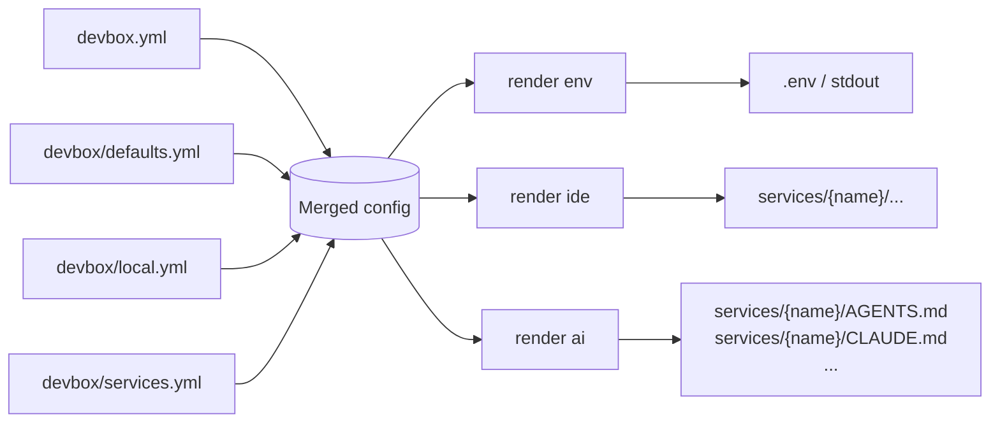

# Render Reference

`devbox render` produces files derived from the merged devbox config. It is the single entry point for code-generated artifacts — none of these files should be hand-edited; re-run the corresponding subcommand instead.

## Contents

- [Subcommands](#subcommands)
- [Common pipeline](#common-pipeline)
- [Inputs and outputs at a glance](#inputs-and-outputs-at-a-glance)
- [Pages](#pages)
- [Related references](#related-references)

## Subcommands

| Command | Output | Source |
|---------|--------|--------|
| `devbox render env` | `.env` content (stdout or `-o <path>`) | `exports.env` rules in `devbox/defaults.yml` + system vars |
| `devbox render ide` | Per-service IDE config files inside each service hub | Template packs under `devbox/templates/ide/<pack>/` |
| `devbox render ai` | Hub-level agent docs (`AGENTS.md`, `CLAUDE.md` symlink, …) | Template packs under `devbox/templates/ai/<pack>/` driven by `manifest.yml` |

All three subcommands read the same merged config (`devbox.yml` → `devbox/defaults.yml` → `devbox/local.yml`, with `devbox/services.yml` joined in). They differ in what they iterate and where they write.

## Common pipeline

Each subcommand:

1. Loads the merged config. A missing or invalid project config is a hard error.
2. Selects targets:
   - `env` — single artifact, no selection.
   - `ide` / `ai` — iterates services, applies a selection policy, and optionally narrows to one service via the `[service]` argument.
3. Writes output files. Where they go depends on the subcommand:
   - `render ide` and `render ai` write inside each service's hub directory, anchored to the project root (the directory containing `devbox.yml`), and enforce path-safety boundaries.
   - `render env` writes to stdout by default, or to the `-o <path>` argument as given. The `-o` path is interpreted relative to the current working directory, not the project root — pass an absolute path if you want a deterministic location regardless of where the command is invoked from.

## Inputs and outputs at a glance

| Aspect | `render env` | `render ide` | `render ai` |
|--------|--------------|--------------|-------------|
| Iterates services | no | yes | yes |
| Reads templates from disk | no | yes (`*.tmpl`) | yes (`*.tmpl`, manifest-driven) |
| Per-service opt-in field | — | `services.<name>.ide.enabled` | `services.<name>.ai.enabled` |
| Default opt-in policy | — | `true` for `type: app`; `false` otherwise | `true` for all types |
| Collision policy when services share `dir` | — | deepest `extends` wins (per-variant overrides) | shallowest `extends` wins (canonical hub identity) |
| Manifest file | — | none — full directory walk | `manifest.yml` declares `render` + `symlinks` |
| Symlinks supported | no | no | yes (relative, hub-internal) |
| Path-safety guards | n/a | symlink rejection in pack and destination | symlink rejection in pack and destination |

## Pages

- [`render env`](env.md) — `.env` generation: system variables, export rules, `when` filtering, value formatting
- [`render ide`](ide.md) — IDE template packs: pack resolution, directory walk, deepest-wins collision policy, per-service rendering
- [`render ai`](ai.md) — Agent docs template packs: manifest schema, shallowest-wins collision policy, render + symlink entries

## Related references

- [`devbox.yml` / `defaults.yml` / `local.yml`](../config/devbox.md) — merged config layers and dot-path resolution (used by `render env`)
- [`services.yml`](../config/services.md) — service definitions, `ide` / `ai` blocks, `extends` chains
- [Templates](../templates.md) — Go template syntax, sprout helpers, render context (shared with info / commands / pipelines)
- CLI reference: [`devbox render`](../cli/devbox_render.md), [`devbox render env`](../cli/devbox_render_env.md), [`devbox render ide`](../cli/devbox_render_ide.md), [`devbox render ai`](../cli/devbox_render_ai.md)
