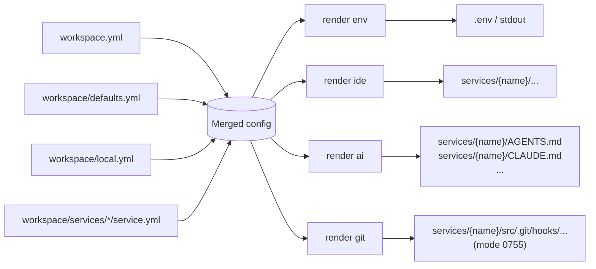

# Render Reference

`dwe render` produces files derived from the merged DWE config. It is the single entry point for code-generated artifacts — none of these files should be hand-edited; re-run the corresponding subcommand instead.

## Contents

- [Subcommands](#subcommands)
- [Common pipeline](#common-pipeline)
- [Inputs and outputs at a glance](#inputs-and-outputs-at-a-glance)
- [Pages](#pages)
- [Related references](#related-references)

## Subcommands

| Command | Output | Source |
|---------|--------|--------|
| `dwe render env` | `.env` content (stdout or `--out <path>`) | `exports.env` rules in `workspace/defaults.yml` + system vars |
| `dwe render ide` | Per-service IDE config files inside each service hub | Template packs under `workspace/templates/ide/<pack>/` driven by `manifest.yml` |
| `dwe render ai` | Hub-level agent docs (`AGENTS.md`, `CLAUDE.md` symlink, …) | Template packs under `workspace/templates/ai/<pack>/` driven by `manifest.yml` |
| `dwe render git` | Per-service shell git hooks at `<svc.Dir>/src/.git/hooks/<basename>` (mode `0755`) | Template packs under `workspace/templates/git/<pack>/` driven by `manifest.yml` |

All four subcommands read the same merged config (`workspace.yml` → `workspace/defaults.yml` → `workspace/local.yml`, with per-service declarations from `workspace/services/<name>/service.yml` joined in). They differ in what they iterate and where they write.

## Common pipeline



Each subcommand:

1. Loads the merged config. A missing or invalid project config is a hard error.
2. Selects targets:
   - `env` — single artifact, no selection.
   - `ide` / `ai` / `git` — iterates services, applies a selection policy, and optionally narrows to one service via the `[service]` argument.
3. Writes output files. Where they go depends on the subcommand:
   - `render ide` and `render ai` write inside each service's hub directory, anchored to the project root (the directory containing `workspace.yml`), and enforce path-safety boundaries.
   - `render git` writes inside `<svc.Dir>/src/.git/hooks/` for each service whose `src/.git` is a real directory; the destination is never tracked by git.
   - `render env` writes to stdout by default, or to the `--out <path>` argument as given. The `--out` path is interpreted relative to the current working directory, not the project root — pass an absolute path if you want a deterministic location regardless of where the command is invoked from.

## Inputs and outputs at a glance

| Aspect | `render env` | `render ide` | `render ai` | `render git` |
|--------|--------------|--------------|-------------|--------------|
| Iterates services | no | yes | yes | yes |
| Reads templates from disk | no | yes (manifest-driven) | yes (manifest-driven) | yes (manifest-driven) |
| Per-service opt-in field | — | `services.<name>.render.ide.enabled` | `services.<name>.render.ai.enabled` | `services.<name>.render.git.enabled` |
| Default opt-in policy | — | `true` for `type: app`; `false` otherwise | `true` for all types | `true` for `type: app`; `false` otherwise |
| Collision policy when services share `dir` | — | deepest `extends` wins (per-variant overrides) | shallowest `extends` wins (canonical hub identity) | deepest `extends` wins (per-variant hooks) |
| Manifest file | — | `manifest.yml` declares `render` (+ `symlinks`) | `manifest.yml` declares `render` + `symlinks` | `manifest.yml` declares `render` only |
| Symlinks supported | no | yes (relative, hub-internal) | yes (relative, hub-internal) | no — `to` must be a basename |
| Output mode | n/a | as written | as written | explicit `chmod 0755` on every run |
| Path-safety guards | n/a | symlink rejection in pack and destination | symlink rejection in pack and destination | hub preflight + symlink rejection in `.git/hooks/` |

## Shared manifest schema

`render ide`, `render ai`, and `render git` all read a `manifest.yml` at the root of their chosen template pack using a single shared schema:

```yaml
render:
  - from: <path inside pack, ending in .tmpl>
    to:   <destination relative to the per-kind dest root>

symlinks:
  - link: <symlink path>
    to:   <existing render destination>
```

Per-kind constraints layered on top:

| Kind | Dest root | `to` shape | `symlinks` |
|------|-----------|------------|------------|
| `ide` | service hub directory | any contained relative path | allowed |
| `ai` | service hub directory | any contained relative path | allowed, must reference a render `to` |
| `git` | `<svc.Dir>/src/.git/hooks/` | **basename only** (no slashes, no `..`) | rejected — must be empty |

The manifest is loaded with strict YAML decode (`yaml.Decoder.KnownFields(true)`); unknown fields are a hard error. An empty manifest (no `render` and no `symlinks`) is rejected. Validation is split into **shape** (pure, no filesystem) and **sources** (resolver-aware existence check) so that shadow-pack overrides participate in source-existence validation identically to how the renderer reads them.

## Local overrides

Any template pack `workspace/templates/<kind>/<pack>/<rel>` can be overridden on a per-file basis by a sibling shadow pack at `workspace/templates/<kind>/<pack>.local/<rel>`. The resolver applied by all three rendering subcommands is:

1. Check `workspace/templates/<kind>/<pack>.local/<rel>`:
   - regular file → use it; the renderer emits one info line `using local override: workspace/templates/<kind>/<pack>.local/<rel>`.
   - exists but is a directory or symlink → hard error; the override does not silently fall back to the canonical pack (so a bad override surfaces itself).
   - missing → fall through.
2. Check `workspace/templates/<kind>/<pack>/<rel>`:
   - regular file → use it.
   - exists but is a directory or symlink → hard error with the offending path named.
   - missing → wrapped `os.ErrNotExist`.

The `<pack>.local/` directory is a **sibling** of the canonical pack, not a child. It lives inside the tracked `workspace/templates/<kind>/` directory and is gitignored by pattern (`workspace/templates/*/*.local/` or a broader `*.local/` rule — recommend adding to the project `.gitignore`).

The override pack only needs to contain the files being overridden — it is not a full pack. `manifest.yml` is read **only** from the canonical pack; an override cannot rewrite the manifest, just substitute individual `from:` sources.

This mirrors the existing user-local override convention in the project:

| Canonical (tracked) | Local sibling (gitignored) |
|---------------------|----------------------------|
| `workspace/workspace.yml` | `workspace/local.yml` (documented in [services reference](../config/services/index.md)) |
| `workspace/docker.yml` | `workspace/docker.local.yml` |
| `workspace/templates/<kind>/<pack>/` | `workspace/templates/<kind>/<pack>.local/` |

`.dwe/` (the runtime directory) is never used for user-authored overrides — it is reserved for DWE-managed state (`state.yml`, `deploy.lock`, `logs/`).

### Input vs output

The override is an **input substitution**, not an output redirection:

- The override file at `workspace/templates/<kind>/<pack>.local/<rel>` is gitignored by the `.local/` pattern and never committed.
- The rendered **output** still lands at the manifest-declared `to`.

What that means in practice:

| Kind | Output path | Tracked? | Effect of local override |
|------|-------------|----------|--------------------------|
| `git` | `<svc.Dir>/src/.git/hooks/<basename>` | never (inside `.git/`) | the override is fully private to the developer |
| `ide` / `ai` | `<svc.Dir>/<rel>` (typically tracked) | usually yes | re-rendering modifies the tracked artifact; the developer is responsible for not committing those changes (`git stash`, `git checkout -- <path>`, or a personal pre-commit guard) |

For IDE/AI, a local override that produces a different rendered output is a workflow you opt into deliberately — keep it out of commits the same way you would keep an unrelated WIP edit out.

## Pages

- [`render env`](env.md) — `.env` generation: system variables, export rules, `when` filtering, value formatting
- [`render ide`](ide.md) — IDE template packs: pack resolution, manifest schema, deepest-wins collision policy, per-service rendering
- [`render ai`](ai.md) — Agent docs template packs: manifest schema, shallowest-wins collision policy, render + symlink entries
- [`render git`](git.md) — Shell git hooks: manifest-driven hook rendering into `<svc.Dir>/src/.git/hooks/`, deepest-wins, mode `0755`

## Related references

- [`workspace.yml` / `defaults.yml` / `local.yml`](../config/workspace.md) — merged config layers and dot-path resolution (used by `render env`)
- [service definitions (`workspace/services/*/service.yml`)](../config/services/index.md) — service definitions, `ide` / `ai` / `git` blocks, `extends` chains
- [Templates](../templates.md) — Go template syntax, sprout helpers, render context (shared with info / commands / pipelines)
- CLI reference: [`dwe render`](../cli/dwe_render.md), [`dwe render env`](../cli/dwe_render_env.md), [`dwe render ide`](../cli/dwe_render_ide.md), [`dwe render ai`](../cli/dwe_render_ai.md), [`dwe render git`](../cli/dwe_render_git.md)
