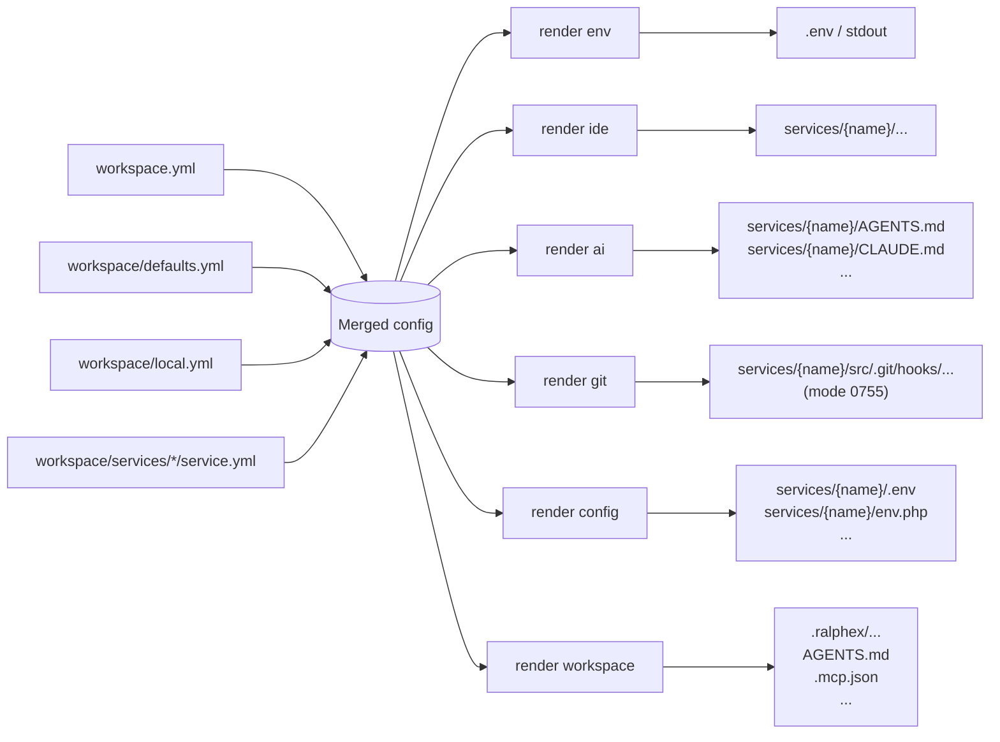

# Render Reference

`dwe render` produces files derived from the merged DWE config. It is the single entry point for code-generated artifacts — none of these files should be hand-edited; re-run the corresponding subcommand instead.

## Contents

- [Subcommands](#subcommands)
- [Common pipeline](#common-pipeline)
- [Inputs and outputs at a glance](#inputs-and-outputs-at-a-glance)
- [Shared manifest schema](#shared-manifest-schema)
- [Local overrides](#local-overrides)
- [Pages](#pages)
- [Related references](#related-references)

## Subcommands

| Command | Output | Source |
|---------|--------|--------|
| `dwe render env` | `.env` content (stdout or `--out <path>`) | `exports.env` rules in `workspace/defaults.yml` + system vars |
| `dwe render ide` | Per-service IDE config files inside each service hub | Template packs under `workspace/templates/ide/<pack>/` driven by `manifest.yml` |
| `dwe render ai` | Hub-level agent docs (`AGENTS.md`, `CLAUDE.md` symlink, …) | Template packs under `workspace/templates/ai/<pack>/` driven by `manifest.yml` |
| `dwe render git` | Per-service shell git hooks at `<svc.Dir>/src/.git/hooks/<basename>` (mode `0755`) | Template packs under `workspace/templates/git/<pack>/` driven by `manifest.yml` |
| `dwe render config` | Per-service config files (`.env`, `env.php`, …) inside each service hub, replaying harvested secrets | Template packs under `workspace/templates/config/<pack>/` driven by `manifest.yml` |
| `dwe render workspace` | Project-root files (`.ralphex/`, `AGENTS.md`, `.mcp.json`, …) | Packs under `workspace/templates/workspace/<pack>/`, selected by `render.workspace` or CLI arguments |

All six subcommands read the same merged config (`workspace.yml` → `workspace/defaults.yml` → `workspace/local.yml`, with per-service declarations from `workspace/services/<name>/service.yml` joined in). They differ in what they iterate and where they write.

## Common pipeline


```mermaid
flowchart LR
  L1[workspace.yml] --> M
  L2[workspace/defaults.yml] --> M
  L3[workspace/local.yml] --> M
  S["workspace/services/*/service.yml"] --> M
  M[("Merged config")]

  M --> E[render env]
  M --> I[render ide]
  M --> A[render ai]
  M --> G[render git]
  M --> C[render config]
  M --> W[render workspace]

  E --> EOUT[".env / stdout"]
  I --> IOUT["services/{name}/..."]
  A --> AOUT["services/{name}/AGENTS.md<br/>services/{name}/CLAUDE.md<br/>..."]
  G --> GOUT["services/{name}/src/.git/hooks/...<br/>(mode 0755)"]
  C --> COUT["services/{name}/.env<br/>services/{name}/env.php<br/>..."]
  W --> WOUT[".ralphex/...<br/>AGENTS.md<br/>.mcp.json<br/>..."]
```

Each subcommand:

1. Loads the merged config. A missing or invalid project config is a hard error.
2. Selects targets:
   - `env` — single artifact, no selection.
   - `ide` / `ai` / `git` — iterate services, apply a selection policy, and optionally narrow to one service via the `[service]` argument. Without the argument each walks **every** service and honours its per-service opt-in field (`render.<pack>.enabled`), so a pipeline should carry one argument-less step (e.g. `cmd: "render ai"`) rather than one step per service; the `[service]` argument is for ad-hoc, single-hub runs.
   - `config` — also iterates services and accepts `[service]`, but its selection is different: app services only, resolved through the config pack rather than a per-service opt-in field.
   - `workspace` — uses the top-level `render.workspace` list or explicit `[pack…]` arguments; it does not select services. An empty list prints an info line and exits successfully.
3. Writes output files. Where they go depends on the subcommand:
   - `render ide` and `render ai` write inside each service's hub directory, anchored to the project root (the directory containing `workspace.yml`), and enforce path-safety boundaries.
   - `render git` writes inside `<svc.Dir>/src/.git/hooks/` for each service whose `src/.git` is a real directory; the destination is never tracked by git.
   - `render config` writes per-service runtime config files (`.env`, `env.php`, …) inside each service's hub directory from `workspace/templates/config/<pack>/`, replaying harvested secrets; app services are iterated in `DeployOrder`.
   - `render workspace` validates every selected pack and renders it in memory before writing into the project root; a planning error leaves files unchanged. Sources ending in `.tmpl` are strict Go templates; other files are copied byte-for-byte.
   - `render env` writes to stdout by default, or to the `--out <path>` argument as given. The `--out` path is interpreted relative to the current working directory, not the project root — pass an absolute path if you want a deterministic location regardless of where the command is invoked from.

## Inputs and outputs at a glance

| Aspect | `render env` | `render ide` | `render ai` | `render git` | `render config` | `render workspace` |
|--------|--------------|--------------|-------------|--------------|-----------------| -------------------- |
| Iterates services | no | yes | yes | yes | yes (app services, `DeployOrder`) | no |
| Reads templates from disk | no | yes (manifest-driven) | yes (manifest-driven) | yes (manifest-driven) | yes (manifest-driven) | yes (manifest-driven) |
| Per-service opt-in field | — | `services.<name>.render.ide.enabled` | `services.<name>.render.ai.enabled` | `services.<name>.render.git.enabled` | resolvable config pack (app-only) | —; top-level `render.workspace` |
| Default opt-in policy | — | `true` for `type: app`; `false` otherwise | `true` for `type: app`; `false` otherwise | `true` for `type: app`; `false` otherwise | app services only; no pack → silent no-op | empty list → info and exit 0 |
| Collision policy when services share `dir` | — | deepest `extends` wins (per-variant overrides) | shallowest `extends` wins (canonical hub identity) | deepest `extends` wins (per-variant hooks) | `extends` parent hub rendered once (alias skipped) | equal paths and file/directory prefix collisions across packs rejected |
| Manifest file | — | `manifest.yml` declares `render` (+ `symlinks`) | `manifest.yml` declares `render` + `symlinks` | `manifest.yml` declares `render` only | `manifest.yml` declares `render` only | `manifest.yml` declares `render` (+ `symlinks`) |
| Symlinks supported | no | yes (relative, hub-internal) | yes (relative, hub-internal) | no — `to` must be a basename | no — rejected | yes (relative, project-root-contained) |
| Output mode | n/a | as written | as written | explicit `chmod 0755` on every run | replace (overwrite) | `0755` if source has any exec bit, otherwise `0644`; chmod on every render |
| Path-safety guards | n/a | symlink rejection in pack and destination | symlink rejection in pack and destination | hub preflight + symlink rejection in `.git/hooks/` | symlink rejection in pack and destination | protected paths; symlink/directory destination rejection |

## Shared manifest schema

`render ide`, `render ai`, `render git`, `render config`, and `render workspace` all read a `manifest.yml` at the root of their chosen template pack using a single shared schema:

```yaml
render:
  - from: <path inside pack>
    to:   <destination relative to the per-kind dest root>

symlinks:
  - link: <symlink path>
    to:   <existing render destination>
```

Per-kind constraints layered on top:

| Kind | Dest root | `to` shape | `symlinks` |
|------|-----------|------------|------------|
| `ide` | service hub directory | any contained relative path | allowed |
| `ai` | service hub directory | any contained relative path | allowed, must reference a render `to` |
| `git` | `<svc.Dir>/src/.git/hooks/` | **basename only** (no slashes, no `..`) | rejected — must be empty |
| `config` | service hub directory | any contained relative path | rejected — must be empty |
| `workspace` | project root | contained relative path outside protected destinations | allowed, must reference a render `to` |

For `workspace`, only `from` paths ending in `.tmpl` are evaluated as templates; other sources are copied byte-for-byte. `render.to` and `symlinks.link` cannot target `workspace.yml`, `workspace/`, `services/`, `.dwe/`, `.git/`, `.env`, or their descendants; comparison is case-insensitive.

The manifest is loaded with strict YAML decode (`yaml.Decoder.KnownFields(true)`); unknown fields are a hard error. An empty manifest (no `render` and no `symlinks`) is rejected. Validation is split into **shape** (pure, no filesystem) and **sources** (resolver-aware existence check) so that shadow-pack overrides participate in source-existence validation identically to how the renderer reads them.

## Local overrides

Any template pack `workspace/templates/<kind>/<pack>/<rel>` can be overridden on a per-file basis by a sibling shadow pack at `workspace/templates/<kind>/<pack>.local/<rel>`. The resolver applied by every pack rendering subcommand, including `workspace`, is:

1. Check `workspace/templates/<kind>/<pack>.local/<rel>`:
   - regular file → use it; the renderer emits one info line `using local override: workspace/templates/<kind>/<pack>.local/<rel>`.
   - exists but is a directory or symlink → hard error; the override does not silently fall back to the canonical pack (so a bad override surfaces itself).
   - missing → fall through.
2. Check `workspace/templates/<kind>/<pack>/<rel>`:
   - regular file → use it.
   - exists but is a directory or symlink → hard error with the offending path named.
   - missing → wrapped `os.ErrNotExist`.

The `<pack>.local/` directory is a **sibling** of the canonical pack, not a child. It lives inside the tracked `workspace/templates/<kind>/` directory and is gitignored by pattern (`workspace/templates/*/*.local/` or a broader `*.local/` rule — recommend adding to the project `.gitignore`).

The override pack only needs to contain the files being overridden — it is not a full pack. `manifest.yml` is read **only** from the canonical pack; an override cannot rewrite the manifest, just substitute individual `from:` sources.

This mirrors the existing user-local override convention in the project:

| Canonical (tracked) | Local sibling (gitignored) |
|---------------------|----------------------------|
| `workspace/workspace.yml` | `workspace/local.yml` (documented in [services reference](../config/services/index.md)) |
| `workspace/docker.yml` | `workspace/docker.local.yml` |
| `workspace/templates/<kind>/<pack>/` | `workspace/templates/<kind>/<pack>.local/` |

`.dwe/` (the runtime directory) is never used for user-authored overrides — it is reserved for DWE-managed state (`deploy/state.yml`, `deploy/deploy.lock`, `logs/`).

### Input vs output

The override is an **input substitution**, not an output redirection:

- The override file at `workspace/templates/<kind>/<pack>.local/<rel>` is gitignored by the `.local/` pattern and never committed.
- The rendered **output** still lands at the manifest-declared `to`.

What that means in practice:

| Kind | Output path | Tracked? | Effect of local override |
|------|-------------|----------|--------------------------|
| `git` | `<svc.Dir>/src/.git/hooks/<basename>` | never (inside `.git/`) | the override is fully private to the developer |
| `ide` / `ai` | `<svc.Dir>/<rel>` (typically tracked) | usually yes | re-rendering modifies the tracked artifact; the developer is responsible for not committing those changes (`git stash`, `git checkout -- <path>`, or a personal pre-commit guard) |
| `workspace` | `<project-root>/<rel>` | depends on the project `.gitignore` | an override can modify tracked root artifacts; keep local differences out of commits |

For IDE/AI/workspace, a local override that produces a different rendered output is a workflow you opt into deliberately — keep it out of commits the same way you would keep an unrelated WIP edit out.

## Pages

- [`render env`](env.md) — `.env` generation: system variables, export rules, `when` filtering, value formatting
- [`render ide`](ide.md) — IDE template packs: pack resolution, manifest schema, deepest-wins collision policy, per-service rendering
- [`render ai`](ai.md) — Agent docs template packs: manifest schema, shallowest-wins collision policy, render + symlink entries
- [`render git`](git.md) — Shell git hooks: manifest-driven hook rendering into `<svc.Dir>/src/.git/hooks/`, deepest-wins, mode `0755`
- [`render config`](config.md) — Service config files: `${...}` substrate, `${generated.<name>}` replay, harvest-not-mint secrets, opt-in pack resolution
- [`render workspace`](workspace.md) — Project-root packs: explicit activation, `.tmpl` vs verbatim sources, file modes, protected paths, planning before writes

## Related references

- [`workspace.yml` / `defaults.yml` / `local.yml`](../config/workspace.md) — merged config layers and dot-path resolution (used by `render env`)
- [service definitions (`workspace/services/*/service.yml`)](../config/services/index.md) — service definitions, `ide` / `ai` / `git` blocks, `extends` chains
- [Templates](../templates.md) — Go template syntax and render context; pack built-ins versus Sprout helpers for info / commands / pipelines
- Run `dwe render --help` (or `dwe render <subcommand> --help`) for the live CLI surface
